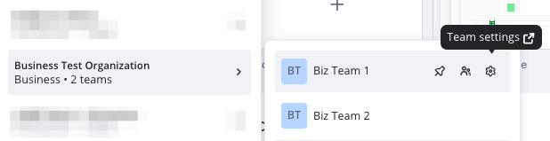

Business Plan Company Admins can create [multiple teams within their subscription](#how-to-create-a-new-team) - this is extremely helpful for working with clients on different projects or for organizing your team content. While both [Company and Team Admins](01-i-am-a-new-miro-admin.-where-to-start.md#team-admin-company-admin) can manage Team-level settings, the option to configure Company-level attributes is available for Company Admins only. See below how this works on Business Plan.

:::note
Miro's new [Business + AI Workflows](../../plans-billing/miro-plans/01-introducing-the-business-+-ai-workflows-plan.md) plan is replacing the legacy Business plan. For existing customers, complete access to some AI features is only available when you upgrade to the new Business plan. To learn more about impact on existing customers, see [Introducing the Business + AI Workflows plan](../../plans-billing/miro-plans/01-introducing-the-business-+-ai-workflows-plan.md).
:::

In this article, you will also learn [how to create new teams within your subscription](#how-to-create-a-new-team) if you, for example, need separate private teams for your clients.

## Team-level settings

### Access team settings

On the left sidebar, hover over the team name and click the **Team** **settings** icon.
 *Team settings icon*

### Team profile

Access the team profile to [change the team name and logo](../team-management/04-update-team-name-or-logo.md), [leave the team](../../using-miro/managing-your-profile/06-how-to-leave-a-team.md) or [delete it](../team-management/06-delete-and-restore-teams.md). To access the team profile:

1. On the left sidebar, hover over the team name and click the **Team** **settings** icon.

2. Click the team for which you want to view the team profile.

Note that the removal of a team on Business Plan doesn't require email confirmation and leads to the deletion of the content stored within the team.

### Users

In the **Users** tab on the Team level, you can:

- see user info
- invite new members to the team
- grant Team Admin rights
- remove members. Note that removing a member on the Team level doesn't lead to full deletion of the user from the subscription. To completely remove the member and release a seat, go to **Users** > **All users > Active users** and then remove the user.

### Apps

In the **Apps** tab, Team and Company Admins can:

- install new apps for the team.
- decide who can install apps for the team by toggling the **Allow non-admins to install apps** option.
- remove an app for a team. Choose an app on the list. The app settings appears. Click **Remove for team**.

### Settings

The team settings are different for Team and Company Admins. Team Admins who are not Company Admins can manage [board and Spaces sharing settings](../../using-miro/sharing-boards/11-default-sharing-settings.md) and [board content settings](../../using-miro/sharing-boards/14-how-to-allow-or-restrict-copying-and-exporting-boards-and-content.md). Company Admins also have the ability to configure [Team discovery settings](../team-management/02-manage-team-signup-mode.md) and [Team invitation settings](../user-management/02-invitation-settings.md).

When configuring the Invitation settings Company Admins can define who can invite new members to the team and trigger the purchase of new licenses as well as allow or forbid [Guests](../../using-miro/sharing-boards/07-collaboration-with-guests.md) in the team.

## Organization-level settings

### Access organization settings

1. On the left sidebar, hover over the team name and click the **Team** **settings** icon.
 *Team settings icon*

2. On the left sidebar, click **Organization**.

3. Click **Organization profile** or **Brand center**.

### Organization profile

Access **Organization profile** to change the Company name and logo and view Subscription details: the current plan, the number of purchased and allocated licenses, the subscription expiration date as well as the number of Members and Guests.

## Billing

On the **Billing** page, Company Admins and [Billing Admins](../admin-faq/01-admin-faq.md) can view detailed subscription information and change subscription details such as subscription size, type of billing, invoice details. To learn more about managing your subscription, see [this article](../../plans-billing/manage-your-subscription-and-plan/01-manage-your-subscription.md).

## Users

On the left sidebar, click **Users**, and then click **All users**. The **Active users** tab lists all users (Members and Guests) that have been invited to your plan's teams or boards. Here you can [convert Guests to Members and vice versa](../user-management/03-how-to-change-members-to-guests.md), [change user licenses](../admin-faq/02-day-passes-for-business-and-consultant-plans.md), [promote and revoke Company Admin](../user-management/06-how-to-manage-admin-roles.md), and [remove users](../user-management/08-remove-users.md).

To view a user's details, click the three dots on a user row, and then click **User info**.

To delete a user and remove a user from teams, click the three dots on a user row, and then click **Delete**.

You can use **Filters** to see all users with a particular license, role, from a certain team, or active/inactive status.

You can make changes in bulk by selecting several users and choosing an option in the **Bulk actions** menu.

To export the list of your Active users in CSV format, click Download CSV.

### Invitations

The **Invitations** section displays the list of *unregistered* users that have been invited to your plan. You can revoke an invitation at any time and release the allocated license. As soon as a user signs up with Miro, their email no longer appears in this list.

## Teams

To view the list of all your teams, on the left sidebar, click **Teams**. You can then view the settings of any team created within your subscription or create a new team.

### How to create a new team

> **Set up by**: Company Admins

1. On the left sidebar, click **Teams**.

2. On the **Active** tab, click **Create team**.
A dialog box appears.

3. Enter a name for the team.

4. Click **Create team**.

The team is created and you are suggested to [invite members to the team](../user-management/01-invite-users.md).
