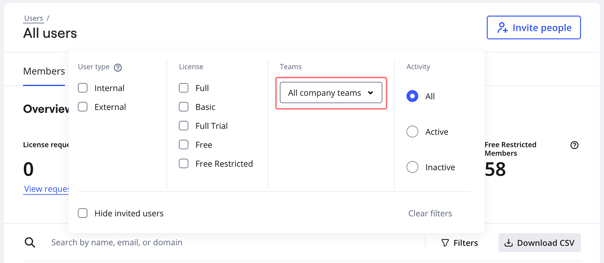
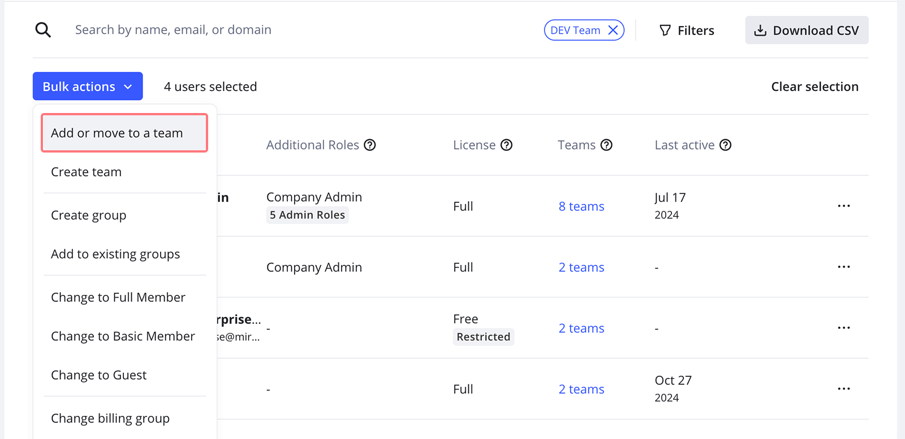

To combine multiple teams into a single team, follow the procedures below.

## Prerequisites

- Notify your team of the following:
  - They will receive an invite to join a new team.
  - They will need to move their boards.
- If the target team does not exist, then [create your target team](../../getting-started/start-here/miro-dashboard/02-how-to-create-a-team-in-miro.md).

## Invite team members

1. Open **Admin console** > **Users** > **All users**.
2. Select **Filters**, and under **Teams** select your team.
    *Filtering users*
3. Select **All users**.
4. Select **Bulk actions > Add or move to a team**.
   A pop-up opens.
5. Choose the target team.
   *Move team members to another team*
6. Select **Add**.
   Your team can now access the original team and target team.

## **Move team data**

1. Ask team members to move each of their boards to the target team.
   > ✏️ Boards not moved will be lost when the original team is deleted. Only board owners can move their boards.
2. Verify that the target team retains sharing settings for each board.

## **Delete original team**

1. Ensure that all team members and content are moved to the target team.
   > ⚠️ To prevent data loss, boards must be moved to the target team before the original team is deleted.
2. Open **Admin console** > **Teams**.
3. Select the team you want to delete.
4. In the **Profile** tab, select **Delete team**.
   The **Delete &lt;your team&gt;?** pop-up opens.
5. Select **Delete team**.
