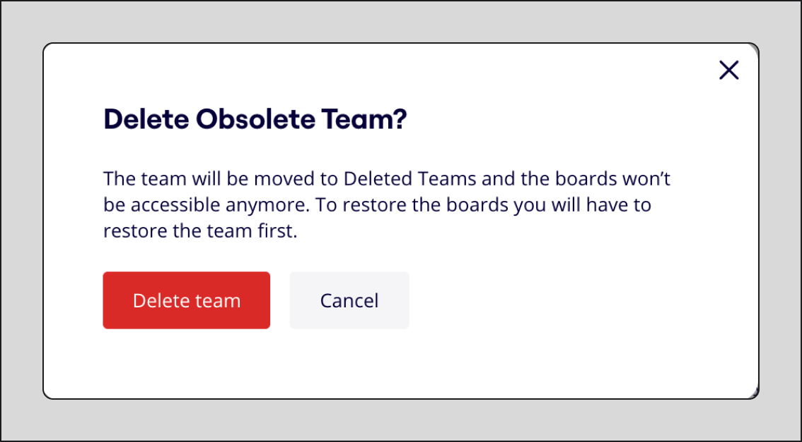

## Delete a team

:::warning
Deleting your team results in **all boards and templates being removed**. To recover accidentally deleted boards, see [Trash management article](../../using-miro/managing-boards/09-trash-management.md). Before you delete a team, you may want to [transfer your boards](../../using-miro/managing-boards/04-how-to-move-a-board.md) to other teams, [save backups](../../using-miro/import-and-export/export/05-how-to-save-board-backup.md), or [export](../../using-miro/import-and-export/export/03-how-to-export-your-board.md) them, and ask your team members to do the same.
:::

To delete a team:

1. Go to **Admin console** by clicking your avatar in the top-right and then clicking **Admin console**.
2. On the left sidebar, click **Teams**.
3. Select the team you want to delete.
   The **Your team** panel opens.
4. Click the **Profile** tab.
5. Click **Delete team**.
6. To confirm, click **Delete team**. *Team removal confirmation message*
7. For a single-team organization, you receive a confirmation email. In the email, click **Delete My Team**.

## Restore a team

When you restore a deleted team, you also restore any boards or templates that were removed when the team was deleted.

You can restore a deleted team within 90 days. After 90 days the team is permanently deleted.

:::note
Only User admins and Company admins can restore a deleted team.
:::

1. Go to **Admin console** by clicking your avatar in the top-right and then clicking **Admin console**.
2. On the left sidebar, click **Teams**.
3. Click the **Deleted** tab.
4. Find the team you want to recover.
5. Click the **three dots** (**…**), then click **Restore team**.
   A dialog opens that asks you to restore the team.
6. Click **Restore**.
   Your team returns to the **Active** tab.

## Delete a team permanently

When you delete a team, you can either recover the team or delete it permanently. If you do nothing, the team will be automatically purged after 90 days.

Deleting the team permanently will also permanently delete any boards or templates created by them. This cannot be undone.

1. Go to **Admin console** by clicking your avatar in the top-right and then clicking **Admin console**.
2. On the left sidebar, click **Teams**.
3. Click the **Deleted** tab.
4. Find the team you want to delete.
5. Click the **three dots** (**…**), then click **Delete permanently**.
   A dialog opens that asks you to delete the team.
6. Select **Delete "your team"**.
7. Click **Delete**.

## Frequently asked questions

Will my subscription tied to my team be terminated upon deletion of the team?

To make sure that there will be no additional charges, please cancel your subscription in Billing settings: use [this guide](../../plans-billing/manage-your-subscription-and-plan/06-cancel-your-miro-subscription.md).

What kind of permissions do I need to delete a team?

Deleting a team requires Company Admin permissions. If you're not the Company Admin, you will see the option to [leave the team](../../using-miro/managing-your-profile/06-how-to-leave-a-team.md).

I requested to delete my team but never got the confirmation email. How can I find the email?

Open your **Spam, Promotions, Junk, Social**, and **Updates** folders and check to see if the confirmation email is there.
It also may be that a firewall is preventing the email from reaching your inbox. Please reach out to your system administrator and ask them to allowlist our domains and subdomains.[Here is an article](../../using-miro/tools/troubleshooting/02-allowlist-miro-mailers.md) with more information on the mailers you need to allowlist.

How can I delete the last team on a Business plan?

While you cannot delete the last team in a Business plan, you can use the following workaround:

1. [Cancel your subscription](../../plans-billing/manage-your-subscription-and-plan/06-cancel-your-miro-subscription.md).
2. When your team expires at the end of the billing period, [downgrade to Free](../../plans-billing/manage-your-subscription-and-plan/04-downgrade-your-plan.md).
3. Delete the free team.

On the Enterprise Plan, please [reach out to Support for assistance](../../using-miro/tools/troubleshooting/06-contacting-miro-support.md).

**More information:**

- [How to leave a team](../../using-miro/managing-your-profile/06-how-to-leave-a-team.md)
- [How to delete your profile](../../using-miro/managing-your-profile/07-how-to-delete-your-profile.md)
