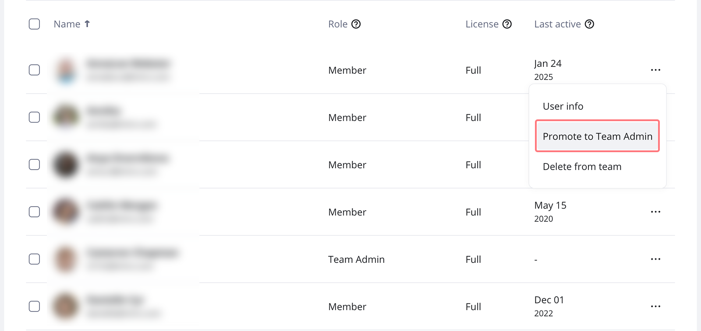
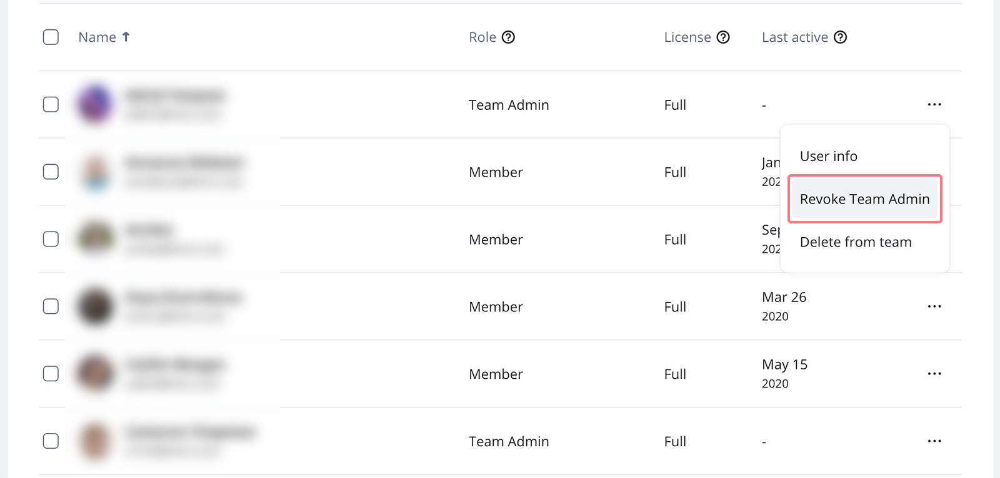

In Miro, there are two levels of settings: Team settings, which are managed by the Team Admin, and Company settings, which are managed by the Company Admin. We recommend having a minimum of two Company Admins and Team Admins. For more information on Admin roles and their privileges, [read our documentation](../get-started-as-a-miro-admin/02-understand-admin-roles-and-their-privileges.md).

:::tip
Reach out to your current Team or Company Admin if you’d like to be granted Admin access. You can find the Team Admin’s email in [Team settings](../get-started-as-a-miro-admin/01-i-am-a-new-miro-admin.-where-to-start.md#team-settings) > Users.
:::

## How to assign a Team Admin role

> **Relevant for:** Free, Starter, Business, and Enterprise plans
> **Who can do it:** Team Admins, Company Admins

Only Team members can be Admins. On Starter and Business plans, a Team Admin should have a paid license.

1. Go to your Admin console.
2. Navigate to **Users** > **All users**.
3. Find the user you want to promote to an admin role.
4. Click the **three dots** (**...**) icon next to the user and choose **Promote to Team Admin**.

*Promoting a Member to Team Admin*

## How to remove a Team Admin role

1. Go to your Admin console.
2. Navigate to **Users** > **All users**.
3. Find the user you want to revoke admin rights from.
4. Click the **three dots** (**...**) icon next to the user and choose **Revoke Team Admin**.

*Removing Team Admin permissions for a user*

## How to assign a Company Admin role

> **Relevant for:** Business and Enterprise plans
> **Who can do it:** Company Admins

1. Go to your Admin console.
2. Click on **Users** > **Active users**.
3. Click the **three dots** (**...**) icon next to the user and choose **Promote to Company Admin**.

## How to remove a Company Admin role

> **Relevant for:** Business and Enterprise plans
> **Who can do it:** Company Admin

1. Go to your Admin console.
2. Click on **Users** > **Active users**.
3. Click the **three dots** (**...**) icon next to the user and choose **Revoke Company Admin**.

## Miro Admin leaving the team or company

If you’re leaving the team or company, grant the Admin role to another user following the steps above.

If you're on an Education Plan, only one Admin per team is allowed. You cannot promote other users to Team Admins. However, if you leave the team you will be prompted to reassign Admin rights to another member.

## Miro Admin left the company

Learn how to regain control of your Miro team if your [Miro Admin has left the company](07-my-miro-admin-left-the-company.md).
