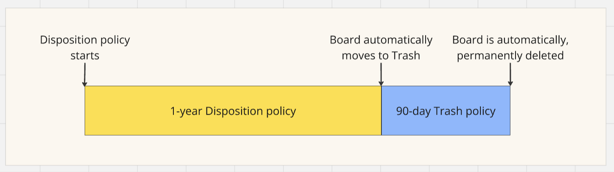
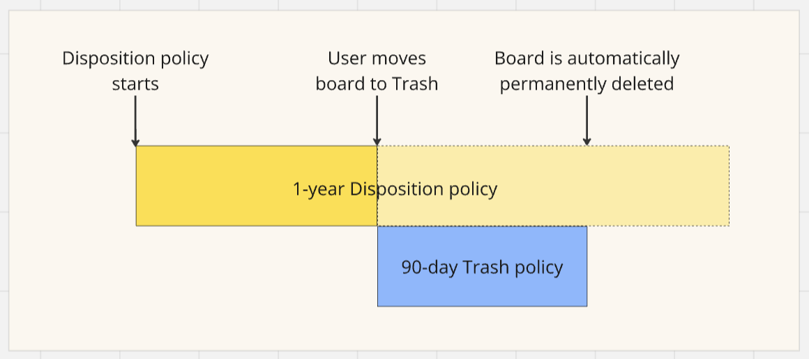
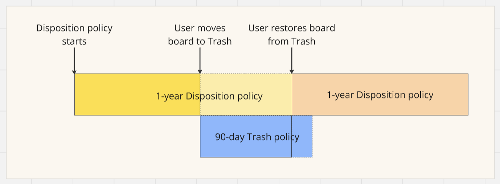

## Automatic movement of boards to Trash

Boards are automatically moved to the Trash on their designated disposition date. If there is no active retention policy affecting the board, its permanent deletion will be determined by the Trash policy.

For example, consider a project board that is designated to move to Trash on July 1, 2025 per the disposition policy and there is no retention policy affecting it. The board will be automatically moved to Trash on July 1, 2025, and permanently deleted on September 29, 2025 per the 90-day Trash policy.

:::note
An active retention policy supersedes the Trash policy. Therefore, the permanent deletion date of the board will follow the Retention policy in place.
:::

If Disposition notifications are enabled for the policy, users will receive a notification per the configured number of days when the disposition notification must be sent in advance of the board’s scheduled move to Trash.

The notification appears in the Miro notification feed and links directly to the board. A banner is also displayed at the top of the board warning the user of the upcoming trash action. Board owners and co-owners have the option to keep the board.

## User-initiated board deletion

When a board owner moves a board to the Trash, the disposition policy no longer affects the board's lifecycle. If no active retention policies apply to the board, its permanent deletion will follow the Trash policy.

For example, consider an operational plan board scheduled for disposition on October 13, 2024. If the board owner preemptively moves the board to the Trash on May 15, 2024, and there are no active retention policies affecting the board, it will adhere to the Trash policy. The board will be permanently deleted on August 13, 2024, per the 90-day Trash policy.

:::note
If there is an active retention policy affecting the board, this policy will override the Trash policy, setting the permanent deletion date according to the Retention policy.
:::

## User-initiated board restoration

When a user restores a board from the Trash, any relevant disposition policy is automatically reapplied. This ensures that the board re-enters its lifecycle with all original policy settings restored.

For example, if a user restores a marketing strategy board from the Trash on June 20, 2024 that earlier had a 1-year disposition policy applicable, this policy is automatically reapplied upon restoration. The board’s new disposition date will be recalculated from the restoration date, setting its updated disposition date to June 20, 2025 or a year from the date when this board was last modified after restoration.

## Disposition notifications

Disposition Notifications alert users in advance when a board is scheduled to be automatically moved to the Trash due to inactivity, based on an active disposition policy.

- Admins can enable notifications when publishing a policy.
- The notification timing is configurable from 1 to 30 days before the scheduled move.
- Notifications are sent per the configured number of days when the disposition notification must be sent in advance of the Trash date.

When a board enters the inspection period:

- A notification appears in the user’s notification feed.
- Clicking it opens the board with a top banner warning of the upcoming move to Trash.
- Users can choose to keep the board to retain it, which resets the disposition timer.

This notification mechanism applies to all scenarios where:

- A disposition policy with notifications is active.
- The board is entering its inspection period (per configured number days before disposition date).

### Scenario 1: Boards that match a disposition policy

These boards fall under a policy and will be moved to Trash after the defined period of inactivity.

If Disposition Notifications are enabled for the policy, a notification will be sent per the configured number of days when the disposition notification must be sent in advance of the board’s scheduled move to Trash. The board will also display a banner allowing users to review or keep it.

### Scenario 2: Boards with a classification label that was added after the board was last modified

These boards are retroactively pulled into scope and still follow the same disposition timeline based on their last modified date.

If Disposition Notifications are enabled, users will receive a notification per the configured number of days when the disposition notification must be sent in advance of the scheduled move to Trash, even if the label was applied after the last edit.

### Scenario 3: Boards with a classification label that was removed before the policy was published

These boards no longer fall under the policy and are excluded from disposition evaluation.

Since they are out of scope, no Disposition Notifications will be sent.

### Scenario 4: Boards recently modified and not yet within the disposition threshold

These boards have been edited recently and are not yet eligible for disposition.

A notification will only be sent if the board enters the inspection period — that is, per the configured number of days when the disposition notification must be sent in advance of the disposition date. Until then, no notification is triggered.

### Scenario 5: Boards modified after entering inspection

Once a board enters the inspection period, its disposition date is locked in. This means that unless a board owner explicitly chooses to keep the board, it will be automatically moved to Trash on the scheduled date.

Modifying or accessing the board during the inspection period does not affect the disposition schedule. The following actions will not change the disposition outcome: editing or viewing the board, changing its classification label or team, or even deleting the associated policy.

If Disposition Notifications are enabled, a notification will be sent per the configured number of days when the disposition notification must be sent in advance of the scheduled Trash date, and the board will display a banner allowing the user to review or keep it.

### Scenario 6: Boards that have already been deleted or manually moved to Trash

These boards are already removed from the workspace and are no longer managed by disposition policies.

No Disposition Notifications are sent for boards that are already in Trash or permanently deleted.

### Scenario 7: Boards under multiple policies

Boards may fall under more than one active disposition policy at the same time, especially if multiple policies target the same classification label or team.

If more than one policy with notifications enabled applies to a board, the user will receive only one notification when the board enters inspection. The notification is based on the policy with the earliest scheduled disposition date and is sent per the configured number of days when the disposition notification must be sent in advance of that date.

## Scenario 8: Boards already in inspection state and the disposition policy is deleted subsequently

If a board has already entered the inspection period and disposition notifications have been sent (if enabled), the scheduled disposition date is locked in. Even if the associated disposition policy is later deleted or modified, the board will still be automatically moved to Trash on the original disposition date—unless the board owner chooses to keep it.

In contrast, if the policy is deleted before a board enters the inspection period, the board is considered out of scope and will not be moved to Trash.
This ensures that once users have been notified, the disposition action remains consistent and predictable, regardless of policy changes made afterward.
