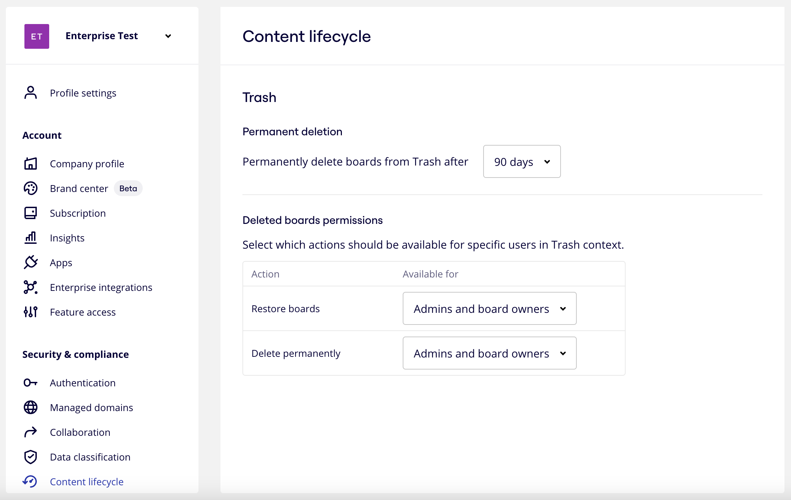

:::note
When you update the permanent deletion period, the updated period applies only to boards that are newly moved to the Trash. Boards that are already in the Trash keep their existing deletion period.
:::

1. From your Miro dashboard, click your avatar in the far-right and go to **Admin Console**.
2. Under **Security & compliance,** click **Content lifecycle**.
   *Set the permanent deletion period in Admin Console*
3. For **Permanent deletion**, select the number of days after which boards in trash are automatically and permanently deleted.
4. Click **Save**.
