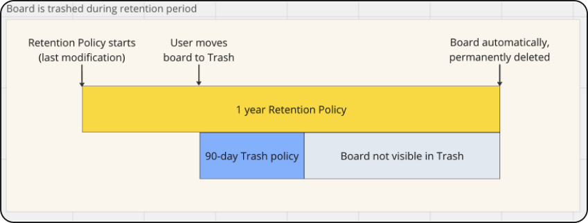
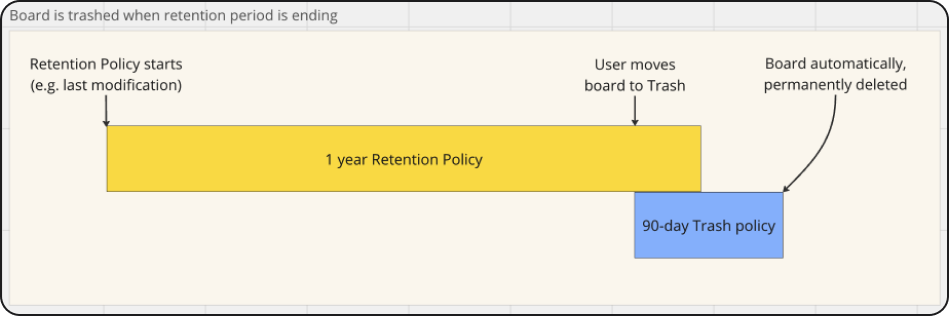
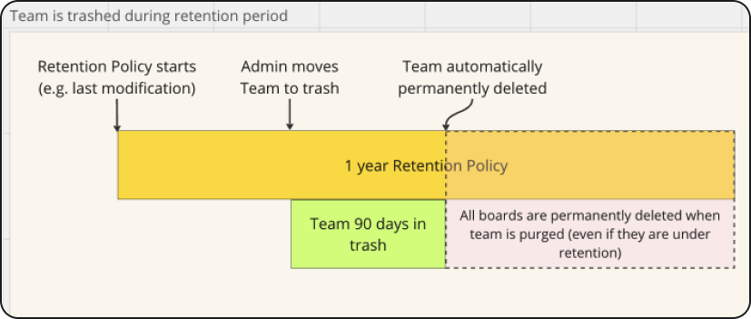

## Board is trashed during retention period

**Retention Policies override Trash Policies.** If a board under retention is moved to the trash during the initial or middle phase of its retention period, the board remains in the trash for the duration configured in the Trash Policy (default 90 days). After this duration, the board no longer appears in the trash. However, the board will persist and be retained until the completion of the retention period, after which the board is then automatically purged. Figure 1 illustrates this scenario.

*Figure 1: Board is trashed during retention period*

## Board is trashed when the retention period is ending

**Trash Policy remains active after the retention period is over.** If a board under retention is moved to the trash when the retention period is ending, the board stays in the trash for the duration configured in the Trash Policy (default 90 days). After this duration, the board no longer appears in the trash. After the retention period ends, the board can be permanently deleted manually and is automatically purged after the Trash Policy ends. Figure 2 illustrates this scenario.

*Figure 2: Board is trashed when the retention period is ending*

## Team is trashed during retention period

**When a team is purged, all boards that belong to a team are permanently deleted.** When a team is moved to the trash then all the boards belonging to that team are permanently deleted after 90 days, including boards that have a retention policy. If a trashed team is permanently deleted manually by an Admin, the same result applies, all the boards belonging to the team are permanently deleted even if those boards are under retention. Figure 3 illustrates this scenario.

*Figure 3: Team is trashed during retention period*
