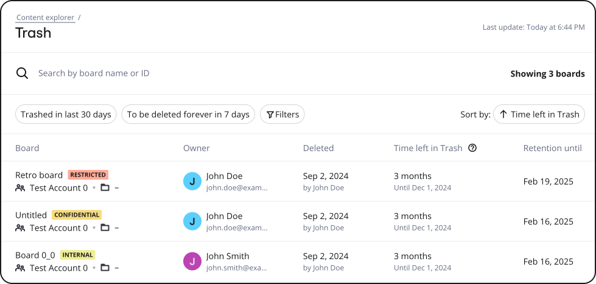
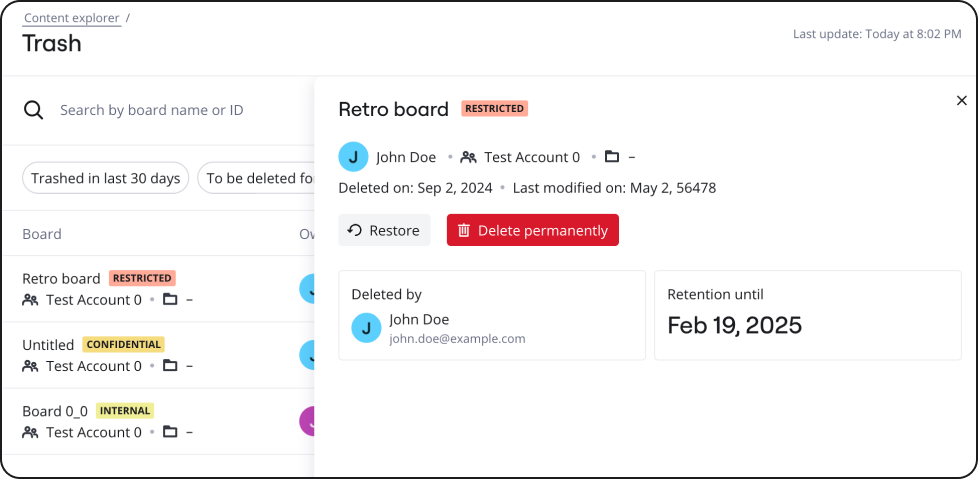

The Content Explorer (Figure 1) allows [Content Admins](../../../administration/get-started-as-a-miro-admin/02-understand-admin-roles-and-their-privileges.md) to view all boards that are in Trash.

*Figure 1: Content Explorer displaying boards in Trash*

The Content Explorer is a one-stop location where you can:

- View boards in trash. View information such as the board name, board owner, the date when the board was deleted, the time left in Trash, and the date until when the board will be retained per the applicable Retention policy.
- Filter results to view information specific to your requirement. For example, you can filter the list of boards based on  general criteria such as the team, owner, classification. You can also filter based on deletion criteria, such as trashed from, trashed until, purging from, and purging until dates. You can filter based on multiple criteria at once.
- Review trash-related board information by clicking the row item. A slide-out panel (Figure 2) appears where you can view information, such as the board name, board owner, team to which the board belongs, date when the board was deleted, date when the board was last modified, the user who deleted the board, and the date until when the board is under retention.
  
  Figure 2: Slide-out panel

:::note
To review boards in Trash, you must have the [Content Admin role](../../enterprise-subscription-management/enterprise-guard-overview/03-understand-admin-roles-and-their-privileges.md). To request for the Content Admin role, contact your Company Admin.
:::

## Review boards in Trash

To review a board in Trash, perform the following steps:

1. If you are on the **Content Explorer** page, skip to step 2.
   If you are not on the **Content Explorer** page:
   a. Go to your [Miro settings.](https://miro.com/app/settings)
   b. On the left pane, under **Enterprise Guard**, click **Content explorer**.
2. On the **Content explorer** page, under **Content lifecycle**, click **Trash**.
3. On the **Content explorer/Trash** page, click the board that you want to review.
   A slide-out panel (Figure 3) appears on the right of the screen with the following information:
   - Board name
   - Board owner
   - Team to which the board belongs
   - Restore board button, which allows you to restore the board from the Trash
   - Delete board permanently button, which allows you to delete the board permanently. Note that retention policies are still applicable.
   - User who deleted the board,
   - Date until when the board is under retentionFigure 3: Slide-out panel

## Filter Content Explorer board list

There may be times when the Content Explorer displays a long list of boards that are under retention, and you want to customize the result list based on specific requirements. [Data Governance Admins](../../enterprise-subscription-management/enterprise-guard-overview/03-understand-admin-roles-and-their-privileges.md) now have the capability to filter the board list according to a variety of criteria, enhancing their ability to focus on key aspects of their content lifecycle management tasks. For more information, see [Filter list of boards under Search, filter, or sort list of boards in Trash](../../canvas-25-admin-features/content-lifecycle-management/14-search-filter-or-sort-list-of-boards-in-trash.md).
