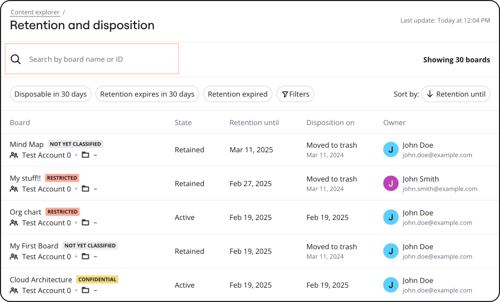
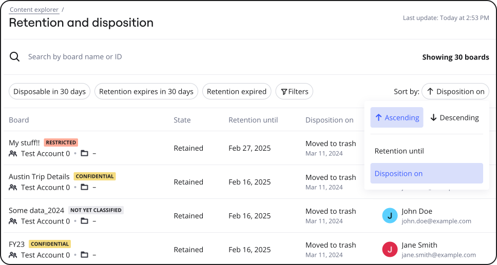
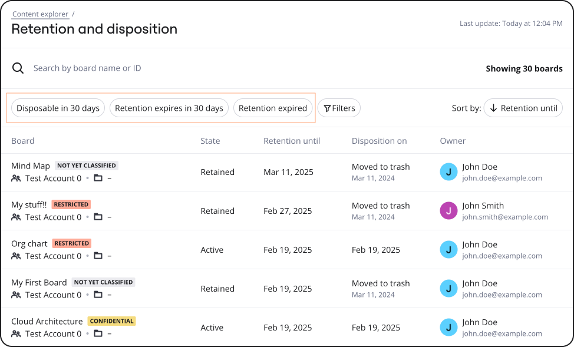
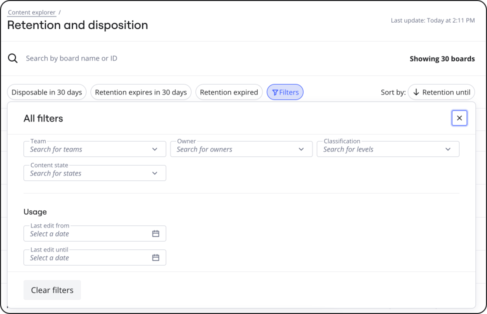

There may be times when the Content Explorer displays a long list of boards that are under retention, and you want to customize the result list based on specific requirements. [Data Governance Admins](../../enterprise-subscription-management/enterprise-guard-overview/03-understand-admin-roles-and-their-privileges.md) now have the capability to search, filter, or sort the board list according to a variety of criteria, enhancing their ability to focus on key aspects of their content lifecycle management tasks.

## Search for a specific board

You can search for specific boards by typing in keywords of the board name or the board ID in the search bar located at the top of the Content Explorer.

:::tip
You can easily obtain the board ID from the board URL.
:::

## Sort the Content Explorer board list

You can sort the board list based on a specific criteria in an ascending or descending order. For example, you can sort the board list in an ascending order, based on the disposition date.

To sort the board list, click the button beside the **Sort by** label and select the appropriate sort criteria. For example, if you want to sort the board list in an ascending order, based on the disposition date, click the button beside the **Sort by** label, click **Ascending**, and then click **Disposition on**.

## Filter Content Explorer board list

The filtering options (Figure 4) not only include board team and owner criteria, but also extend to board usage and disposition-related criteria.

### Quick filters

You can use quick filters to filter the list of boards in just one click.

### Smart filters

You can also filter the board list using smart filters that allow you to narrow down the list of boards based on multiple board-related criteria such as the team, owner, classification level, board state or the board usage criteria, such as the last edited duration (last edit from and last edit until dates). You can also filter content based on retention and disposition policy criteria, such as the retention or disposition policy applied, or the retention start and end date.

Additionally, you can can select and combine multiple filter criteria at once. The variety of filtering options empowers Data Governance Admins to streamline their analysis, quickly isolating and addressing specific content lifecycle management tasks.

*
Figure 4: Smart filter criteria*

:::note
To filter the Content Explorer result list, you must have the [Data Governance Admin role](../../enterprise-subscription-management/enterprise-guard-overview/03-understand-admin-roles-and-their-privileges.md). To request for the Data Governance Admin role, contact your Company Admin.
:::

To use smart filters in the Content Explorer result list, perform the following steps:

1. If you are on the **Content Explorer** page, skip to step 2.
   If you are not on the **Content Explorer** page:
   a. Go to your [Miro settings.](https://miro.com/app/settings)
   b. On the left pane, under **Enterprise Guard**, click **Content explorer**.
2. On the **Content explorer** page, under **Content lifecycle**, click **Retention and disposition**.
3. On the **Content explorer/Retention and disposition** page, click the **Filters** button at the top of the board list.
   The **Filters** box appears.
   *
   Figure 5: Filters box*
4. Click the appropriate filter criteria that meet your requirements. You can:
   - Filter the board list based on various criteria such as the board location and owner criteria such as the team, owner, classification level, board state or the board usage criteria, such as the last edited duration (last edit from and last edit until dates).
   - Filter content based on disposition and retention policy criteria, such as the disposition or retention policy applied, or the retention start and end date.
   - You can filter based on multiple criteria at once.

   The Content Explorer updates the result list to match your filter criteria in real time.
