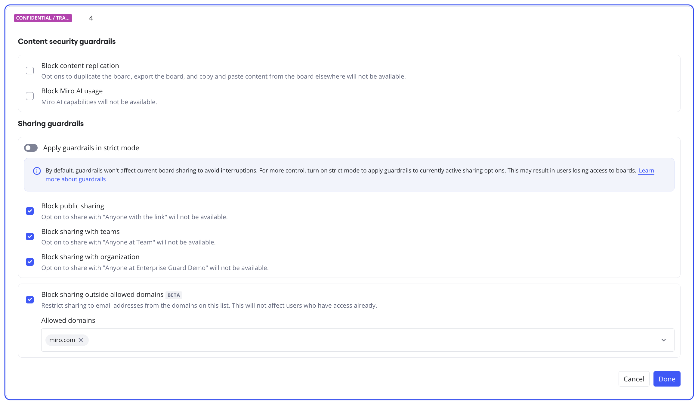

Defining guardrails is the third step of the auto-classification and guardrails configuration flow. In this step of the flow, you will configure the guardrails, which are the restrictions applicable for each classification level, such as block public sharing, block sharing with teams, block sharing with organization, or block content replication. For example, you can configure guardrails to block public sharing, block sharing with teams, block sharing with organization, and block content replication for users of boards that are classified as CONFIDENTIAL.

### Prerequisites

- You must complete the first and second step of the auto-classification and guardrails flow, [1: Define classification levels](../../canvas-25-admin-features/data-classification/07-define-classification-levels.md) and [2: Define auto-classification](../../canvas-25-admin-features/data-classification/07-define-classification-levels.md).
- You must know the guardrails that you want to assign to each classification level based on your security and governance requirements.
- You must have the [Sensitive Content Admin role](../../enterprise-subscription-management/enterprise-guard-overview/03-understand-admin-roles-and-their-privileges.md). To request for the Sensitive Content Admin role, contact your Company Admin.

Admins have two options for rolling out Intelligent Guardrails in their organization:
- **Default mode:** By default, guardrails do not affect active sharing options on boards to avoid disrupting ongoing collaboration, including when the boards are reclassified during auto-classification.

- **Strict mode:** When the Apply guardrails in strict mode toggle is turned on, guardrails override all active sharing options. This provides Admins with the strictest levels of control, but can also result in some users losing board access immediately.

## Assign guardrails

To assign guardrails to a classification level, perform the following steps:

1. On the **Define guardrails** page, click the **Edit** icon of the classification level for which you want to assign the guardrails. For example, if you want to assign guardrails for the CONFIDENTIAL classification level, click the Edit icon on the row of the CONFIDENTIAL classification level.
2. Select the checkbox for each guardrail label that you want to assign to this classification level. For example, if you want to block public sharing, block sharing with teams, block sharing with organization, block content replication for the users of boards that are classified as CONFIDENTIAL, block sharing outside allowed domains, and block Miro AI usage, select the following check boxes:
   - **Block content replication**- **Block Miro AI usage (Beta)**
   - **Block public sharing**
   - **Block sharing with teams**
   - **Block sharing with organization**
   **- Block sharing outside allowed domains (Beta)**
   After you select this check box, you must add the domains that you want to allow by typing and selecting from the list of domains allowed in the organization, or by typing a new domain in the box and clicking + **Add**.
   For more information on each content and sharing guardrail, see [Intelligent Guardrails overview and scenarios](../../canvas-25-admin-features/data-classification/01-intelligent-guardrails-overview.md).
3. By default, guardrails do not affect active sharing options on boards to avoid disrupting ongoing collaboration, including when the boards are reclassified during auto-classification.

   If you want to apply guardrails and override all active sharing options, turn on the **Apply guardrails in strict mode** toggle. This can result in users losing access to boards. This provides Admins with the strictest levels of control, but can also result in some users losing board access immediately.
   
4. Click **Done**.
   Your configuration is saved, but it will only take effect after you click **Publish** on the [**Review impact**](../../canvas-25-admin-features/data-classification/06-review-impact.md) page.
5. When you are done with defining guardrails for various classification levels, proceed to [Complete guardrails configuration](../../canvas-25-admin-features/data-classification/05-define-guardrails.md#complete-guardrails-configuration).

## Complete guardrails configuration

After you finish assigning guardrails for different classification levels, click **Next**. Your configuration is saved, but it will only take effect after you click **Publish** on the [Review impact](../../canvas-25-admin-features/data-classification/06-review-impact.md) page.
