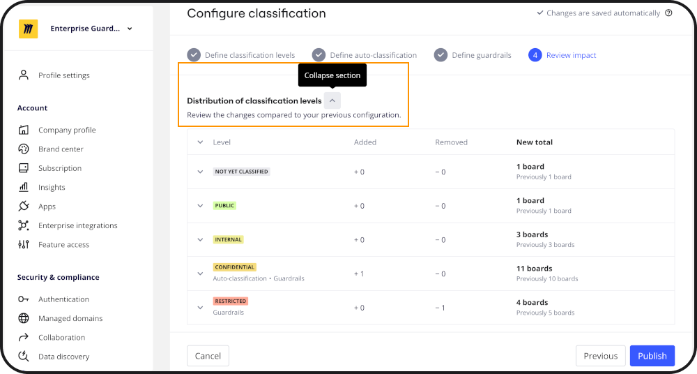
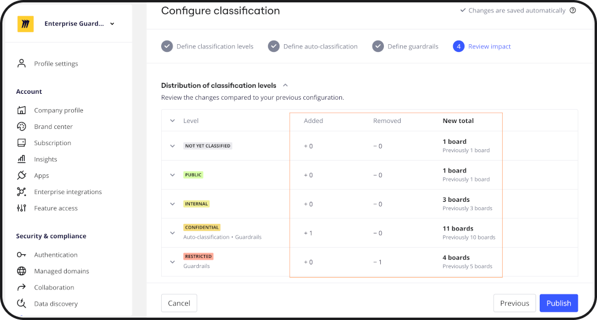
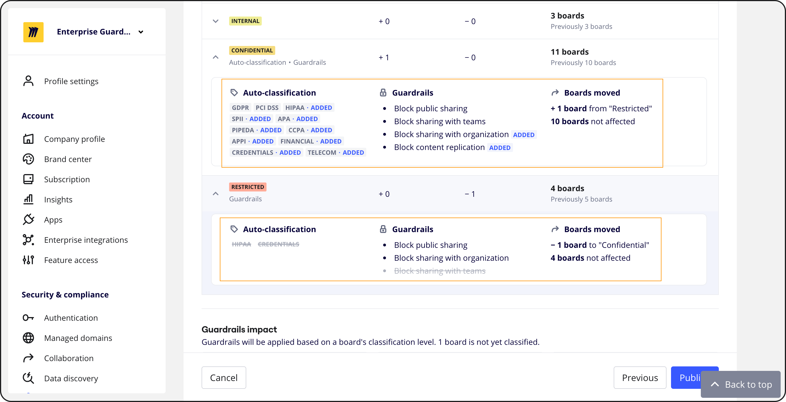
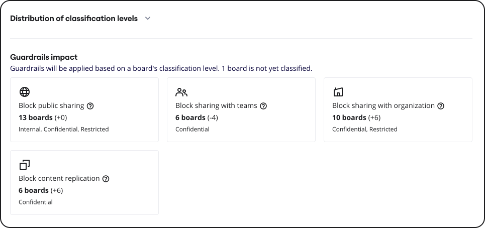

This is the last step of the auto-classification and guardrails configuration flow. In this step of the flow, you must review the impact of the classification or guardrails configuration updates. In this step of the flow, you must review the impact of the changes you are making to the classification or guardrails configuration. The following sections describe the information available in the review impact page and various actions you can take.

## Distribution of classification levels

This section allows you to review the impact of your updated configuration in terms of the changes for each board classification level.

The **Distribution of classification levels** section is collapsible, enhancing your ability to scroll through the list of updates more efficiently (see Figure 1).

*Figure 1: Collapsible Distribution of classification levels section*
The column-based user interface simplifies the process of comparing and reviewing board classification updates. We've provided distinct columns that display the number of boards added, number of boards removed, and updated total for each classification level (Figure 2).

*Figure 2: Column-based user interface displaying the number of boards added, number of boards removed, and updated total for each classification level*

The drill-down feature offers a comprehensive view (Figure 3) of the following details:
- Auto-classification labels added or removed.
- Guardrails added or removed.
- Number of boards that shifted to a specific classification level.
- Number of boards unaffected by the configuration changes you've made.

*Figure 3: Drill-down feature with comprehensive view of updates*

## Guardrails impact

This section displays the guardrails that will be applied based on a board's classification level, the total number of boards that will have each specific guardrail. The number in  parenthesis indicates the number of boards for which the guardrail is added or removed after the new configuration is published. Additionally, this section also displays the number of boards that are unclassified (Figure 4).

To update the guardrails configuration, click **Previous**.
*
Figure 4: Configure classification > Review impact*

## Update the auto-classification configuration

To make updates after reviewing the impact of the updates you’ve made to the auto-classification and guardrails configuration, click the **Previous** button, make the updates to the configuration, and then review the impact once again.

## Publish configuration

After you review the impact of the classification or guardrails configuration you've made, click **Publish**.

:::note
**Notes:**
- The classification level configuration is applied immediately.
- The guardrails configuration is applied immediately.
- When new boards are added with sensitive data, these boards are auto-classified after the next Data Discovery cycle is complete.
- When board content is updated (removal or addition of sensitive content), these boards are auto-classified after the next Data Discovery cycle is complete.
:::
