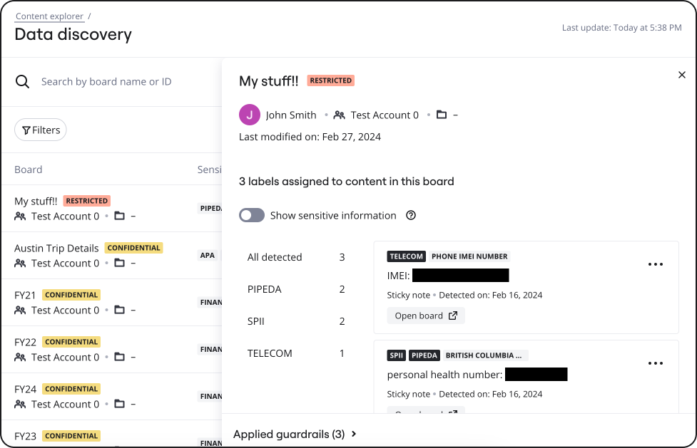

In the process of data discovery, you might encounter situations where the system generates matches that, while technically accurate, may not be relevant or regarded as sensitive data based on various security policies and specific needs of an organization. Suppressing a match that does not pose a security or privacy risk becomes crucial for tailoring the data discovery process to an organisation’s specific data security and privacy requirements.

There may also be times when the system incorrectly flags data on your boards as likely sensitive (a false positive). Various factors contribute to these occurrences, including the proximity of related terms or the formatting of sensitive data. You can also suppress false positive matches.

When you suppress a match, the updates happen in real-time. The board classification and the applied guardrails are also updated per the Auto-classification and Intelligent Guardrails configuration.

:::note
To suppress a sensitive content match, you must have the [Sensitive Content Admin role](../../enterprise-subscription-management/enterprise-guard-overview/03-understand-admin-roles-and-their-privileges.md). To request for the Sensitive Content Admin role, contact your Company Admin.
:::

To suppress a sensitive content match, perform the following steps:

1. If you are on the **Content Explorer** page, skip to step 2.
   If you are not on the **Content Explorer** page:
   a. Go to your [Miro settings.](https://help.miro.com/hc/articles/https://miro.com/app/settings)
   b. On the left pane, under **Enterprise Guard**, click **Content explorer**.
2. On the **Content explorer/Data discovery** page, click the board that you want to review.
   A slide-out panel appears on the right of the screen.
   *
   Figure 1: Slide-out panel*
3. Click the ellipsis beside the sensitive data match that you want to suppress, and then select **Hide match**. Note that the updates happen in real-time. The board classification and the applied guardrails are also updated per the Auto-classification and Intelligent Guardrails configuration.

   When you suppress a match, the updates happen in real-time. The board classification and the applied guardrails are also updated per the Auto-classification and Intelligent Guardrails configuration.

   Repeat this step for every sensitive data match that you want to suppress.
4. Click on the next board that you want to work with in the Content Explorer result list and perform the necessary actions, or close the slide-out panel by clicking the **Close** button at the top-right of the panel.
