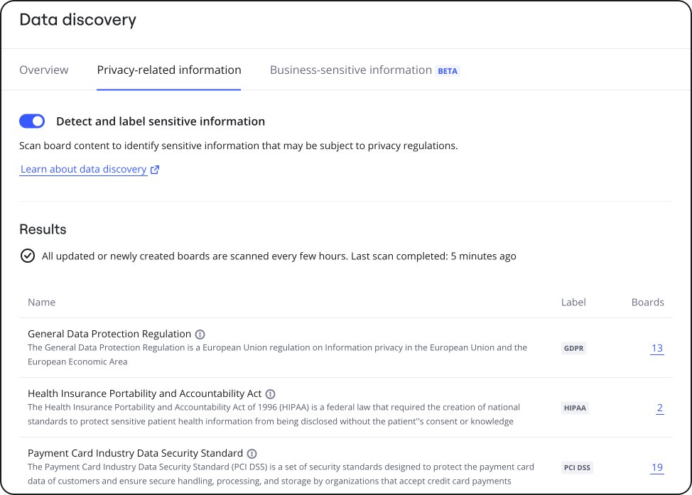

The Data Discovery cycle runs at least once every hour and scans all boards updates for privacy-related information. This includes boards that were already scanned in the previous data discovery cycle.

:::note
To view Data Discovery results, you must have the [Sensitive Content Admin role](../../enterprise-subscription-management/enterprise-guard-overview/03-understand-admin-roles-and-their-privileges.md). To request for the Sensitive Content Admin role, contact your Company Admin.
:::

*
Figure 1: Data discovery results*

While we are continuously working with our technology partner and customers to improve the sensitive content detection system, we cannot guarantee that it will find and flag 100% of the sensitive data on your boards. Our sensitive content detection system uses patterns and other criteria to determine the probability of a match. There may be times when the system incorrectly flags data on your boards as likely sensitive (a false positive) or fails to flag data as sensitive (a false negative). Various factors contribute to these occurrences, including the proximity of related terms or the formatting of sensitive data.

For more information on how you can suppress false positive matches, see [Suppress a sensitive content match](../../canvas-25-admin-features/data-discovery/11-suppress-a-sensitive-content-match.md).

## View information about last completed data discovery scan

The data discovery **Results** section displays when the last data discovery scan was completed, represented in a Month Day, Year date format, and an Hour:Minute AM/PM, with a time zone specification (GMT+offset) time format. For example, Dec 14, 2023, 10:15 PM GMT+1 (Figure 1).

## View data discovery results

The data discovery **Results** section displays information, such as the name of the regulation, a brief description, the associated label, and the count of boards containing potentially sensitive content that might fall under the scope of the regulation (Figure 1).

To explore the boards with highly-sensitive data, click the board count link. The Content Explorer appears with the list of boards. For more information, see [Review boards with highly-sensitive data](../../canvas-25-admin-features/data-discovery/16-review-boards-with-privacy-related-information.md).
