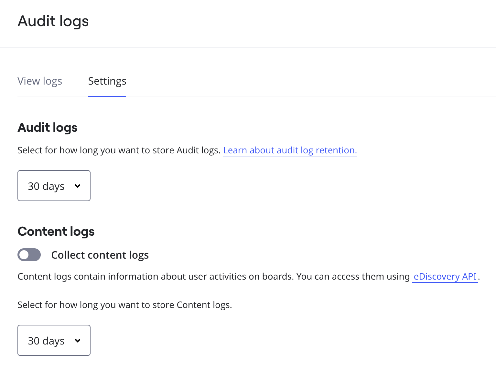
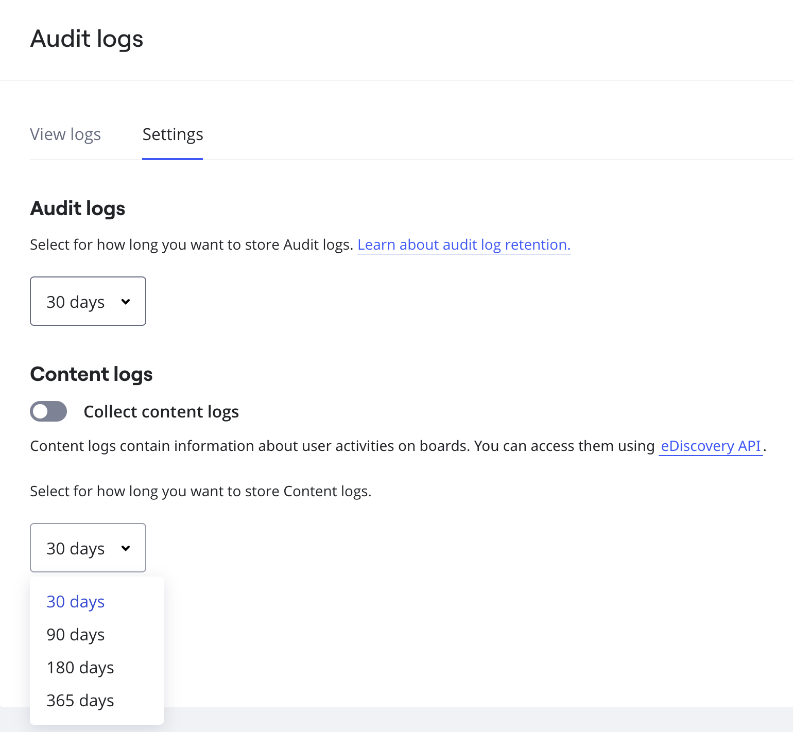

Content logs allow enterprise customers to collect detailed records of user activity on boards and leverage them for investigations or regulatory archival.

Content logs can be ingested into various purpose-built tools for legal, compliance, and security purposes. By providing a solution to export user activity data at scale, Miro mitigates customer risk and unlocks opportunities for more knowledge workers across the enterprise to experience the collaborative power of Miro while observing strict security and compliance requirements.

## Content log data

When a user updates a widget on the board, a log entry is created with information, such as the time of the user action, user details, type of action (create, update, delete), board and widget IDs, and other relevant information about the widget's state as a result of users’ actions. Content logs *do not* record updates in widget position, size, or rotation.

## Collecting content logs

The events are logged from the moment an Admin enables the collection of content logs. Collected events are stored for 30 days, by default.

To enable the collection of content logs, perform the following steps:

1. Go to Company Settings.
2. On the left panel, click **Security** > **Audit logs**.
3. Under **Audit logs**, click the **Settings** tab.
4. Under the **Content logs** section, click to turn on the toggle to **Collect content logs**.
   
   *Enabling the collection of content logs*

## Access content logs via API

Admins can use the [Content logs API](https://developers.miro.com/reference/board-content-logs) to programmatically access Content logs data within their organization. Admins can also collect content log data using supported integrations, like Smarsh or Theta Lake.

In order to authenticate access to the API, Admins can choose from the following options:

- Enable eDiscovery toggle in Enterprise Integrations.
- Create a Platform application and give it access to Content log:read scope.
- Install and authorize one of the eDiscovery integrations from the Marketplace.

## Deleting content logs

Admins can set a retention policy for content logs, choosing between 30, 90, 180, or 365 days. By default, the retention period is set to 30 days.

:::note
Once content logs are deleted, they cannot be recovered.
:::

To set a deletion period, perform the following steps:

1. Go to Company Settings.
2. On the left panel, click **Security** > **Audit logs**.
3. Under **Audit logs**, click the **Settings** tab.
4. Under **Content logs**, choose an option from the drop-down list. You will be asked to confirm your choice.
   
   *Setting content logs retention policy*
