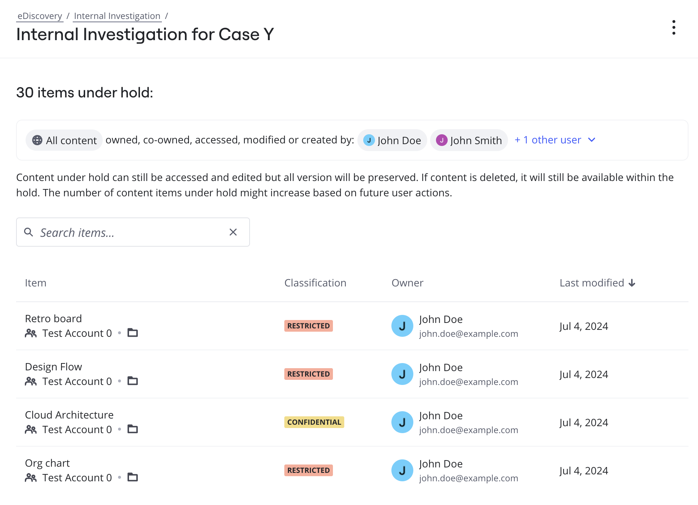

Once a legal hold is in place, [eDiscovery Admins](../../enterprise-subscription-management/enterprise-guard-overview/03-understand-admin-roles-and-their-privileges.md) can review or explore the preserved Miro boards to ensure that all relevant data is intact and ready for legal proceedings or investigations. Reviewing Miro boards under legal hold allows admins to assess the content and identify critical information that may be used as evidence, while ensuring the integrity of the preserved data. By regularly reviewing boards under legal hold, eDiscovery Admins can maintain compliance and ensure that their organization is fully prepared for the legal requirements ahead.

*Figure 1: Sample list of boards in legal hold*

To review boards under legal hold, perform the following steps:

:::note
You must have the [eDiscovery Admin role](../../enterprise-subscription-management/enterprise-guard-overview/03-understand-admin-roles-and-their-privileges.md) to perform this task. To request for the eDiscovery Admin role, contact your Company Admin.
:::

1. Go to your [Miro settings](https://miro.com/app/settings).
2. On the left pane, under **Enterprise Guard**, click **eDiscovery**.
3. On the **eDiscovery** page, click the case that contains the legal hold you want to review.
4. On the **Legal hold** page, click the legal hold for which you want to review the matching boards under hold.
   The list of boards under this legal hold appears with the following information:
   - Name of the legal hold
   - Type of content affected by the the legal hold
   - Users in this legal hold
   - Board details, such as the name of the board under hold, team name, board classification, owner, and last modified date.
   You can search the list of boards by typing keywords in the **Search** box

   **Notes:**
   - Boards under hold can still be accessed and edited but all version will be preserved. If content is deleted, it will still be available within the hold. The number of content items under hold might increase based on future user actions.

   - When a user under legal hold opens, modifies, or interacts with a board in any way (renaming or adding content), that board is flagged and preserved. For example, if the board’s name is changed or content is updated, it will be automatically placed on legal hold. Additionally, board ownership and board creation are put on hold.

   - When a legal hold is created, it applies to boards that custodians created, owned, or co-owned at the time of the hold. Additionally, any boards custodians access and modify after the hold is in place are also included. Historical board access and update details are not available in this release.
