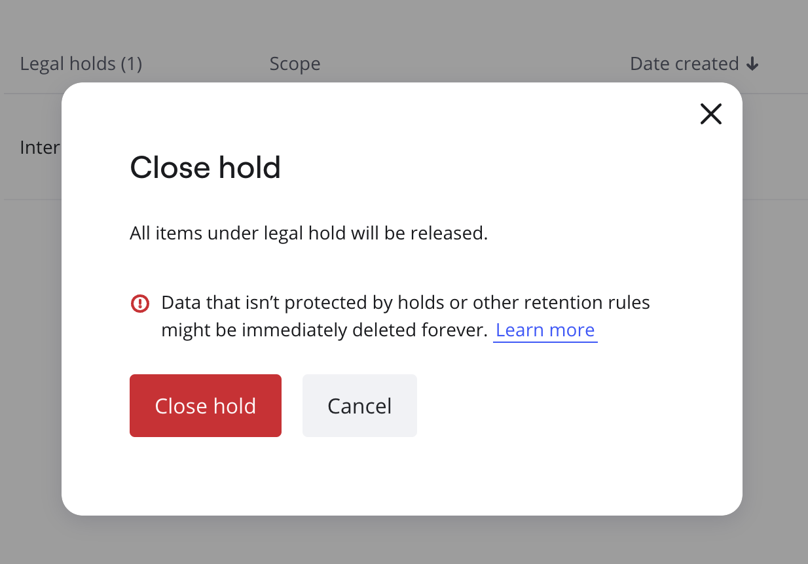

Closing a legal hold is one of the final steps in the eDiscovery process once the litigation or investigation has concluded. For [eDiscovery Admins](../../enterprise-subscription-management/enterprise-guard-overview/03-understand-admin-roles-and-their-privileges.md), this process involves releasing the Miro boards and custodians that were under legal hold, allowing the preserved boards to return to normal operations. Closing a legal hold ensures that data management processes can resume as usual, and the system can archive or delete information that is no longer required to be preserved for legal purposes. Once the hold is lifted, the content can be managed according to the organization's retention policies. By efficiently closing a legal hold, eDiscovery Admins help their organization maintain compliance while optimizing the management of Miro boards and reducing unnecessary data retention.

To close a legal hold, perform the following steps:

:::note
You must have the [eDiscovery Admin role](../../enterprise-subscription-management/enterprise-guard-overview/03-understand-admin-roles-and-their-privileges.md) to perform this task. To request for the eDiscovery Admin role, contact your Company Admin.
:::

1. Go to your [Miro settings](https://miro.com/app/settings).
2. On the left pane, under **Enterprise Guard**, click **eDiscovery**.
3. On the **eDiscovery** page, click the case within which you want to close a legal hold.
4. Click the ellipsis (three dots) on the row of the legal hold you want to close, and then click **Close legal hold**.
   The **Close hold** confirmation box (Figure 1) appears, which informs you that all items under legal hold will be released and data that is not protected by holds or other retention policies might be immediately deleted forever.
   
   *Figure 1: Close hold confirmation box*
5. Once you are sure that you want to close the legal hold, click **Close hold**.
   The legal hold will be deleted. It may take a couple of minutes to release the legal hold from all  matching boards.
