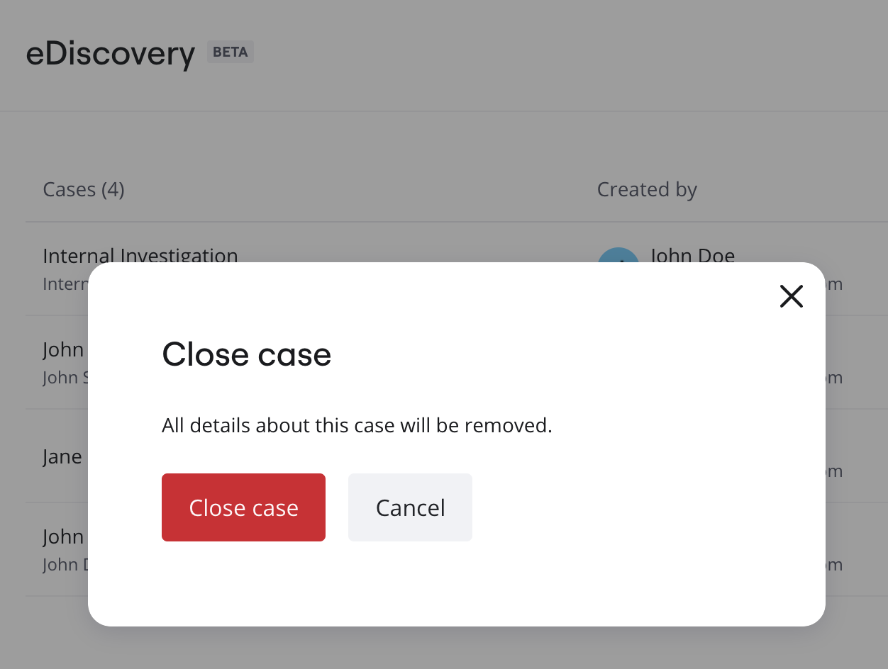

Closing a case is the final stage in the eDiscovery process, marking the conclusion of a legal matter or investigation. [eDiscovery Admins](../../enterprise-subscription-management/enterprise-guard-overview/03-understand-admin-roles-and-their-privileges.md) must ensure that all associated legal holds within the case are closed before closing the case.

To close a case, perform the following steps:

:::note
You must have the [eDiscovery Admin role](../../enterprise-subscription-management/enterprise-guard-overview/03-understand-admin-roles-and-their-privileges.md) to perform this task. To request for the eDiscovery Admin role, contact your Company Admin.
:::

1. Ensure that all associated legal hold within the case are closed. For more information, see [Close a legal hold](../../canvas-25-admin-features/ediscovery/12-close-a-legal-hold.md).
2. Go to your [Miro settings](https://miro.com/app/settings).
3. On the left pane, under **Enterprise Guard**, click **eDiscovery**.
4. On the **eDiscovery** page, click the case that you want to close.
5. Click the ellipsis (three dots) on the row of the case you want to close, and then click **Close case**.
6. The **Close case** confirmation box appears, which informs you that all details about this case will be removed.  
7. Once you are sure that you want to close the case, click **Close case**.
   The case is deleted.
