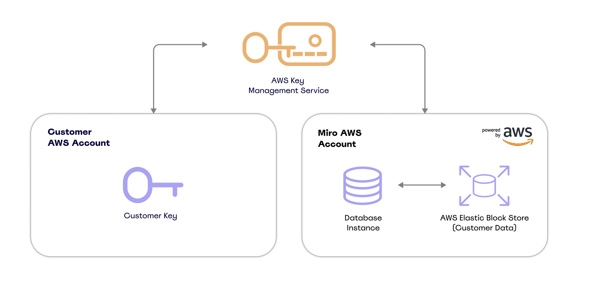

The Enterprise Guard add-on includes an option for Encryption Key Management (EKM). EKM provides centralized control over encryption keys to help safeguard your data. This cloud-based solution enables monitoring of activity logs associated with encryption keys and allows the revocation of key access to your data.

For additional control and visibility into how encryption keys are used in Miro, you can also use Bring Your Own Key (BYOK). With BYOK, you manage the encryption of your organization’s data within the Miro platform.

## Experience the advantages of EKM

- **Seamless Implementation:** Effortlessly integrate EKM into your system without the need for hardware installation or maintenance, thanks to its 100% cloud-based solution.

- **Total Key Access Control:** Enjoy complete authority over your encryption keys. You have the ability to revoke your key, rendering all encrypted data inaccessible to both Miro and end users.

- **Enhanced Access Visibility:** Gain insights into key-related activities with access visibility. Monitor and track logs through AWS CloudTrail for a thorough understanding of your encryption key's usage.

## How does EKM protect customer data

Miro provides EKM by offering encryption of your Production Data and Backup Data at rest with Custom Encryption Key while the customer grants Miro access to the Custom Encryption Key. Miro supports EKM with a key hosted in your own AWS account via AWS KMS. With EKM, you gain greater auditing visibility and increased access control over data (user-generated content), such as shapes, widgets, and uploaded files.

## Data encryption at Miro

Ensuring the utmost security of your data is a paramount concern at Miro. By default, we employ encryption measures for customer data, both in transit and at rest, irrespective of their subscription plan. When accessing Miro through the internet, your data enjoys protection through TLS 1.3 encryption and PKI certificates issued by Amazon Web Services (AWS). Upon reaching our servers, your data is further safeguarded through AES-256 encryption at rest, utilizing keys managed by Miro through the AWS Key Management Service (KMS). [Learn more about security at Miro.](https://miro.com/trust/security/)

> Note: You are solely responsible for the security and protection of any and all Backup Data downloaded or transferred by you to your systems or any third-party systems. You are solely responsible for its Custom Encryption Key. If you lose your Custom Encryption Key, Miro cannot assist you in recovering access to the data. Once your Production Data or Backup Data is in transit or outside of Miro’s control, Miro cannot guarantee its protection.

## How do I enable Encryption Key Management

Configuring and deploying Encryption Key Management requires the assistance of Miro's internal teams. If you need assistance, contact your Miro representative or [request assistance via Miro's Support team here](../../../using-miro/tools/troubleshooting/06-contacting-miro-support.md).

## Glossary

- **Backup Data:** A snapshot of your content created in or submitted to the Miro service that is stored by Miro for recovery and other purposes.

- **Custom Encryption Key:**  A unique security key customized and implemented by you that individuals require to access your Production Data and Backup Data.

- **Production Data:** All data you and your users access during the use and day-to-day operation of the Miro services.
