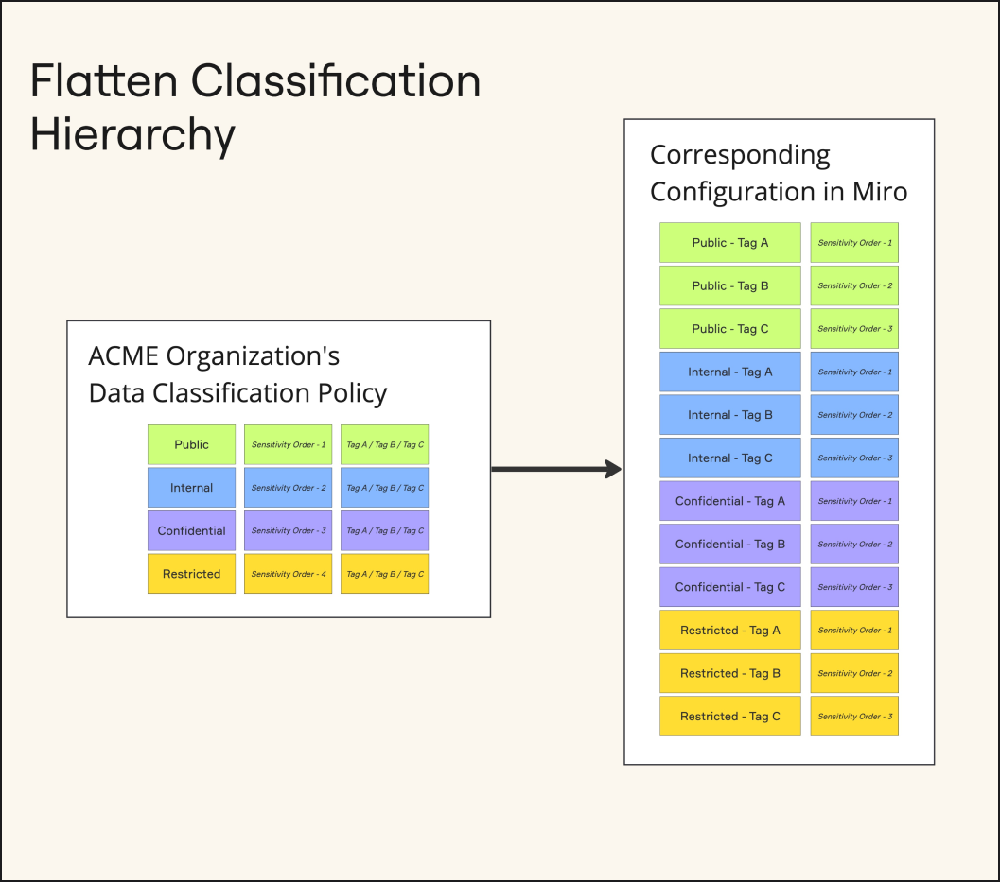

## Data security overview

Find, classify, and secure sensitive content using the Data Security features of Enterprise Guard.

- **Data Discovery**: Discover sensitive data such as Personal Identifiable Information (PII), Personal Health Information (PHI), and Payment Card Industry (PCI) data in just a few clicks.
- **Auto-classification**: Set criteria for Miro to automatically classify your boards based on sensitive content found on boards.
- **Intelligent Guardrails**: Enforce real-time security rules and restrict what users can do with a board based on the board's manual or automated classification.
- **Content Explorer**: Get a unified view of all Miro boards with sensitive content and each board’s classification.

*Find, classify and secure sensitive data*

## Deployment overview

This deployment approach prioritizes securing sensitive data found through Enterprise Guard’s Data Discovery while minimizing disruption to end-user activity.

<iframe allow="fullscreen; clipboard-read; clipboard-write" allowfullscreen="allowfullscreen" frameborder="0" height="390" scrolling="no" src="https://miro.com/app/live-embed/uXjVNrjv8h8=/?moveToViewport=-3966,-1331,10269,3273&amp;embedId=881755370090" width="690"></iframe> *Enterprise Guard Deployment Overview*

#### Configuration steps

1. [Audit Sensitive Data](#audit-sensitive-data)
2. [Configure Classifications](#configure-classifications)
3. [Publish Classifications](#publish-classifications)
4. [Deploy Guardrails](#deploy-remaining-guardrails)
5. [Loosen Blanket Restrictions](#loosen-blanket-collaboration-restrictions)

#### End-user communication and enablement steps

1. [Create a Rollout Plan](#create-a-rollout-plan)
2. [Initial Enterprise Guard Announcement](#announce-upcoming-changes)
3. [Classifications Roll-out Announcement](#classification-announcement)
4. [Resolve Unnecessary Occurrences of Sensitive Data](#resolve-unnecessary-occurrences-of-sensitive-data)
5. [Guardrails Roll-out Announcement](#guardrails-announcement)

## Audit Sensitive Data

Complete the audit described in this section as early as possible in your Enterprise Guard deployment. It has no impact on end-users at all but will allow you to assess the scope and severity of sensitive data occurrences in your Miro instance.

Use the audit results to create a rollout plan that balances end-user change management with your organization’s security policies.

### Turn on Data Discovery

The first step in configuring your data classification framework is to enable Data Discovery in your Miro account. Miro will then scan all of your boards for sensitive data according to the Region and/or Privacy Regulation Policies (labels) enabled.

[How to enable Data Discovery in your Miro environment](../../canvas-25-admin-features/data-discovery/13-activate-privacy-related-data-discovery.md)

It may take up to 24 hours for sensitive content to be detected. Once Miro has identified the sensitive content that matches these sensitivity labels (ie. GDPR, PCI), the Content Explorer can be used to review the results in more detail.

### Audit with the Content Explorer

Content Explorer gives Sensitive Content Admins a way to review occurrences of sensitive data discovered by Miro Enterprise Guard, revealing where the occurrences have taken place (board name), who the actor is (board owner), why the occurrence was flagged (label), and what the content is.

Use the filters in the Content Explorer such as “Classification = Confidential” to focus on the most important occurrences of sensitive data.

## Create a Rollout Plan

Once Data Discovery is enabled and occurrences of sensitive content are revealed, it's time to create a rollout plan for Classifications and Guardrails according to your organization's policies, requirements, severity of findings, and your available resources. The sections below offer suggested communication best practices to inform end-users and support your change management process.

### Announce Upcoming Changes

Ahead of publishing your classification framework into Miro, it’s recommended to inform users of your organization’s decision to enable Enterprise Guard across all Miro content, and provide context according to your organization’s data security policies and practices.

Consider including the following information:

- What is Enterprise Guard
- Why it’s important for your organization
- Overview of which aspects of the end-user experience will be affected
- Explanation of your organization’s classification framework
- Which data regulation policies will be included in data discovery
- Timeline of upcoming changes
- Where to go with questions and feedback

## Configure Classifications

### Add Classifications Framework

Establishing data classifications in Miro is designed to be flexible and adaptable to any existing data classification frameworks within your organization.

The classification levels in Miro will display their current sensitivity order. Match the sensitivity order to your organization’s classification hierarchy where sensitivity order 1 is the least sensitive classification level.

[How to configure Classifications](../../canvas-25-admin-features/data-classification/07-define-classification-levels.md)

### Flattening Classification Frameworks

Miro Enterprise Guard classification structure is designed to adapt to your existing data classification policy.

If your organization’s existing classification framework has more than one layer of hierarchy (such as sub-classification levels or tags), flattening your classification framework may be required. The example below depicts a classification framework with 3 tags that would need 3 separate classification levels per tag per level.

It’s recommended to keep classification levels to a minimum.


*Flattening classification frameworks*

### Link Documentation and Write Descriptions

Clear classification descriptions and guidelines will inform your end users about the classification policy, at-scale. While end-users are on the board, classification descriptions will appear next to the classification label. End users will see a "learn more" question mark in each panel that links out to the classification documentation.

|  |  |
| --- | --- |
| **Classification description** | When users click the board classification badge, the description of the current classification level appears.  Add a meaningful description that informs your users about the sensitivity of this board and the recommended precautions or actions.  Classification-description.png |
| **Link to guidelines** | When the user clicks the learn more icon (question mark icon) beside the board classification badge, this URL is loaded in a new browser tab.  Provide your users more information about your board classification levels and how to work with them.  Consider including:   - What is Enterprise Guard - Why it’s important for your organization - Overview of which aspects of the end-user experience will be affected - Explanation of your organization’s classification framework - Which data regulation policies will be included in data discovery - Where to go with questions and feedback |

### Define Auto-classification Criteria

Miro will apply classifications automatically to boards where content matching the corresponding privacy regulation is detected. Each classification level can be linked to multiple of the [Sensitivity labels](../../canvas-25-admin-features/data-discovery/06-sensitivity-labels-and-infotypes-reference.md) but each Sensitivity label can only be linked to a single classification level.

If multiple criteria are met, the most sensitive classification level will be applied.

[How to define Auto-classifications](../../canvas-25-admin-features/data-classification/09-define-auto-classification.md)

### Skip Guardrails Configuration

As stated previously, this guide seeks to prioritize end-user change management in addition to deploying Enterprise Guard. We recommend publishing classifications without guardrails. Board classifications in this configuration will be a visual indicator but will not impact the end-user experience.

Before adding guardrails to the classifications, [resolve unnecessary occurrences of sensitive data](#resolve-unnecessary-occurrences-of-sensitive-data) and [onboard users to manual classification](#onboard-users-to-manual-classification) to ensure a smooth transition without interfering with the critical work happening on the boards.

### Configure Guardrails for Highest Classifications

Using conclusions from your initial audit, you may decide to deploy Guardrails without delay. Consider applying Guardrails to the most sensitive classifications only. This balances the urgency of securing sensitive data while not impacting the vast majority of end-users.

## Publish Classifications

Before publishing auto-classifications, you’ll have the opportunity to review its impact to your end users. If you’ve configured the classification levels without Guardrails, there will be no substantial impact to end-users when you publish.

[How to publish Classifications](https://help.miro.com/hc/articles/16494764223378-Review-impact)

### Classification Announcement

After publishing classifications, send an announcement to your end-users.

Consider including the following information:

- A brief review of Enterprise Guard or reference the previous announcement
- Overview of which aspects of the end-user experience will be affected
- Explanation of your organization’s classification framework
- Which data regulation policies will be included in data discovery
- Timeline of upcoming changes
- Where to go with questions and feedback

## Resolve Unnecessary Occurrences of Sensitive Data

Before releasing Intelligent Guardrails we recommend communicating with board owners whose boards contain sensitive information. It’s possible that the sensitive data is unintentional and can be removed.

Inform users that Intelligent Guardrails will soon be implemented according to your organization’s security policies. Your end-users can take the opportunity to remove unnecessary sensitive data from their boards and prevent disruption to their work.

## Onboard Users to Manual Classification

Even with Auto-classification enabled, many boards will remain unclassified or in the default classification if they are not manually reclassified by end-users.

### Manual Classification End-user Experience

The board owner, [board co-owners](../../../using-miro/sharing-boards/06-co-owners-of-boards-and-spaces.md), editors who are members of the team, and Company Admins with [Content Admins permissions](../../managing-enterprise-teams-and-content/12-content-admin-permissions.md) can update the classification label either by clicking the classification badge or from the board details. Select a new label and click update.

When adjusting the classifications lower in the sensitivity order (for example, from Confidential to Public), users will be required to provide a justification which is logged in your Miro account’s audit logs.

### End-user Communication

Upon the initial deployment of Enterprise Guard it is recommended to send regular communication to end-users that encourage the use of classifications on every board. This will ensure the full suite of guardrails and classifications are utilized and therefore increase the security of your Miro instance.

Consider including the following information:

- A reminder to classify boards regularly
- Instructions on how to classify boards
- Information on providing a justification
- Video | End-user Board Classification (embed links available below)

<iframe allowfullscreen="" frameborder="0" height="315" src="//fast.wistia.com/embed/iframe/3ado2k4f6c" width="560"></iframe>
*Board classification in Miro*

### Resources

- Video | Board Classifications for End-users
  - [Wistia link](https://mirohq.wistia.com/medias/3ado2k4f6c)
  - Embed code:
    - ```
      <script src="https://fast.wistia.com/embed/medias/3ado2k4f6c.jsonp" async></script><script src="https://fast.wistia.com/assets/external/E-v1.js" async></script><div class="wistia_responsive_padding" style="padding:56.25% 0 0 0;position:relative;"><div class="wistia_responsive_wrapper" style="height:100%;left:0;position:absolute;top:0;width:100%;"><div class="wistia_embed wistia_async_3ado2k4f6c seo=false videoFoam=true" style="height:100%;position:relative;width:100%"><div class="wistia_swatch" style="height:100%;left:0;opacity:0;overflow:hidden;position:absolute;top:0;transition:opacity 200ms;width:100%;"></div></div></div></div>
      ```

## Deploy Remaining Guardrails

At this point, end-users should have had ample time to check their boards for unnecessary sensitive data, and manually adjust their board classifications.

[How to deploy Intelligent Guardrails](../../canvas-25-admin-features/data-classification/05-define-guardrails.md#complete-guardrails-configuration)

> ⚠️ Use caution when applying guardrails to the default board classification. Applying guardrails to the default classification will have significant impact on end-users because many boards will have the default classification.

### Guardrails Announcement

After publishing Guardrails, send an announcement to your end-users.

Consider including the following information:

- A reference to previous announcements about Enterprise Guard
- What are Guardrails
- An overview of classifications and their associated guardrails
- How to manually adjust classifications
- Where to go with questions and feedback

## Loosen Blanket Collaboration Restrictions

Enterprise Guard allows you to deploy targeted controls. Before Enterprise Guard, however, there weren’t as many options to tailor controls to specific cases. The result was most likely “blanket controls” — preemptively strict settings that apply to most boards therefore add friction to the collaboration of your Miro users.

Applying blanket controls, such as locking down external collaboration for all users and boards, lacks precision. Users can experience friction when the content they are collaborating on is not sensitive and it can block entire use cases from Miro.

All in all, blanket controls can impact the ROI that you get from Miro, but now with Enterprise Guard, your end users can get more value out of Miro while ensuring that sensitive content is protected. You’ll need to reevaluate a few settings in your account to take full advantage of Enterprise Guard.

*<iframe allowfullscreen="" frameborder="0" height="315" src="//fast.wistia.com/embed/iframe/pukpdy1ji9" width="560"></iframe>
Loosening board restrictions*

### Other Settings vs Enterprise Guard

In Miro, there are 3 settings areas that work together to determine the actual experience of the user.

- Company-level settings
- Team-level settings
- Enterprise Guard

Whenever there are competing settings the strictest setting is implemented. Check here for more information.

### Relevant Settings and Where to Find Them

You will need to re-evaluate a few settings to make sure that Miro is configured holistically. Here is a list of settings that are relevant and where to find them in your Miro account. Some settings can be controlled from both the company level and the team level.

Remember, if two settings apply to the same part of the Miro experience, the stricter setting will dictate the experience.

|  |  |  |
| --- | --- | --- |
| **Setting** | **Description** | **Where it's available** |
| Public links | A public link grants access to a board without logging in. It can be configured to view, comment, or edit access and require a password. | Company-level  Team-level  Enterprise Guard |
| Embedding | Controls if and how users can embed Miro boards into other software or websites. | Company-level |
| Guest settings | A Guest is a user who is invited only to a single board rather than an entire team or account. | Company-level  Team-level |
| Board sharing | Controls how boards can be shared to other users in the account, in and between teams. | Team-level  Enterprise Guard |
