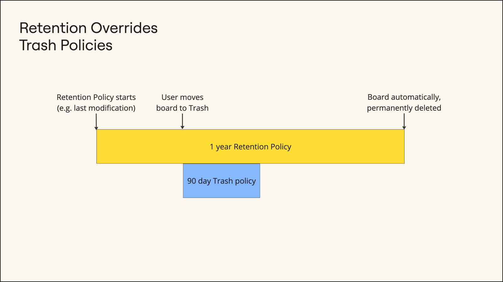

## Content Lifecycle Management Overview

In most enterprises, content is growing exponentially in both volume and complexity. Proper management and governance of Miro boards is critical for multiple reasons, including:

- Proactively adhering to industry-specific regulations or internal organization guidelines
- Minimizing risk in scenarios like legal disputes or security breaches
- Maintaining organizational efficiency

We currently support the following features:

- [Trash policies](https://help.miro.com/hc/articles/13860817985426-Trash-Policy)
- [Retention policies](https://help.miro.com/hc/articles/16855776325778-Retention-policies)

## Content Lifecycle Management Deployment Overview

While the recommended process of [Part 2: Deploy Data Security](../../enterprise-subscription-management/enterprise-guard-deployment-guide/03-enterprise-guard-deployment-guide-part-2-deploy-data-security.md) includes progressive configuration and end-user communication, Content Lifecycle Management does not.

Neither Trash policies nor Retention policies are likely to disrupt end-user activity in Miro and can therefore be configured immediately.

## Deploy a Global Retention Policy

Currently, only a global retention policy is supported by Enterprise Guard. Additional configuration options will become available and offer greater flexibility in the future. Consider regulatory requirements of your industry and organizational policies to determine what your global retention policy duration should be.

Because greater granularity is not available, it may be beneficial to configure your global retention policy to match the longest requirement expected by your organization. For example, if certain content in Miro must be retained for 5 years because of a regulatory requirement, your global retention policy should be set to 5 years.

You can reduce the scope of boards kept under this 5 year retention policy later as Miro releases more granular retention scopes such as classification level or team.

[How to configure Retention policies](https://help.miro.com/hc/articles/16855776325778-Retention-policies)

## Configure the Trash Policy

By default, Miro boards are automatically and permanently deleted from the Trash after 90 days. You can update the default setting and choose to automatically and permanently delete boards from the Trash in 30, 60, 90, or 180 days.

When you update the automatic and permanent board deletion period, the updated period applies only to boards that are newly moved to the Trash. Boards must be manually moved to Trash by Board Owners or Board Co-owners.

When a board is in the Trash but the Trash policy but the deletion period has not ended, certain users can manually and permanently delete the boards. Choose who can do so in the Trash settings between Board Owners or admins.

[How to configure Trash policies](https://help.miro.com/hc/articles/13860817985426-Trash-settings)

## Retention and Trash working together

Retention policies override Trash policies and manual, permanent deletion. See the examples and diagram below.

Examples:

- If a board is moved to the Trash and manually, permanently deleted by the board owner but the board is under a retention policy, the board will be retained. At the end of the retention period, the board will be immediately and permanently deleted.
- If a board is moved to the Trash and the permanent deletion period ends but the board is under a retention policy, the board will be retained. At the end of the retention period, the board will be immediately and permanently deleted.

*Retention and trash working together*
