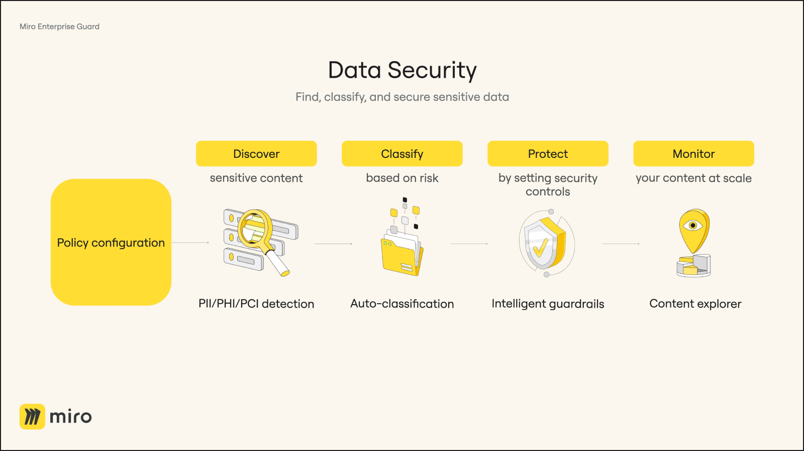

In today's digital age, the exponential growth of data, especially sensitive information has become a significant concern for enterprises. Miro, known for its enterprise-ready, online collaboration workspace that fosters innovation and teamwork, has observed a substantial increase in the complexity and quantity of content within its boards. A notable number of Miro boards contain highly-sensitive data, such as Personal Identifiable Information (PII), Protected Health Information (PHI), Payment Card Information (PCI), and more, presenting challenges to managing risk and ensuring compliance. This trend highlights the importance of implementing advanced security and compliance measures to help prevent potential data breaches and intellectual property leaks.

## Introducing Enterprise Guard: a comprehensive security and governance solution for Miro

Recognizing these challenges, Miro introduces **Enterprise Guard**, a paid add-on that provides advanced security and governance capabilities. Enterprise Guard offers a suite of features that empower organizations to effectively identify, classify, secure, and manage sensitive content across Miro boards. This solution is tailored to ensure compliance and robust data protection at scale.

With the integration of Enterprise Guard into Miro's enterprise ecosystem, organizations can now leverage a more robust, automated, and comprehensive security framework. This add-on is not just about protecting data—it’s about enabling enterprises to continue innovating and collaborating on Miro securely, without impeding business operations.

## Enterprise Guard General Availability release: key features

- **Data Discovery:** Enterprise Guard enables a proactive and thorough [data discovery](../../canvas-25-admin-features/data-discovery/01-data-discovery-overview.md) process, crucial for identifying sensitive data like credit card numbers, social security numbers, and other critical information scattered across various Miro boards. This proactive strategy is crucial in identifying and mitigating potential vulnerabilities, helping you prevent data breaches and ensure compliance.
- **eDiscovery:** Enable secure preservation, tracking, and export of board data to support legal, compliance, and security requirements. The eDiscovery feature in Enterprise Guard helps organizations meet regulatory obligations through [Legal Holds](../../canvas-25-admin-features/ediscovery/02-legal-hold-overview.md), [Content Logs](../../canvas-25-admin-features/ediscovery/06-content-logs-overview.md), and [Board Export](../../canvas-25-admin-features/ediscovery/13-board-export-api-overview.md) capabilities.

  Legal Holds prevent permanent deletion of content relevant to investigations or legal matters by preserving all boards a user under hold interacts with—including all their versions. Content Logs provide detailed records of user activity, which can be exported and integrated into external tools for auditing or legal review. With eDiscovery APIs, Enterprise customers can also export board data at scale, ensuring that critical information is accessible for legal and compliance workflows.
- **Auto-classification**: Set criteria for Miro to [automatically classify your boards](../../canvas-25-admin-features/data-classification/03-auto-classification-overview-and-scenarios.md) based on sensitive content found on boards.
- **Intelligent Guardrails:** [Enforce real-time security rules](../../canvas-25-admin-features/data-classification/01-intelligent-guardrails-overview.md) and restrict what users can do with a board, such as restricting board content replication and sharing capabilities at various levels (public, team, organization), based on the board’s manual or automated classification. This ensures sustained privacy and compliance without hindering business operations.
- **Trash Policy**: Enterprise Guard’s [Trash Policy](https://help.miro.com/hc/articles/13860817985426) offers enhanced control over the deletion and restoration of Miro boards. Organizations can set automatic deletion timelines (30, 60, 90, 180 days) for compliance with regulatory requirements, balancing data retention with enterprise risk minimization.
- **Retention:** Ensure data protection and compliance by allowing administrators to define, edit, and delete policies tailored to their organization's needs. These policies play a crucial role in safeguarding Miro boards within the organization, allowing you to retain certain boards for a specified period of time. [Retention](https://help.miro.com/hc/articles/16855776325778) ensures Miro boards do not get deleted accidentally or intentionally until the board is out of the retention period. By leveraging retention policies, organizations can ensure data protection, compliance, and the preservation of business-critical information.
- **Disposition:** Enable automatic cleanup of boards by archiving and deleting them based on retention policies. [Disposition](../../canvas-25-admin-features/content-lifecycle-management/03-disposition-overview.md) ensures boards are retained only as long as needed and are automatically moved to Trash after a period of inactivity. From there, standard trash settings determine who can restore the boards and when they’ll be permanently deleted—supporting compliance, operational efficiency, and data security.
- **Encryption Key Management(EKM):** [EKM](../../canvas-25-admin-features/encryption-key-management/01-encryption-key-management-overview.md) grants centralized control over encryption keys, enabling organizations to monitor key-related activities and revoke access whenever necessary, thereby ensuring an additional layer of data security.
