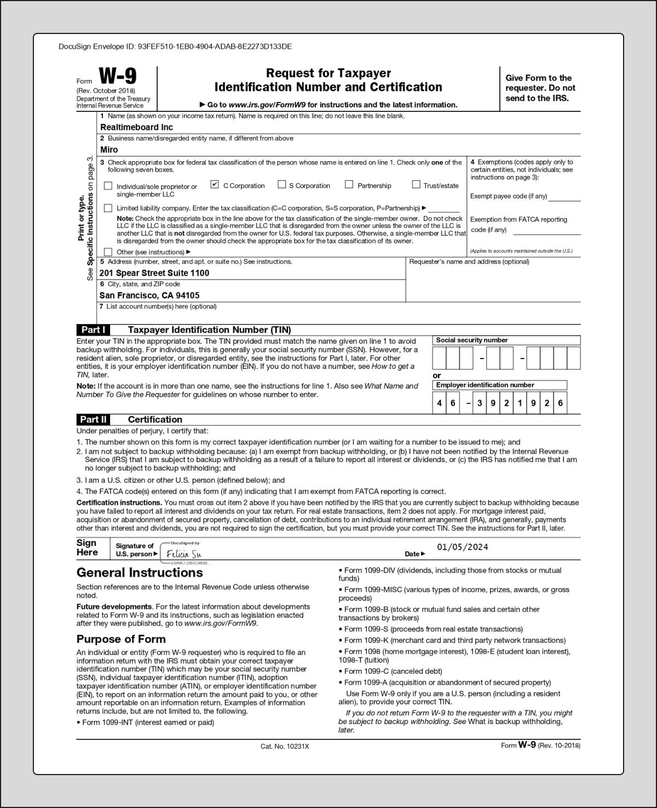
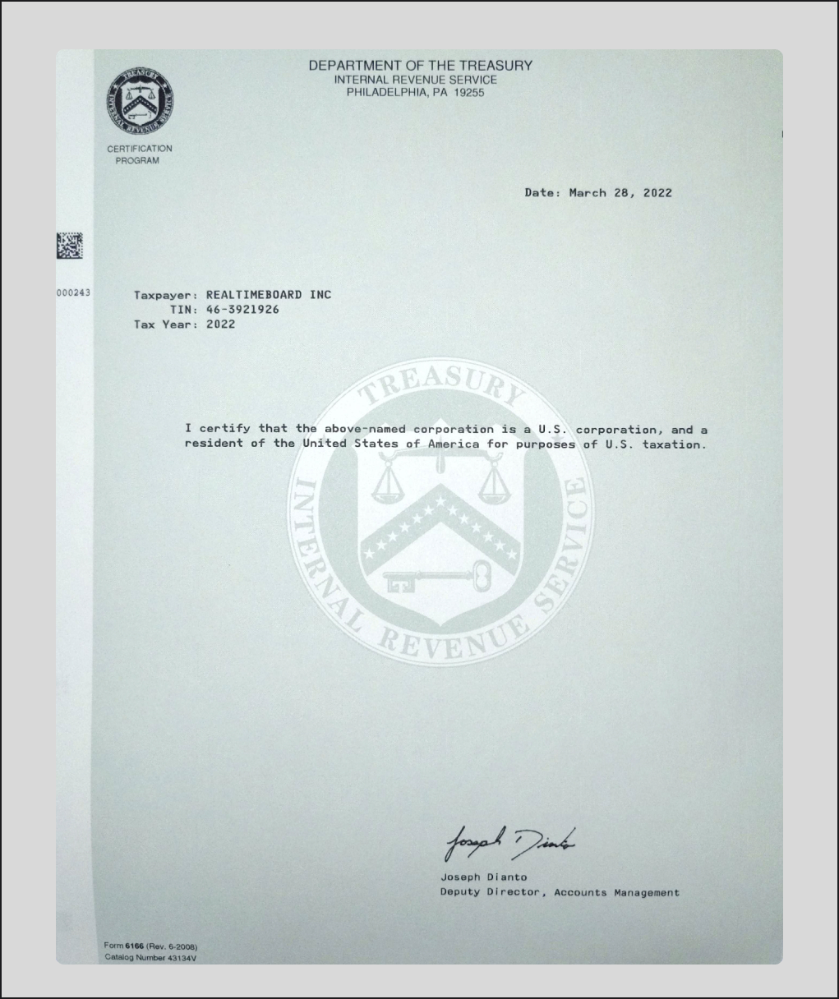

Miro accepts most major payment methods, including bank transfers, ACH, paper checks, and credit cards when applicable. Certain payment methods may only be accepted for specific plans or geographic regions.

## Wire Transfer/ACH

Miro accepts bank transfers (U.S. or international wire) or ACH (U.S. banks only). These options offer an immediate, reliable, and safe way to send and receive money.

You can find Miro's bank information and remittance address on the PDF copy of your invoice, which is sent to your organization’s billing contact.

Please contact the Miro billing team for bank verification over the phone.

## Credit Card

Miro no longer accepts credit card payments for Enterprise Plan invoices greater than $15,000.

Please contact the Miro billing team with any questions about Miro’s credit card policy.

## Paper check

When issuing a check to the Miro Billing Team, please send it to:

REALTIMEBOARD, INC.
P.O. Box 103473
Pasadena, CA 91189-3473

## Tax Information

U.S. customers may request a copy of Miro’s W-9 form, or United States Tax Residency Certificate for non-U.S. customers.

Learn more about Miro [tax requirements](../../../plans-billing/billing-and-payments/06-taxes.md).

*Example of the W-9 form*

*Example of the United States Tax Residency Certificate*
