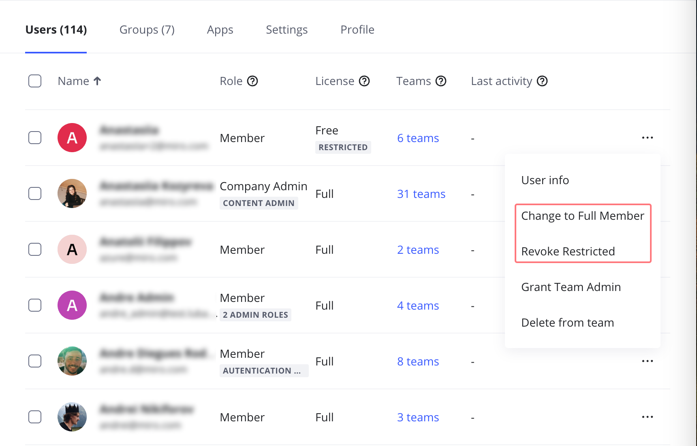
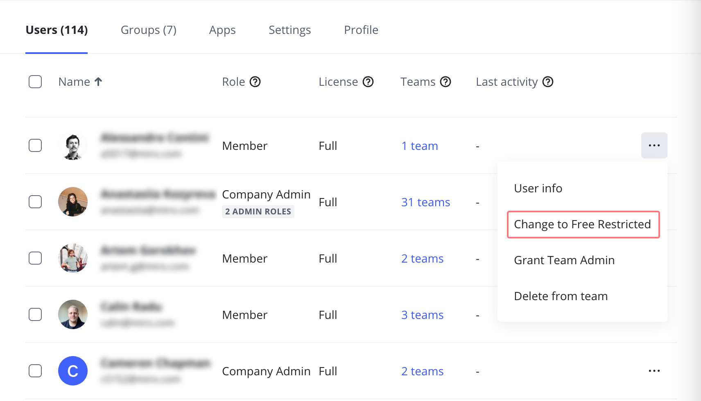
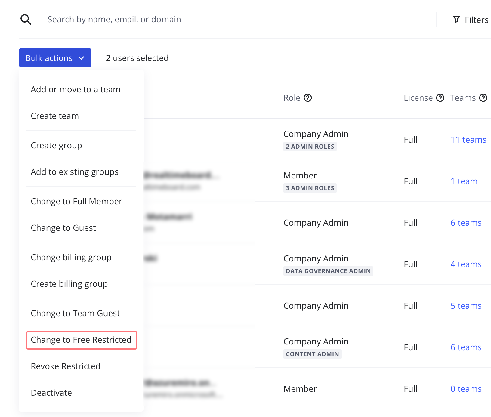

Learn about license management on the Flexible Licensing Program (FLP), including what license management options are available for new users, and how to convert existing licenses.

:::tip
If you're new to FLP licensing, we recommend first reading [Flexible Licensing Program](03-flexible-licensing-program-flp.md) and [User access levels on Enterprise Plan](../../user-management/11-user-access-levels-on-enterprise-plan.md) to understand how our licensing models, license types and Miro roles work together.
:::

## Assigning licenses to new users

Members Guests Visitors

Based on your company's default license settings, new members are assigned either a Free or Free Restricted license. To set a default license for new members on your subscription, reach out to your Miro contact person.

New members are assigned the default license:

- when invited by non-Admin members
- automatically via [Just-in-Time provisioning](../../security-integrations/single-sign-on-sso/09-single-sign-on-sso.md), [Domain control](../../canvas-25-admin-features/domain-control/01-domain-control.md) or [SCIM](../../security-integrations/system-for-cross-domain-identity-management-scim/02-scim.md)

Company Admins also have the option to select a license for invited members.

- select **Free** if you want users to have the option to edit (they will be upgraded to a Full license as soon as they edit or create a board, are invited to edit a board, are granted board co-ownership, or are added to a [project](../../../using-miro/sharing-boards/16-projects.md) as Editor)
- select **Free Restricted** to invite the member without editing rights

*Company admins can grant a Free or Free Restricted license to their invitee*

Guests invited to a board are always assigned a **Free** license. Learn how to [invite guests on an Enterprise Plan](../../../using-miro/sharing-boards/07-collaboration-with-guests.md#invite-guests).

[Visitors](../../../using-miro/sharing-boards/08-collaboration-with-visitors.md) of publicly shared boards are free of charge and do not have licenses.

## How to upgrade or downgrade licenses

> **Who can do it:** Company Admins

**Free** licenses are automatically upgraded to a **Full license** as soon as the user creates or edits a board.

Free Restricted to Full Full to Free Restricted Bulk convert licenses

Free Restricted licenses can be upgraded to a Full license manually by Company Admins, or as part of [Enterprise workflow automation](../enterprise-workflow-automation/01-enterprise-workflow-automation.md).

To upgrade a Free Restricted license to a Full license:

1. Open **Teams** or open **Organization settings** > **Users** > **All Users** > **Active users**.
2. Click the **three dots** (**...**) icon next to a Free Restricted user.
3. Select **Change to Full member**.

   
   *Converting a Free Restricted license to a Full license*

Full licenses can be downgraded to a Free Restricted license if Company Admins would like to limit the user's access and release additional Full licenses.

Full members can’t be downgraded to a Free license as Free licenses can be only assigned to new users.

To downgrade a Full license to a Free Restricted license:

1. Open **Teams** or open **Organization settings** > **Users** > **All Users** >**Active users**.
2. Click the **three dots** (**...**) icon next to a Full user.
3. Select **Change to Free Restricted**.

   
   *Converting a Full to a Free Restricted license*

To bulk convert several licenses at once:

1. Open **Organization settings** > **Users** > **All users** > **Active users**.
2. Individually select all the users whose licenses you wish to convert, or apply filters to select users. You can select up to 50 users
3. Click **Bulk actions** and select a new license option

   
   *Bulk converting licenses*
