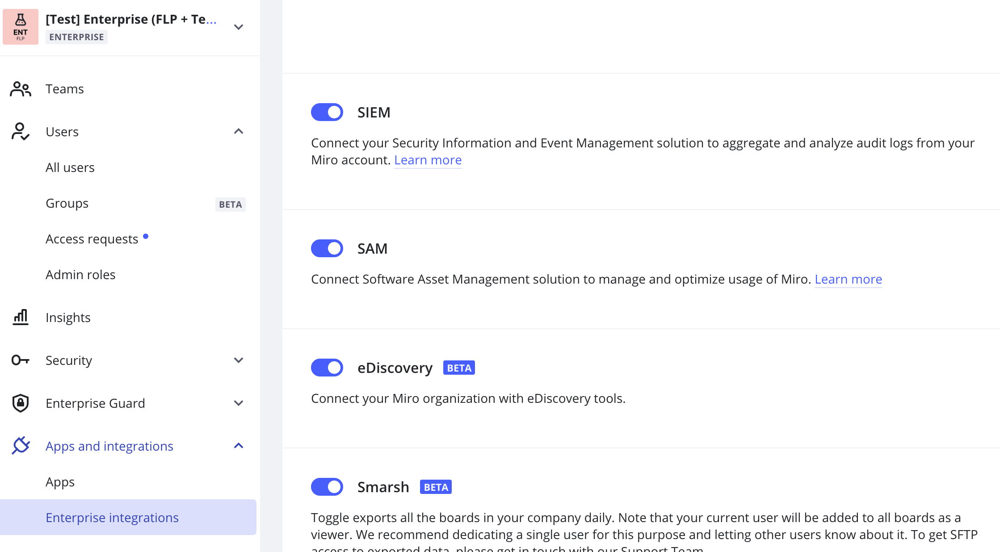

Analyze and customize your subscription usage at scale with the help of the Productiv & Miro integration. The integration allows getting the list of non-active users and deactivating them from the Asset management app.

## Supported features

The integration gives access to the following features:

- **Download subscriptions**
  - Get a list of user’s subscription usage and the number of licenses allocated in your Miro Enterprise subscription.
- **Reclaim subscriptions**
  - Deactivate users in your Miro Enterprise plan based on subscription usage.

Productiv provides real-time feature usage down to the team-level.

*Miro usage information in Productiv*

## Configuration steps

:::note
Please see the configuration steps in the [Productiv documentation](https://help.productiv.com/hc/en-us).
:::

To copy the access token on the Miro side, in the admin console go to **Apps and integrations** > **Enterprise integrations** and scroll down to **SAM**.

*SAM configuration in the Enterprise admin console*

After you enable the toggle, you can copy the access token or generate a new one.

:::note
If the toggle has been enabled by another Admin, you will not have the option to copy the token. A message indicates which admin enabled SAM, and how to contact them.
:::

To deactivate SAM, toggle **SAM** to the off position.
