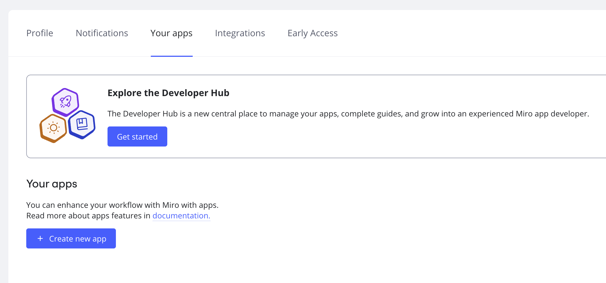

Analyze and customize your subscription usage at scale with the help of the ServiceNow & Miro integration. The integration allows getting the list of non-active users and deactivating them from the Asset management app.

## Supported features

The integration gives access to the following features:

- **Download subscriptions**
  - Get a list of user’s subscription usage and the number of licenses allocated in your Miro Enterprise subscription.
- **Reclaim subscriptions**
  - Deactivate users in your Miro Enterprise plan based on subscription usage.

## Configuration steps

### Integration

1. In ServiceNow, go to **SaaS License** module and select **Direct Integration Profiles** option, then click on **New**:

   
   *SaaS License module*

   > ✏️ In case that the **Saas License** module is not present in your ServiceNow instance you will need to install it following these [steps](https://docs.servicenow.com/bundle/quebec-it-asset-management/page/product/software-asset-management2/task/request-saas-license-management.html "https://docs.servicenow.com/bundle/quebec-it-asset-management/page/product/software-asset-management2/task/request-saas-license-management.html").
2. Search for **Miro Enterprise Integration Profile**:

   
   *Miro Enterprise Integration Profile*
3. You will see two subflows pre-defined to **Download Subscriptions** and **Reclaim Subscriptions:**
   **
   *Download Subscription Subflow*

   **
   *Reclaim Subscription Subflow*

### How to create a new connection

1. To create a new Connection go to **Credentials & Connections** > **Connection & Credential Aliases** and click on **New**.
   
   *The option to create a new Connection & Credential Alias*

 Click on **Create New Connection & Credentials** link:

*Connection & Credential Aliases*

For **Download Subscriptions** subflow, you will need to provide **Client ID** and **Client Secret**.

*Create Connection and Credential*

2. To get the **Client ID** and **Client Secret,** on the Miro side go to **Settings > Profile settings > Your apps** and select **Create new app.**

*Create a new app in your profile settings*

3. Set up the **App name**, select a team and click on **Create app.** Note that you need to have a [Developer team](../../managing-apps-on-enterprise-plan/04-enterprise-developer-teams.md).

4. On the app page in the **Permissions** section you will need to check the **organizations:read** option and click on **Install app and get OAuth Token.**

5. Select a team that is a part of your Enterprise organization and install the app.

6. Copy the **Client ID** and **Client Secret**.

For **Reclaim Subscriptions** subflow you will need to provide a **SCIM API** token. To get a SCIM API token, in Miro access the admin console and go to **Apps and integrations** > **Enterprise integrations** > **SCIM Provisioning** and copy the token under **API Token**.

## Subscription usage customization

By default, **Last activity threshold** is set to 60 days. To change it navigate to **Reclamation Rules** and select Miro rule, then you can modify the last activity threshold as follow:

*Last activity threshold*

## Possible issues and how to resolve them

When trying to install the app for a team, you see the error message "We couldn't install this app. You cannot install this application. Its scopes are not available in your current plan".
- This is expected behavior when installing the app in a Dev team as the Dev team doesn't have access to the organization-level scopes. You'll want to install the app under one of your Enterprise teams where it does have access to organization scopes for the ServiceNow integration.

*The error when installing the app for a Dev team*
