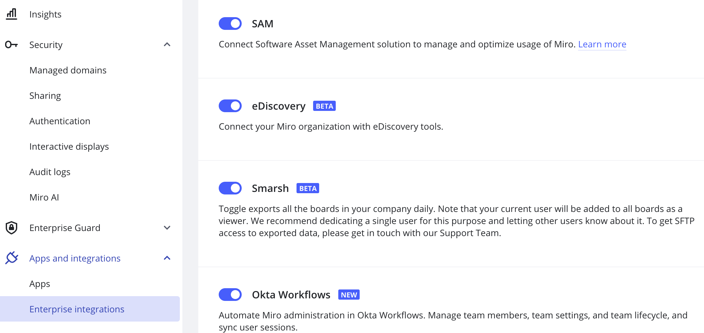

Analyze and customize your subscription usage at scale with the help of the Zylo & Miro integration. The integration allows getting insights into Miro usage and the list of non-active users.

## Supported features

The integration provides insights into Miro user adoption and license usage. You will get access to the following data sourced from Miro:

- Miro user roles, licenses, and activity including last activity date and the number of created, accessed and shared boards
- Deprovision insights that will allow you to identify users that have been inactive within a certain timeframe.

## Configuration steps

1. In Zylo, navigate to **Integrations**.
2. Click **Utilization** under Categories.
3. Click **Connect** on the Miro tile. The instructions to connect will appear in a series of screens in the Zylo application.

To copy the access token on the Miro side, open the admin console and got to **Apps and integrations** > **Enterprise integrations** and scroll down to **SAM**.

*Enable SAM in the Enterprise admin console*

After you enable the toggle, you can copy the access token or generate a new one.

If the toggle has been enabled by another Admin, you will not have the option to copy the token. However, you will still be able to deactivate the integration by disabling the toggle.
