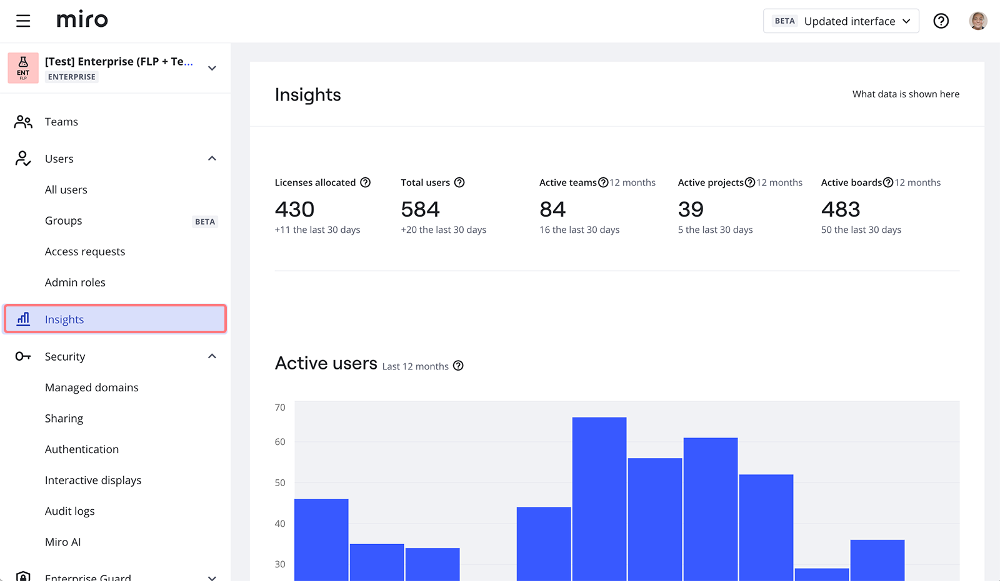
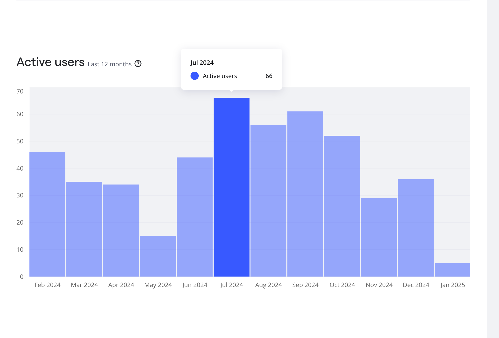
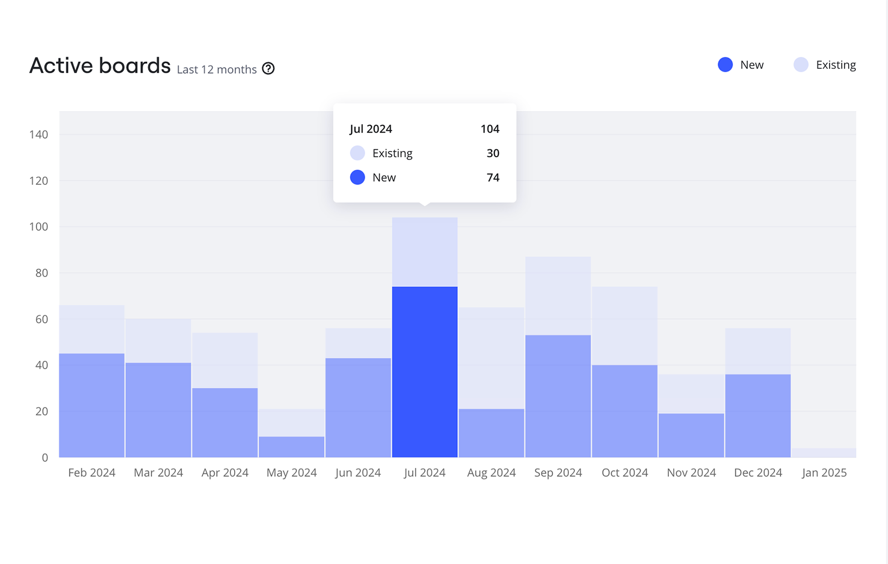
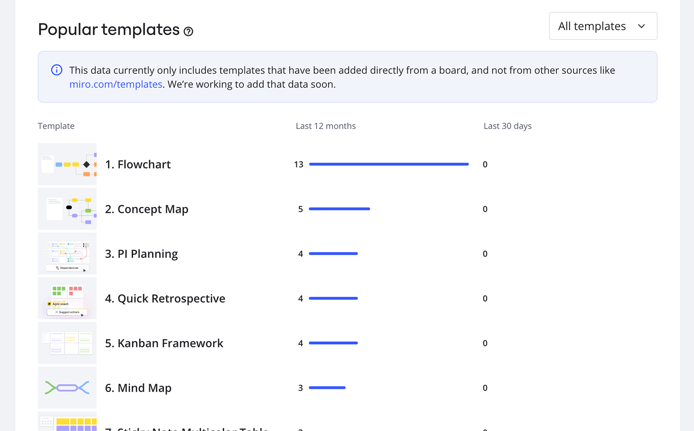

:::note
Admin Insights has been significantly enhanced and relaunched as Admin Analytics, offering richer dashboards, deeper reporting, and expanded visibility. For the most up-to-date information, see the [Admin Analytics documentation](02-overview-dashboard.md).
:::

Understanding how Miro is adopted in your company is essential to make decisions that impact your organization and business. Use your Insights dashboard for a global overview of collaboration on a company, team, and user level.

## What are Insights?

Open **Insights** to review user activity and content within your plan, make better decisions about usage, and understand the value that Miro brings to your company.

- Check how active users, teams, Spaces, and boards have changed over time
- See the most popular templates

The Insights dashboard includes four sections: top-level data, Users, Boards, and Popular templates. You can see all data accumulated within the last 12 months.

*Admin insights*

## Top-level data

At the top of the page are data insights that provide an overall view of your subscription. The gray text under each category displays the count of Full members and users who have joined your plan within the last 30 days, along with the number of teams, Spaces, and boards active in the last 30 days.

**Licenses allocated** - the number of members assigned a Full license

**Total users** - the number of all Members and Guests registered in your plan. Users who access boards from [public links](../../../using-miro/sharing-boards/03-sharing-boards-and-inviting-collaborators.md#sharing-boards-via-a-public-link) (visitors) are not included

**Active teams** - the number of teams in which at least one member opened a board within the last 12 months

**Active Spaces** - the number of all Spaces (private and shared with the team) where at least one member opened a board within the last 12 months

**Active boards** - the number of boards opened by registered users within the last 12 months

## Active users

The **Active** **users** section provides insights into your user activity. Learn how many users opened a board at least once each month. The metric includes all users in your plan, including Members and Guests. Users who opened public boards (visitors) are not included.

*The Active users section in Insights*

## Active boards

The **Active boards** section provides insights into how many boards have been opened at least once each month. We break them down into **New** and **Existing** boards.

**New boards** are any boards created during the observed month.
**Existing boards** are the boards created during previous months and are active during the observed month.

*The Active boards section in Insights*

## Popular templates

In the **Popular templates** section you can see the most frequently used templates added to boards from the [Template picker](../../../getting-started/start-here/your-first-board/04-templates.md#from-the-template-picker-templates-and-blueprints).

You can filter the templates by selecting [Standard](../../../getting-started/start-here/your-first-board/04-templates.md) and [Custom](../../../getting-started/start-here/your-first-board/02-custom-templates.md) templates in the **All templates** dropdown menu. To see more templates click **Show 10 more**.

Deleted templates are also shown on the dashboard.

*Popular templates in Insights*
