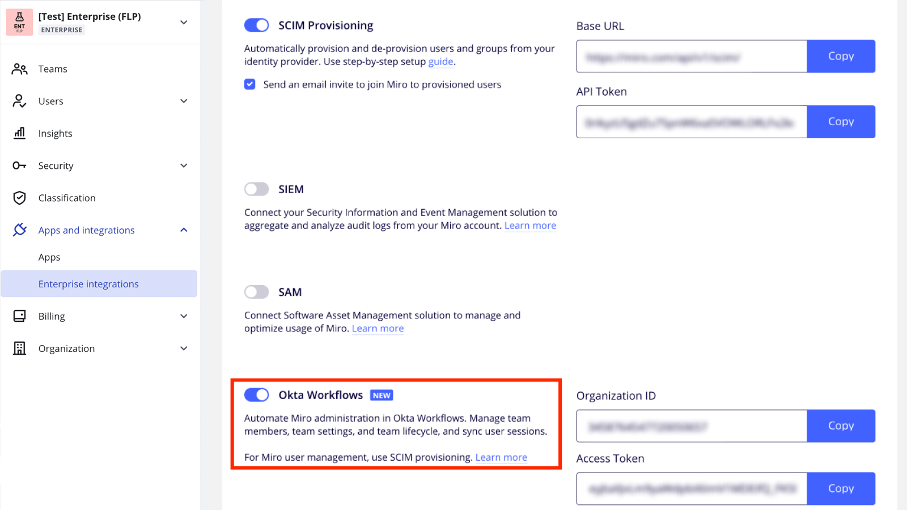
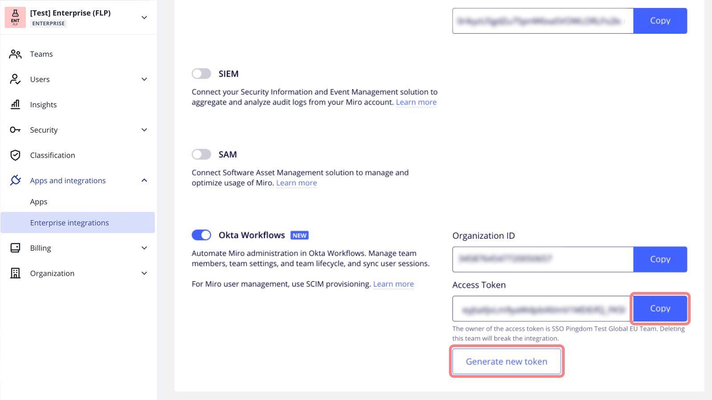
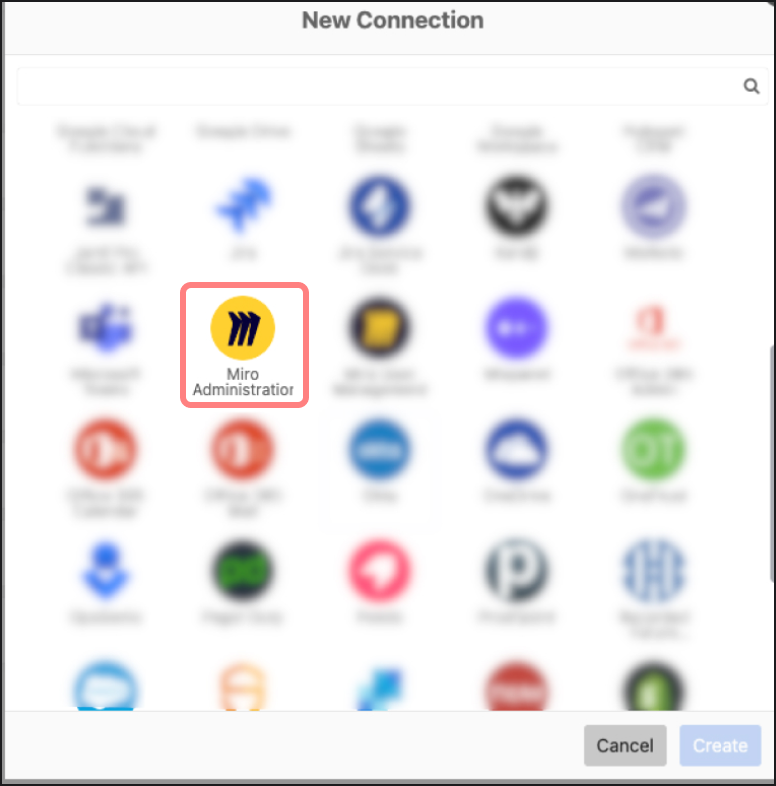
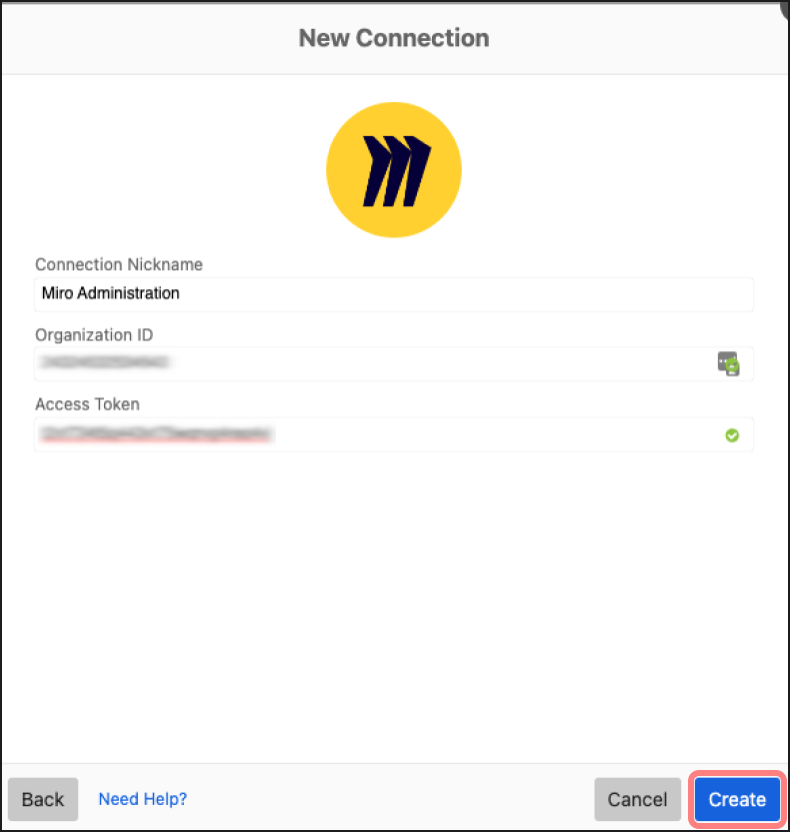

Configure the Miro Connector for Okta Workflows to use the Miro Administrator Connector from your Okta Workflow dashboard.

Read more about Administrator Connector and User Connector in [Set up workflow automation for Okta Workflows](../../enterprise-subscription-management/enterprise-workflow-automation/03-set-up-miro-connectors-for-okta-workflows.md).

## Configure settings on Miro

### Generate an access token

1. In your Miro Enterprise settings page, go to **Apps and integrations** > **Enterprise Integrations**, and then scroll down to **Okta Workflows**.

2. To enable **Okta Workflows**, click the corresponding toggle.

*Okta Workflows in Miro Enterprise integrations settings*

3. To copy the access token, click **Copy**.

4. To generate a new access token, click **Generate new token**.

*Access token*

:::warning
If the toggle has already been enabled by another Company Admin, you cannot copy the token. You can only disable the integration.
:::

:::warning
The integration is tied to the team with the largest number of users. It's not possible to choose a different team. However, the integration will work for all the teams within your Enterprise plan, and the integration-relevant events will be shown for the whole plan in your Audit logs.
:::

## Configure settings on Okta Workflows

### Create a new connection

1. In your Okta Workflows dashboard, go to **Connections**.

2. Click the **+ New Connection** button.

3. On the **New Connection** dialog, select the **Miro Administrator** connector.

*Miro Administration Connector*

4. Paste your **Organization ID** and your **Access Token** in the corresponding input fields on the dialog.

5. Click **Create**.

*Creating a new connector*

6. After establishing the newly created connection, you can start creating Okta Workflows.
