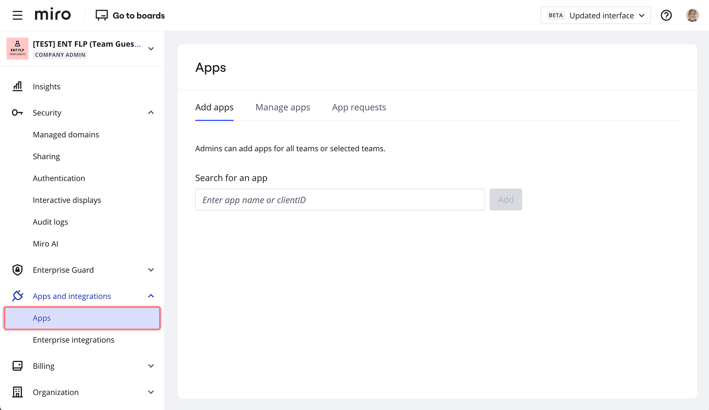
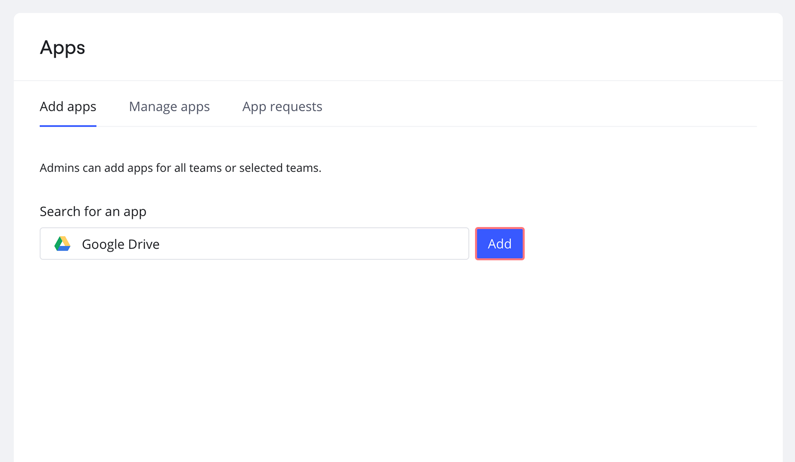
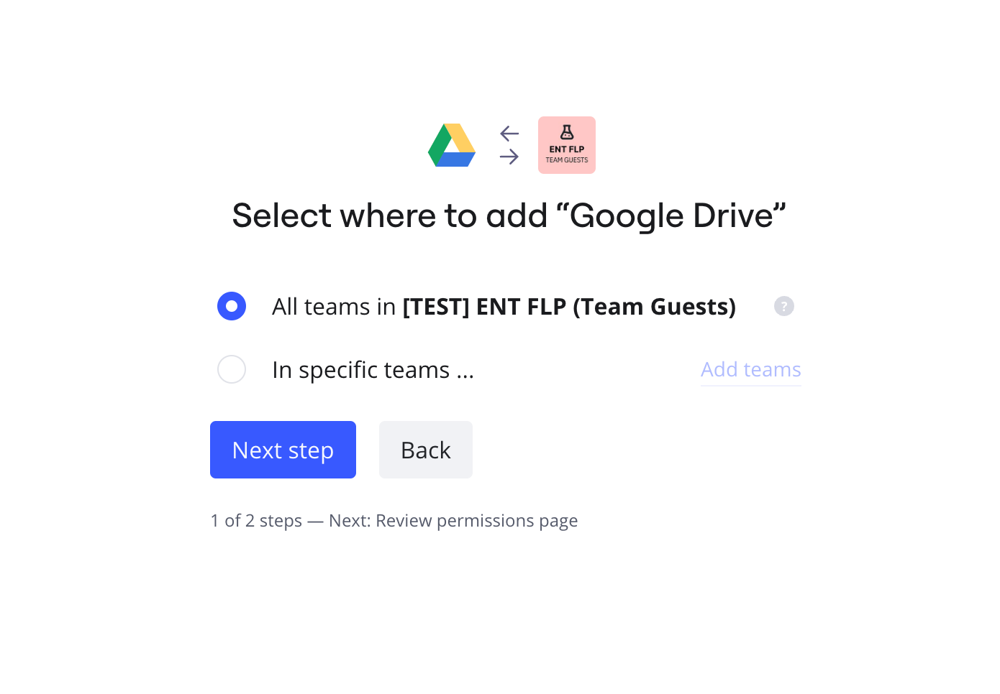
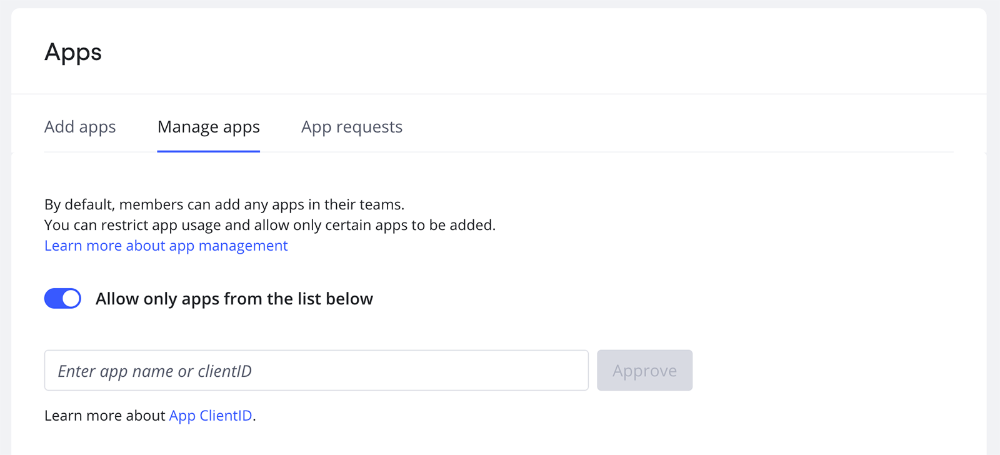
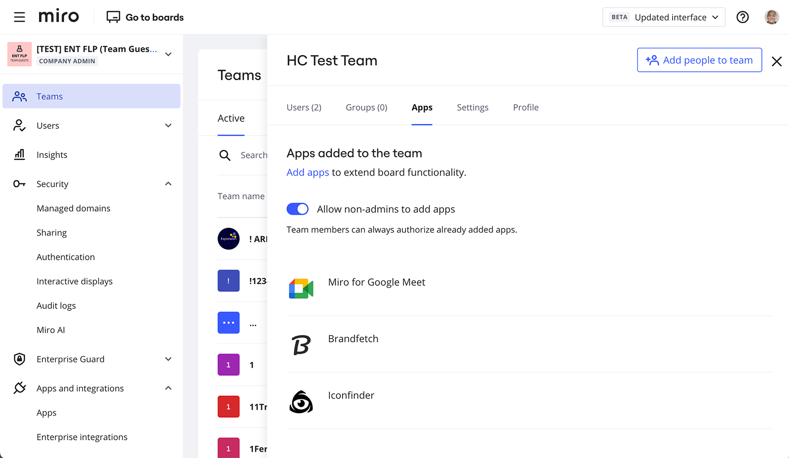

Learn how to manage apps and permissions on an organizational and team level.

### Who can manage apps?

Organization-level app management is only available on the Enterprise Plan for Company Admins. Team-level app management is available on Business and Enterprise plans for Team and Company admins.

### Add apps for an organization or specific teams

Add and authorize apps for all users in an organization or specific teams in your organization from the app management controls.
Go to **Company** settings > **Apps and integrations** > **Apps**. From this section, Company Admins can add apps for all or specific teams.

*Apps management control in Company settings*

Enter an app name or client ID in the search bar. Select an app from the dropdown list and click **Add**.

*Adding an app from Company settings*

You can add the app for all teams in your organization or choose specific teams. If an app is already added for some teams, you will see the corresponding tag. If you re-add the app for a team, team members will need to reauthorize the app. Click **Add** to finish.

*Selecting who to install the Google Drive app for*

If you add an app for all teams, the app will be added for all newly created teams as well.

### Pre-added apps

Some apps are already pre-added for users. They may require additional authorization or individual sign-in. These pre-added apps are: [Box](../../integrations-apps/more-integrations/05-box-legacy.md), [Dropbox](../../integrations-apps/more-integrations/06-dropbox.md), [Google Drive](../../integrations-apps/google/05-google-drive.md), [OneDrive](../../integrations-apps/microsoft/06-onedrive.md), [Smartsheet](../../integrations-apps/more-integrations/15-smartsheet-app-for-miro.md), [Azure Cards](../../integrations-apps/microsoft/03-azure-cards.md), [Jira Cards](../../integrations-apps/atlassian/03-jira-cards.md), [Brandfetch](https://miro.com/marketplace/brandfetch/), [Google Images](../../integrations-apps/google/06-google-images.md), [Slack](../../integrations-apps/more-integrations/14-slack.md). These apps will not be pre-added if they are not on the company-approved list. You can [manage this list](#approving-apps-for-individual-user-management) if you're a Company Admin.

### Preauthorize apps for an organization

If you add an app, you can also preauthorize it at the same time. If an app is pre-added and preauthorized by an admin, users in the organization will be able to start using it right away. Individual sign-in to a 3rd party service may still be required for certain apps.

This feature is available only for apps built with the Miro Web SDK. The Miro Web SDK enables extending Miro functionality. It's a toolbox to build powerful apps that run inside a Miro board.

### Approving apps for individual user management

By default, users can add any app for their team. Company Admins can restrict user app management to allow only certain apps to be added by their teams.

Company Admins can enable or limit the addition of certain apps for their users by going to **Company** settings > **Apps and integrations** > **Apps** > **Manage apps** and toggling on the option **Restrict members to add apps only from the list below**.

*Limiting additions for approved apps on Enterprise plan*

If this is limited, only those apps that have been approved can be added by Enterprise users. To approve an app for users, enable the toggle next to it or paste a client ID in the corresponding field to approve an internally developed app.

To restrict a previously added app, find the app on the list and make sure that the toggle next to the app is disabled. Please note that users from all Enterprise teams will not be able to use the app if it is restricted.

If an app is restricted in your organization, users will be able to send [requests for app usage to Company Admins](03-app-request-flow.md).

Users can see approved apps on the Marketplace within Miro boards stored in the Enterprise plan.

### Allow or restrict app usage in teams

Team and Company Admins can also manage the usage of apps on the team level: they can allow or restrict team members to add new apps for the team. The setting is configured for each team separately.

*Apps & Integrations in Team settings*

Learn more about [Miro apps and integrations.](../../integrations-apps/integrations-basics)
