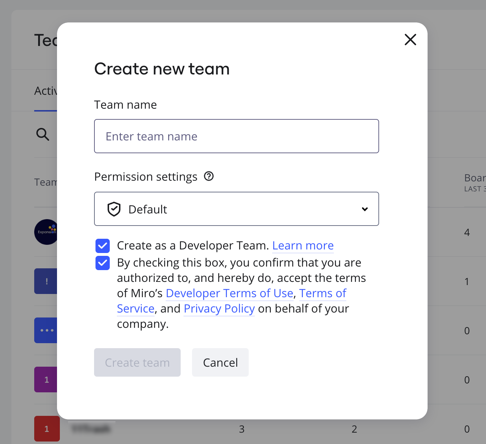
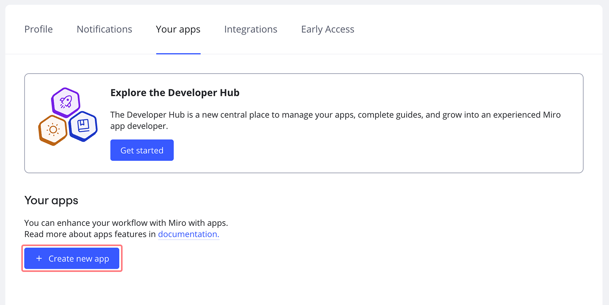
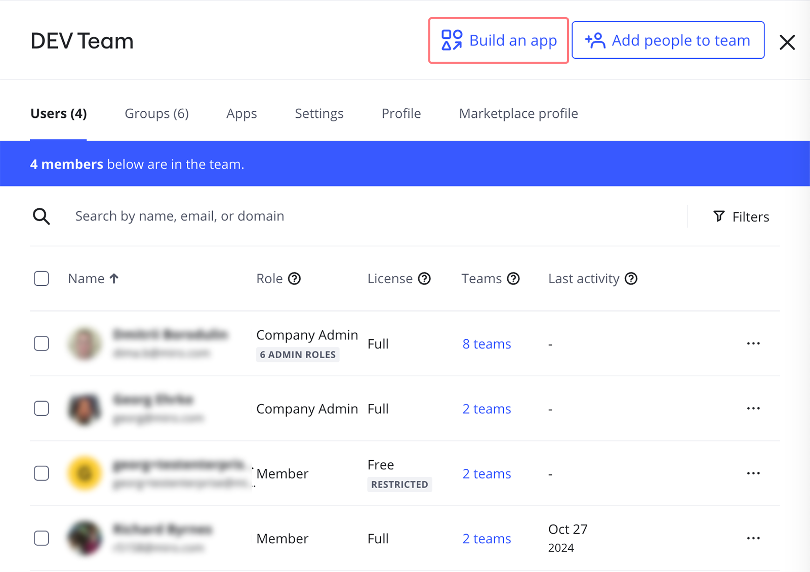
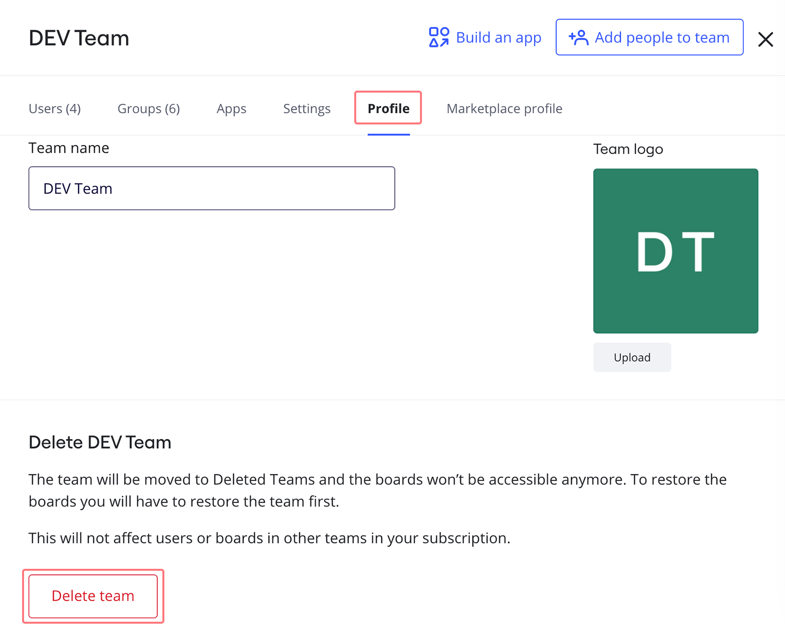

Meet the option to set up Developer teams within Enterprise subscriptions - an easy and secure way to create custom apps for your Enterprise plan.

### Creating a Developer team

To set up a Developer team, open **Company** settings > **Teams** and click **Create new team** in the top right corner.

On the next pop-up, insert the team name and choose the level of team permissions: you can set the default permissions settings or select a team to copy the team permissions (learn more about [permissions and default settings](../managing-enterprise-teams-and-content/07-team-management-on-enterprise-plan.md)). Check the box **Developer team**, confirm your authorization, and click **Create team**.

*Creating a Developer team*

### Enterprise Developer team permissions

You can safely create apps for the Enterprise Developer team that provides you with all the Enterprise security features while being a part of your Enterprise subscription.

The Enterprise Developer team has unlimited boards and no limit on members.

Boards created in the team will have a watermark to differentiate them from other teams in the organization.

The team has all the standard settings to configure user permissions on Enterprise plan: you can allow/forbid team members to invite new users, share boards with the team/Company/by public link, move boards, restrict allowed domains, etc. For more information, check out [this article](../managing-enterprise-teams-and-content/10-team-permissions-on-enterprise-plan.md).

### Creating and installing apps

> **Set up by**: Team Admins
> If you want to invite developers to build an app in the team, be sure to [grant Team Admin permissions](../../administration/user-management/06-how-to-manage-admin-roles.md)

To create a new application on your Miro Enterprise using the Enterprise Developer team, navigate to [**Profile settings**](../../using-miro/managing-your-profile/01-profile-settings.md) **> Your apps**, agree to the terms and conditions, and click on **Create new app.**

*Your apps in Profile settings*

:::tip
You can also navigate to the page by clicking **Build an app** in the top right corner of the Developer team's dashboard.
:::

*The option to build new custom apps*

Insert the app name, select your Developer team for the application and click on **Create app.**

**
*Creating a new app for the Enterprise Developer team*

On the app page, scroll down and select the scope of access you want to grant to your app and then click on **Install app and get OAuth token.**

**
*App permissions*

When installing the application select a team (which is different from the Developer team) from your Enterprise organization and click on **Install & authorize**. The access token will be displayed on the next step.

*Installing the app*

### Deleting a Developer team

You can delete the Developer team as you would any other team in your Enterprise organization, but you must first delete all apps created under that team. Once the apps are deleted, navigate to [**Teams**](../../administration/get-started-as-a-miro-admin/01-i-am-a-new-miro-admin.-where-to-start.md), click on the team name, select the **Profile** tab, and then select **Delete team**.

:::warning
Please note that upon deleting the Enterprise Developer team, any tokens associated with it will no longer be valid.
:::

*Delete the Enterprise Developer team*
