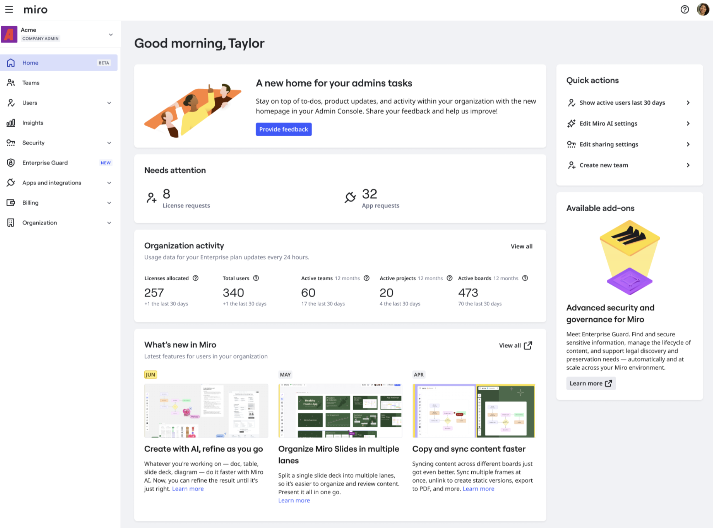
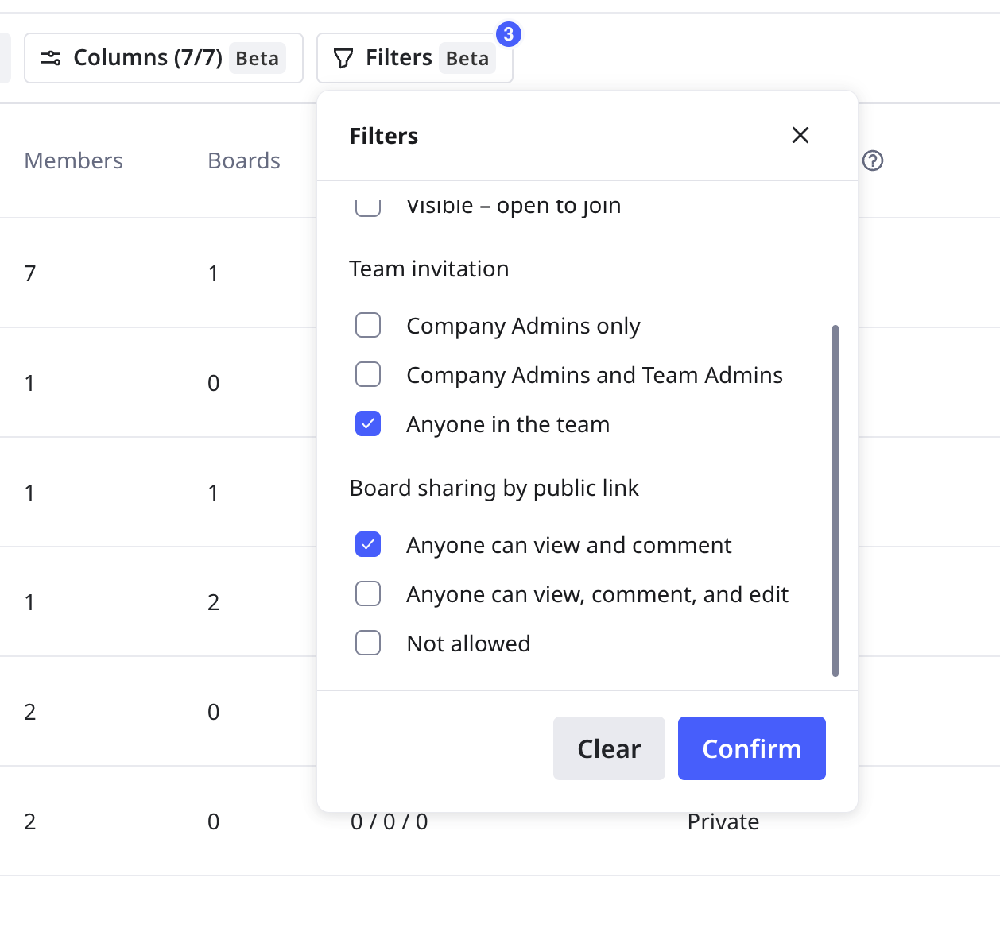

The new Miro Admin Console makes essential administration workflows easier to perform with reorganized settings, and improved common UX patterns.

<iframe allow="encrypted-media" allowfullscreen="" frameborder="0" src="//fast.wistia.com/embed/iframe/4kedcunyqe" style="width: 100%; aspect-ratio: 16 / 9;"></iframe>

## Key features

The updated Miro Admin Console includes the following key features:

- **Enhanced admin interface**
  Enables fast access to admin settings, and streamlines administrative tasks.
- **New team management flow**
  Enables efficient management of users, teams, roles, and security.
- **Organization selector**
  Enables you to switch organizations without leaving the current page.
  > 💡 The organization selector also shows your plan type.
- **Profile menu**
  Enables you to view your role and access your personal profile.

## Admin Home (Beta)

Admin Console includes a homepage where you can monitor activity inside your organization, see license and app requests, and take quick action. Admin Home also provides a section for what's new in Miro, enabling you to stay current on product updates.

*Admin Home is a central hub for admins managing their organization's Miro environment.*

Admin Home gives admins a strategic snapshot of their organization's status, including metrics on user activity, license management, and team performance.

## General admin interface updates

Admin Console includes a dashboard that scales to fit the full width of your screen. The top bar is now static, and has a hamburger menu in the upper left corner that expands and collapses the left-side navigation panel.

### Organization selector in Miro Admin Console

At the top of the left-side navigation, you can use the organization selector to quickly change to another organization, without leaving the current page.

The organization selector also shows your current plan type.

### Left-side navigation panel

Use the left-side navigation to find all admin functionalities.

:::note
Some pages and sections are renamed, or have changed location.
:::

In order of appearance, the new left-side navigation panel includes the following sections:

- **Home** (Beta)
  Provides a central hub with highlights and actionable insights for managing your organization.
- **Teams**
  Manage every team in your organization.
- **Users**
  Manage all users, access requests, and admin roles. You can view and update your active, deactivated, and invited users on the **All users** page.
- **Insights**
  Review user and board activity, and popular templates.
- **Security**
  Manage authentication, domains, sharing, interactive displays, and audit logs.
- **Enterprise Guard**
  Manage all Enterprise Guard functionality.
  > ✏️ Enterprise Guard customers can find the **Classification** page under the **Enterprise Guard** section.
- **Apps and integrations**
  Configure SCIM and other enterprise integrations, and apps.
- **Billing**
  Manage licensing and AI credits, and billing groups.
- **Organization**
  Review and manage your organization profile and brand center. You can also manage access to features like Miro AI.

## Team management at scale

In Admin Console, you can manage all teams in your organization from the **Teams** view.

Go to **Admin Console** > **Teams**.

Click **Columns** to extend the data shown for each team. You can view settings like number of boards created recently, and which teams are hidden.

Click **Filters** to show only teams that match your criteria. For example, you want to see which teams allow anyone in the team to invite new members.

*Add columns and select filters to manage teams in your organization.*

:::tip
Use **Filters** to perform a security audit and manage security compliance for teams.
:::

Select a team to open the team settings panel. You can view the following admin tabs:

- **Users**
  Update licenses and roles.
- **Apps**
  See which apps are enabled for the team, and optionally remove them.
- **Settings**
  Specify team settings like allowed domains, privacy, and security.
- **Team profile**
  Update team name and logo, and optionally delete the team.

## Profile menu in Miro Admin Console

To access your profile menu, click you avatar in the top-right. Then select **Profile**.
