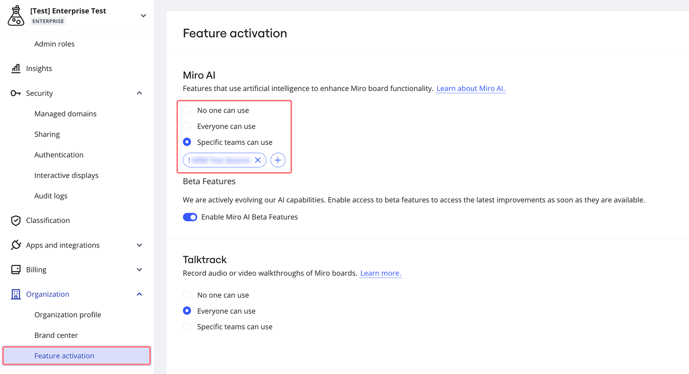
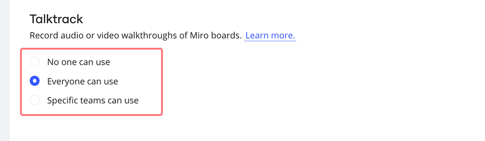

Start using the latest Miro tools for your organization. Grant your users access to Miro features directly from your admin settings.

## How Feature activation works

Easily manage your organization's access to Miro features. Grant access to a feature to evaluate its capabilities, and update access at any time based on the unique needs of your company and teams.

- You can make a feature accessible to everyone in your company or specific teams, or revoke access for everyone.
- If you grant access to a feature when it's in beta, your access settings will remain the same after its release.
- Revoking access to a feature does not delete any content created during its use.

> **💡** Keep track of which features have been made available to users in your [Audit logs](../security-integrations/security-management/01-audit-logs.md).

## How to use Feature activation

1. Go to your **Account** settings.
2. Click on **Organization**.
3. Click **Feature activation**.
4. Under the feature you wish to manage, choose **No one can use**, **Everyone can use**, or **Specific** **teams can use**.
5. If you select **Specific** **teams can use**, click **+ Add teams**.
6. A dropdown will open. Use the search, or scroll to find and select teams to grant access to. You can add teams (up to 10) by clicking **+**. To remove a team’s access, click **x** next to the team name.

:::note
You can grant access to a feature for up to 10 selected teams. A recommended practice is to start with one team to test out the capabilities, then expand to other teams before rolling out across the organization.
:::

*Feature access settings*

## Available Feature access controls

### Miro AI

Miro uses machine learning models along with your input to generate content on your Miro board. Miro AI enables users to automate content generation, organization, and summarization on their boards. Within the Miro AI section, you have the option to turn on or off beta features.

**More information:**

- [Miro AI](../../using-miro/miro-ai/03-create-with-ai.md)
- [Miro AI Admin security](../canvas-25-admin-features/data-security/04-miro-ai-admin-security.md)

### Talktrack

Record interactive video walkthroughs of Miro boards to get ideas across, without spending extra time in meetings. Explore Talktrack's features and see how it can help your team be more productive and efficient in their collaboration efforts.

*Talktrack Feature access control*

**More information:**

- [Talktrack](../../using-miro/facilitation-tools/asynchronous-tools/02-talktrack-board-recordings.md)
- [Talktrack Admin security](../canvas-25-admin-features/data-security/08-talktrack-admin-security.md)
