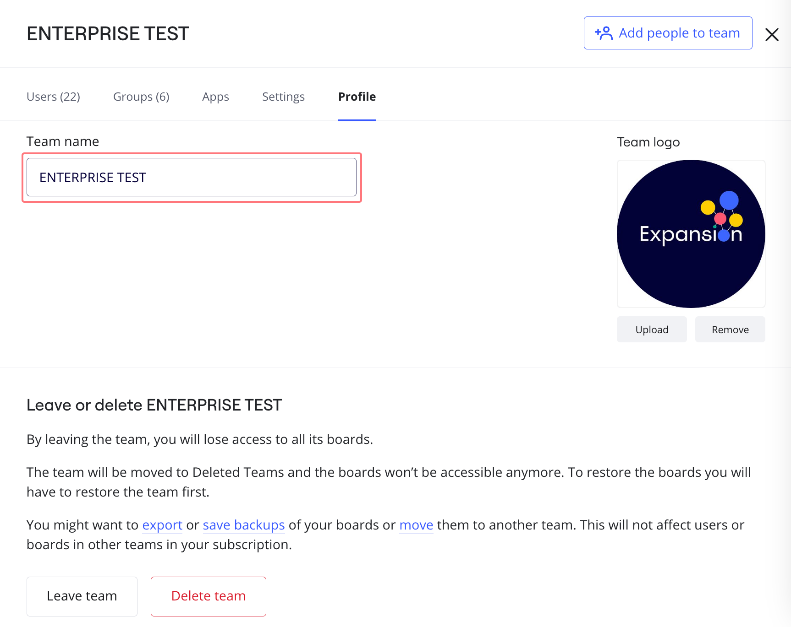
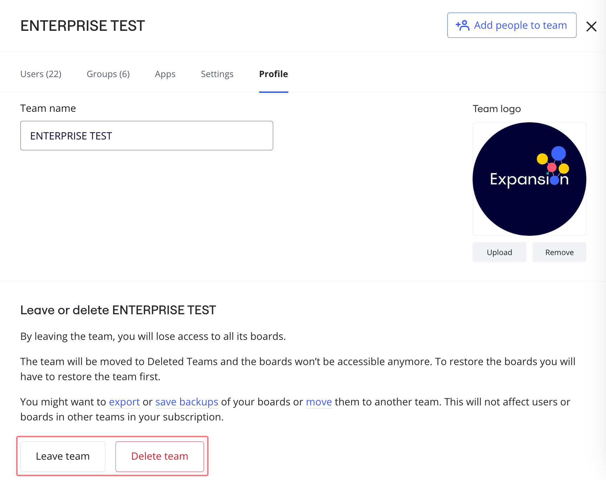
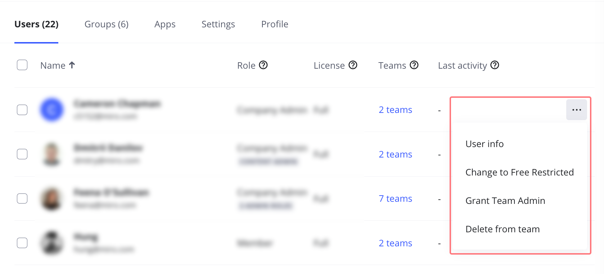
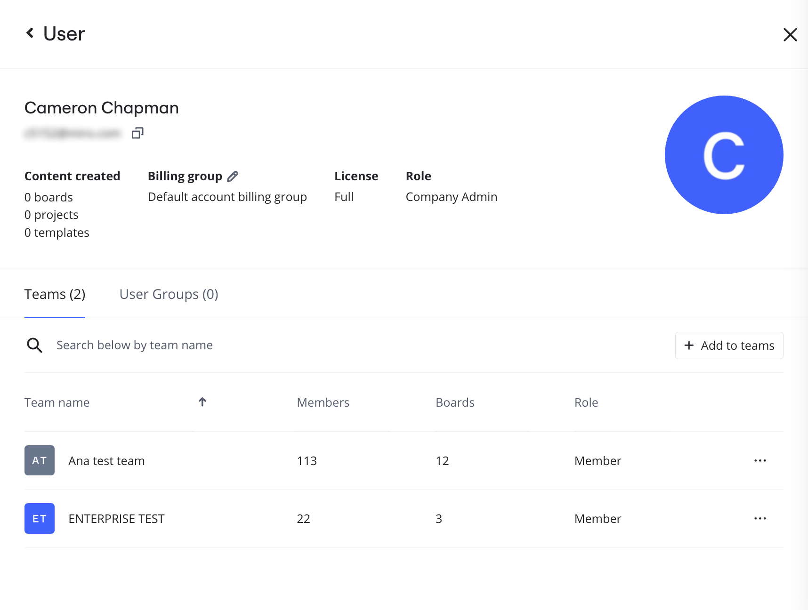
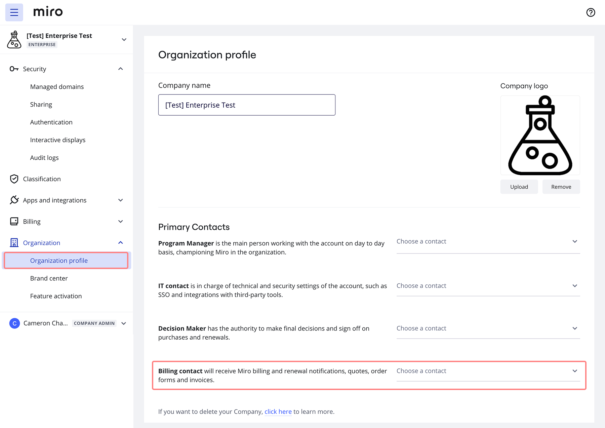
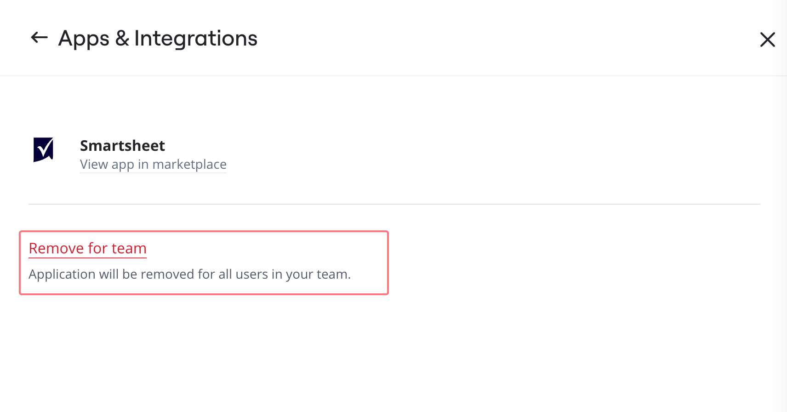

A team in Miro is a shared workspace where users can collaborate on boards and Spaces. With the Enterprise Plan, you can set up multiple teams tailored to specific groups or purposes. This feature allows for seamless cross-team collaboration, as Miro users can be members of multiple teams.

Company admins can set up each team according to its needs, including managing team apps and integrations for the team, as well as user permissions and team privacy.

:::tip
In Admin Console, the team icon shows which team settings a Team admin can change. As Company admin, go to **Admin Console** > **Teams** > **\{team name\}** > **Settings** tab.

Team icon: 
:::

:::tip
If you’re new to Miro, learn more about [Team and Company settings](../../administration/get-started-as-a-miro-admin/01-i-am-a-new-miro-admin.-where-to-start.md#team-admin-company-admin).
:::

## Team management settings

In Admin Console, you can manage all teams in your organization from the **Teams** view.

Go to **Admin Console** > **Teams**.

Click **Columns** to extend the data shown for each team. You can view settings like number of boards created recently, and which teams are hidden.

Click **Filters** to show only teams that match your criteria. For example, you want to see which teams allow anyone in the team to invite new members.

*Add columns and select filters to manage teams in your organization.*

:::tip
Use **Filters** to perform a security audit and manage security compliance for teams.
:::

Select a team to open the team settings panel. You can view the following admin tabs:

- **Users**
  Update licenses and roles.
- **Apps**
  See which apps are enabled for the team, and optionally remove them.
- **Settings**
  Specify team settings like allowed domains, privacy, and security.
- **Team profile**
  Update team name and logo, and optionally delete the team.

### How to edit a Team profile

> **Who can do it:** Company Admin, Team Admin

#### **Change the team name**

From the Team profile, click on the **Team name** field to edit the team name.

*Changing the team name*

#### **Change the team logo**

From the Team profile, click **Upload** to add or change the Team logo, or click **Remove** to delete an existing logo.

*Changing the team logo*

#### **Leave or Delete a team**

From the Team profile, users and admins can choose to leave the team. Company admins and Team admins can delete the team.

*The option to leave or delete a team*

## Team user management settings

> **Who can do it:** Company Admin, Team Admin

To see the full list of users within a team, click on a team name. You will see each user’s role, license type, and the number of teams they're in.

### Managing users in a team

To open the user management settings, click the **three dots** (**...**) icon next to the user.

**Company admins** can edit the user's info, change the user license to Full Member or Free Restricted, grant (or revoke) Team Admin permissions, and delete the user from the team.

Depending on the [team invitation settings](../user-management/03-invitation-settings-on-enterprise-plan.md), **Team admins** can grant (or revoke) Team Admin permissions, and delete the user from the team.

*User management settings*

#### **Promote a user to Team Admin**

> **Who can do it:** Company Admin, Team Admin

1. Click the **three dots** (**...**) icon next to a user name.
2. Click **Grant Team Admin**.

#### **Remove a user from a team**

> **Who can do it:** Company Admin, Team Admin

1. Click the **three dots** (**...**) icon next to a user name.
2. Click **Delete from team**.

### Edit user info

When you click **Edit user info**, a side panel will open. Within the panel you will see a more detailed view of a user's profile and activity in Miro, including how many boards, Spaces, and templates the user has, and the names of their teams. You can edit these details depending on your Team or Company admin permissions.

*User profile with list of Teams*

#### **Add or remove a user from a team**

Within the **Edit user info** dialogue box, click **+** to grant access to a new team, or click **x** next to a team to remove access. You will be prompted to reassign the user’s boards to a new board owner.

## How to find your Billing Contact

If you need to find the **Billing Contact** for your team's plan, you can do so in **Settings**.

1. Go to **Settings**.
2. Click on **Organization Profile** and scroll to **Primary Contacts**.
3. Your **Billing Contact** will be listed (or can be selected) there.

*Billing Contact is found under Settings > Organization Profile*

## Set up apps for a team

> **Who can do it:** Company Admin, Team Admin

Teams may need access to specific applications for better collaboration. You may also need to restrict access to some applications.

Go to **Settings** > **Apps & Integrations** > **Apps** to see all applications currently approved for the team.

*App management settings*

### Removing app access for a team

Click on an application. You will see the app details. Click **Remove for team** to remove access to the the app for the whole team.

*Removing access to an app for a team*

### Allow or restrict apps for team members

Let your team members add approved apps from the Miro Marketplace. Toggle on **Allow non-admins to add apps**.

:::tip
Company Admins can add and remove apps and oversee app requests in Company settings > Apps. Learn more about [App management.](../managing-apps-on-enterprise-plan/02-app-management.md)
:::

*Allowing non-admins to add approved apps*

## Manage team permissions

> **Who can do it:** Company Admin

Configure permissions for your teams, including invitation settings, sharing permissions for boards and Spaces, allowed domains, and board content settings.

You can also restrict the ability to move boards from and to the team, and enable or disable the board co-owner role for the team.

Learn more in the article [Team permissions on Enterprise plan](10-team-permissions-on-enterprise-plan.md).

## Turn on team privacy mode

> **Who can do it:** Company Admin

If you need teams within your organization to stay invisible to each other you can turn on Team privacy mode.

Once the option is enabled, members of the Enterprise subscription cannot see teams they're not part of, and the option to [share boards with the entire company](../../using-miro/sharing-boards/03-sharing-boards-and-inviting-collaborators.md#sharing-a-board-with-the-entire-company) is disabled.

Learn more about [managing team privacy and discovery on Enterprise Plan](11-manage-team-privacy-and-discovery-on-enterprise-plan.md).

## Export your team details

To download a list of all teams under your Enterprise subscription, go to **Company** settings > **Teams** and click the **Download** icon.

*Downloading a CSV file with teams data*

The CSV document will include:

- **Team name**
- **URL** to access the [Permissions settings](07-team-management-on-enterprise-plan.md) of a team.
- [SCIM](../security-integrations/system-for-cross-domain-identity-management-scim/02-scim.md) **security groups** indicating an IdP group synced with the team within your Enterprise subscription.

The other columns (**WhoCanInvite, InviteExternalUsersEnabled, TeamCollaborationCoOwnerRoleEnabled**, etc.) are related to your [team permissions](07-team-management-on-enterprise-plan.md). You can quickly go to a team **Permissions** settings following the link in the second column and configure the team settings in accordance with your security standards.
