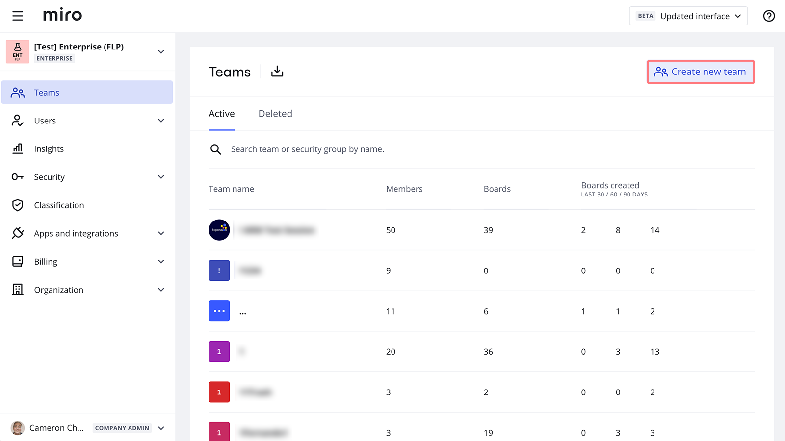
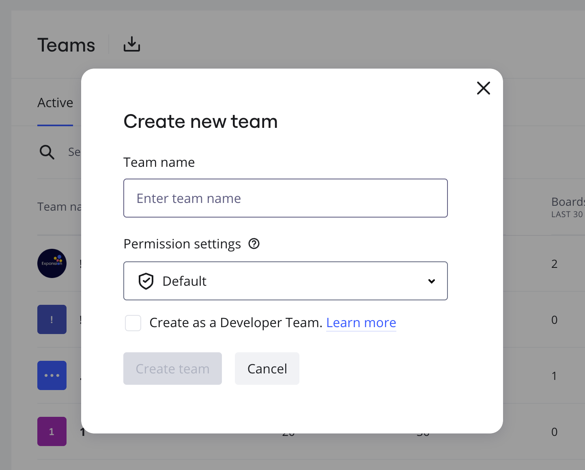
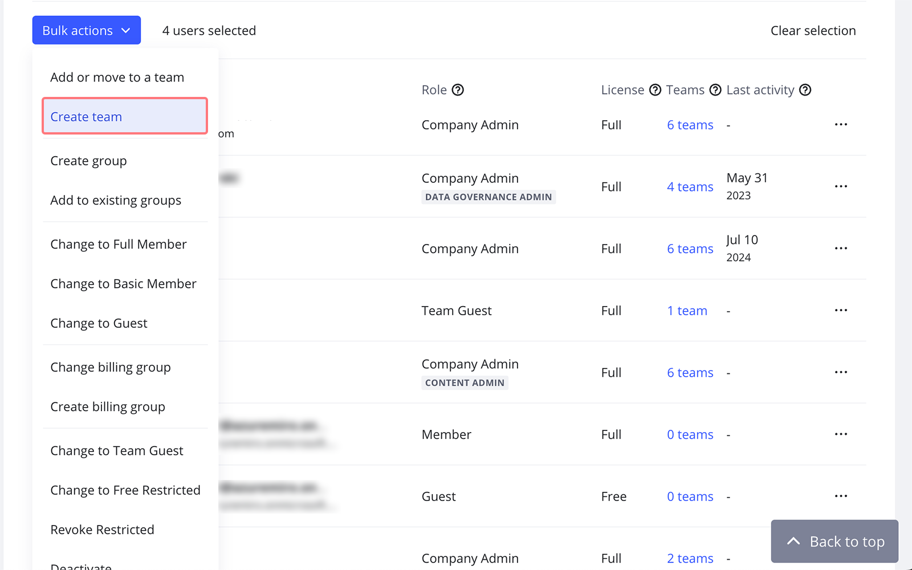

Company Admins can create new teams to split the members into appropriate groups.

There are two simple ways to create a new team on Enterprise plan.

1) Go to **Company settings** by clicking on your avatar in the upper right corner of your Dashboard and then clicking on **Settings**.

In the **Teams** section, click **Create new team**in the upper right corner.

*Company teams list*

Type in the name of a new team and choose the level of team permissions: you can set the default permissions settings or select a team to copy the team permissions. Learn more about [permissions and default settings](07-team-management-on-enterprise-plan.md). Click **Create team** to proceed.

:::tip
Check the **Developer team** box if you wish to build custom apps in your Enterprise plan. [Learn more](../managing-apps-on-enterprise-plan/04-enterprise-developer-teams.md).
:::

*A new team name field*

After creating a team you will be automatically added there as a Team Admin. Then you can [add new members](../user-management/05-manage-user-invitations-on-enterprise-plan.md) to your team.

2) Create a new team via bulk actions — just mark the users you need to add to a new team in **Company** settings > **Users** > the **Active users**tab, then click **Bulk actions** > **Create team**.

*Selected users will be added to a new team*

You can also apply filters and select up to 50 users on the list at once.

After that, you can set a name and permissions level for your new team.

:::note
To learn how to create a new Miro team if you're not an Enterprise plan Admin, check out [this article](../../getting-started/start-here/miro-dashboard/02-how-to-create-a-team-in-miro.md).
:::
