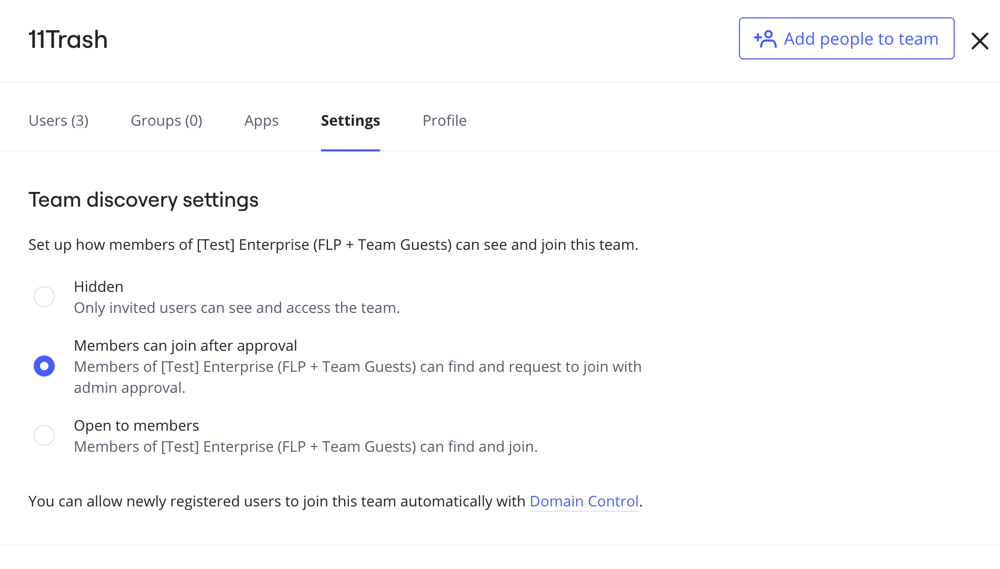
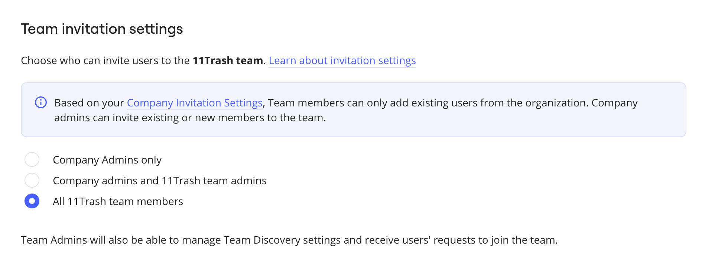
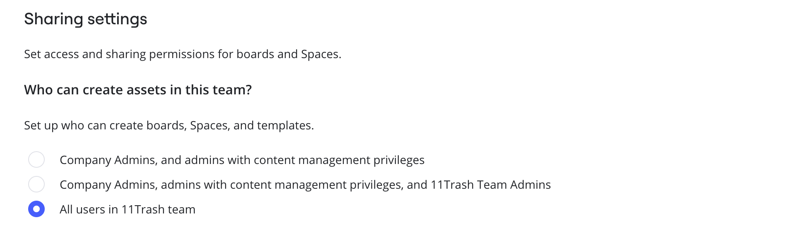
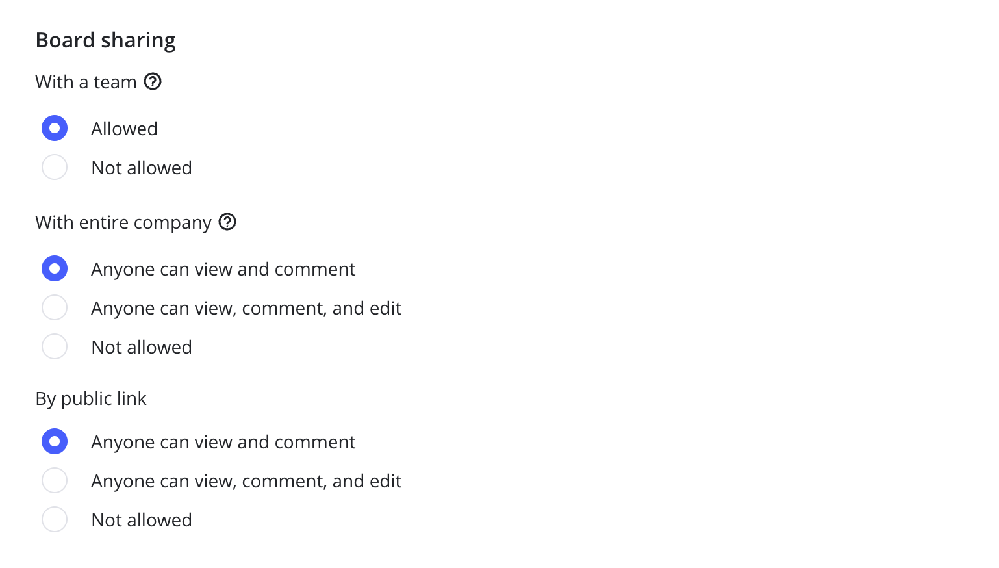
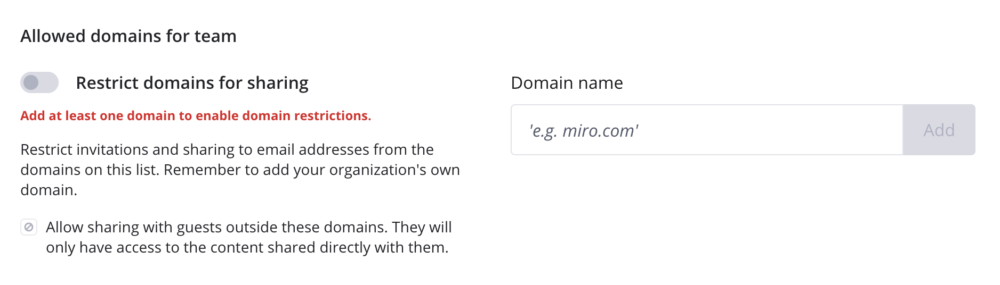
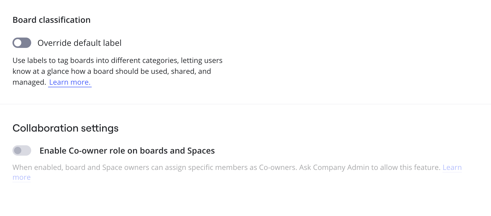

Enterprise plan provides the advanced permission settings and allows you to easily configure the needed level of access and security for your teams. You can select the Team discovery, Invitation settings, Sharing settings, and Board content settings that meet your company's needs and policies. The settings are configured for each team under Enterprise subscription.

:::note
When [creating a new team within an Enterprise subscription](09-create-a-new-team-on-enterprise-plan.md), Company Admins can select default permissions settings or pick a team to copy the team permissions. Learn more about the [default settings below](#default-settings).
:::

## How to access team permissions and settings

From the Miro dashboard, in the top-left select your avatar. Then select **Settings** to open the admin console.

From the admin console, select **Teams**. Then select the team you want to configure. The team view opens. Next, select **Settings**.

:::tip
To find your team, you can use the search bar at the top of the **Teams** view.
:::

The first configuration is **Team discovery settings**.

*Team discovery settings on the Enterprise admin console.*

You can make your team open for joining by other Enterprise users or hide it - learn more in the article [Manage Team privacy and discovery on Enterprise plan](11-manage-team-privacy-and-discovery-on-enterprise-plan.md). The setting can be changed by Company Admins and Team Admins if they are [allowed to invite new members to the team](../user-management/05-manage-user-invitations-on-enterprise-plan.md).

**Team invitation settings** enable Company Admins to determine who can invite users to the team and choose whether you need [guests](../../using-miro/sharing-boards/07-collaboration-with-guests.md) in the team.

*Team invitation settings on the Enterprise admin console*

**More information:** See [Manage user invitations on Enterprise Plan](../user-management/05-manage-user-invitations-on-enterprise-plan.md).

Company Admins can also configure **Sharing settings**.

First of all, you can define who can create new content (boards, Spaces, and templates) in the team and move boards to the team. This is extremely helpful if you need to set up a dedicated team for [auto-provisioning](../user-management/13-user-provisioning-on-enterprise-plan.md) or use a team as storage for certain boards. You can allow this to all members, Company Admins only, or to Company Admins and Team Admins.

*Sharing settings on the Enterprise admin console*

You can allow or forbid team members to share boards and Spaces with the whole team, entire company, or via public links. If you restrict these types of sharing, the options will get removed from the team boards.

*Board sharing on the Enterprise admin console*

It is also possible to set up [**Sharing settings** for the team newly created boards and Spaces](../../using-miro/sharing-boards/11-default-sharing-settings.md). Both Company and Team Admins have access to the setting.

:::warning
The option **Anyone at company can find and view/comment** is not shown if [Team privacy](07-team-management-on-enterprise-plan.md) is enabled.
:::

**More information:** See [Sharing policy on Enterprise Plan](../canvas-25-admin-features/data-security/07-sharing-policy-on-enterprise-plan.md).

Company Admins can set [allowed domains for a team.](../canvas-25-admin-features/data-security/07-sharing-policy-on-enterprise-plan.md)

Company Admins can see the setting to [restrict or allow moving boards to and from the team](../canvas-25-admin-features/data-security/07-sharing-policy-on-enterprise-plan.md#restrict-ability-to-move-boards-to-other-teams-team-level). 
*Allowed domains for team on the Enterprise admin console*

Company and Team Admins can configure **Content security** settings for a team: choose whether users outside the team should be able to copy board content (as well as duplicate the team boards and download board content) and decide for whom this option should be available on newly created boards (unless the board owner selects another option).

*Content security on the Enterprise admin console*

As a part of the content security settings, Company and Team Admins can also configure a default label for newly created boards in the team, or **Board classification**. The team's default label will override the Company's default label configured in the Company [board classification settings](../canvas-25-admin-features/data-security/02-data-classification.md).

At the bottom of the page, you will see the **Collaboration settings** section. Here Team and Company Admins can enable the board co-owner role which is disabled by default. Note that the option is greyed out if the role is not allowed at the Company level. [Learn more](../../using-miro/sharing-boards/06-co-owners-of-boards-and-spaces.md).

*Board classification and Collaboration settings on the Enterprise admin console*

### Default settings

If you choose **Default** permission settings when [creating a new Enterprise team](09-create-a-new-team-on-enterprise-plan.md), the following settings will be chosen:

- **Team discovery settings**: members can join after approval
- **Invitation settings**: all team members can invite new users and guest collaborators are allowed
- **Sharing settings**:
  - All team members can create **assets in this team**
  - **Board sharing**: team members can share their content with the team for viewing, commenting, and editing, share with the entire company for viewing and commenting, and publicly for viewing and commenting (if [public sharing is allowed on the Company level](../canvas-25-admin-features/data-security/07-sharing-policy-on-enterprise-plan.md))
  - **Settings for board sharing**: only board owners can access
  - **Spaces sharing settings**: only Spaces owners can access
  - **Allowed domains for the team**: the toggle to restrict allowed domains is off. [Allowed domains configured on Company level](../canvas-25-admin-features/data-security/07-sharing-policy-on-enterprise-plan.md) are applied
- **Moving boards to other teams**: allowed
- **Board content settings**
  - **Copying board content**: allowed for team members and users outside the team
  - **Default board copying**: team members with editing rights can copy board content on newly created boards
- **Board classification**: the option to override the default label is disabled
- **Collaboration settings**: co-owner role is disabled
