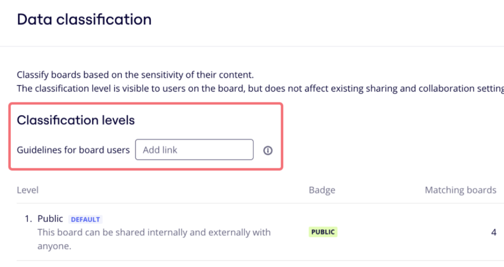

Data classification allows Enterprise Plan users to assign labels to their boards to specify the board content sensitivity level.

You can find the data classification settings in the Enterprise admin console. Go to **Settings**, and select **Classification**.

:::note
For customers with Enterprise Guard, you can find **Classification** in the admin console under **Enterprise Guard**. Go to **Settings** > **Enterprise Guard** > **Classification**.
:::

Ensure that you understand the following key points about data classification:

- Data classification is aninternal labeland has no impact on the board sharing settings, which means boards can be shared beyond their classification.
- Boards that were created before the feature was enabled will be marked as not classified.
- [Duplicating a board](../../../using-miro/managing-boards/03-how-to-duplicate-a-board.md) will copy the current data classification label on the new board copy.
- Labels are currently not displayed in [presentation mode](https://help.miro.com/hc/articles/360017731073), in [Smart meetings mode](https://help.miro.com/hc/articles/4408834812690), and on mobile.

## How to set up classification labels

In **Settings**, select **Classification**. To activate classification labels for your Enterprise organization, select **Set up classification.**

## How to add new classification labels

Company Admins can create and customize up to 30 classification labels, and set a default label for all new boards in the organization.

In **Classification** settings, four labels are already created, which you can customize. You can also create new labels to suit your organizational needs.

To create a new classification:

1. Select **Edit classification levels**.
2. Click **Add level**.
3. Set the classification **Level**, add a **Name**, add a **Description**, and change the **Badge color**.
4. If you would like to add a reference for board users, add a **Link to guidelines**.
5. (Optional) Select **Preview** to see how your label will appear in production.
6. Select **Done.**
7. (Optional) To reorder your classification labels, click the up (**Ʌ**) or down (**V**) arrows.
8. Click **Publish** to finalize the changes.

:::note
When you create or edit a classification label, your changes are saved as a draft and are not published until you click the **Publish** button. This means that you can exit the classification configuration and come back to it at any time.
:::

You can also add a link to your company's classification guidelines where collaborators can learn more about the existing data classification policies.

*Classification guidelines link*

## How to customize classification drafts

To edit a classification **without** a draft saved:

1. Click the **Edit classification levels** button.
2. Click the **Edit** pencil icon.
3. Make your changes and click **Done**.
4. Click **Publish** to finalize the changes.

To edit a classification **with** a draft saved:

1. From the Data classification panel, click **Resume configuration**.
2. Click the **Edit** pencil icon.
3. Make your changes and click **Done**.
4. Click **Publish** to finalize the changes.

## How to delete a classification label

To delete a label, click the trash icon. Note that you cannot delete the [default label](#adding-the-default-label-on-company-level).

*Deleting a label*

### Adding the default label on Company level

Choose a default classification label for newly created boards. Each new board that gets created in the Enterprise organization is assigned the default label.

To set up a default label for your organization, tick **Default classification label** when you add or edit a classification label.

*Setting up the default classification label*

### Adding the default label on Team level

> **Set up by**: Company Admins, Team Admins

Company and Team Admins can enable the **Override default label** and set a default label at the team level: every new board that gets created in the team will be assigned with this new default label overriding the default label set on the Company level.

To enable this setting, navigate to Team settings > **Permissions** and scroll down.

Note that you can set the team override label only if the data classification setting is enabled at the Company level.

For [newly created teams,](../../managing-enterprise-teams-and-content/09-create-a-new-team-on-enterprise-plan.md) this setting is disabled if you choose the default settings when creating a team.

### Adding classification labels to boards

> **Set up by:** [board owners](../../../using-miro/sharing-boards/01-board-access-rights.md), [board co-owners](../../../using-miro/sharing-boards/06-co-owners-of-boards-and-spaces.md), editors who are members of the team, Company Admins with [Content Admins permissions](../../managing-enterprise-teams-and-content/12-content-admin-permissions.md)

If data classification is enabled in your Company settings, users can see and change the board labels. The data classification label appears as a badge next to the board name. When hovering over the badge, collaborators can see a tooltip with the label name and description.

The board owner, [board co-owners](../../../using-miro/sharing-boards/06-co-owners-of-boards-and-spaces.md), editors who are members of the team, and Company Admins with [Content Admins permissions](../../managing-enterprise-teams-and-content/12-content-admin-permissions.md) can update the classification label either by clicking the classification badge or from the board details. Select a label and click **Update**. If the Company Admin added a link to guidelines in the settings, the user can follow the link on the pop-up to get more details.

*Changing the data classification label on the board*

### Data classification filter on the dashboard

Users on Enterprise plan with enabled data classification can filter their boards by labels on the dashboard. **Any classification** is selected by default.

*Board classification filter on the dashboard*
