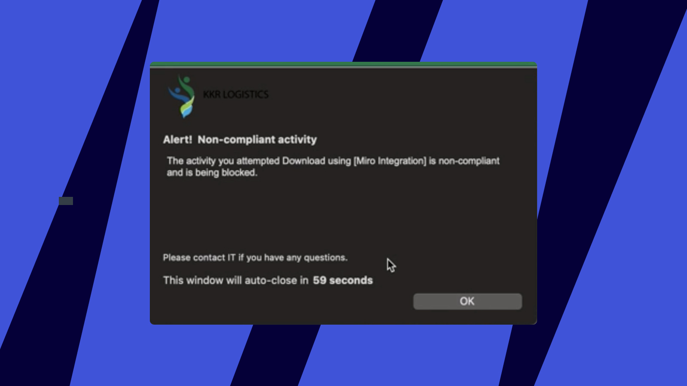

Miro custom connector for Netskope enables visibility on data leakage related events and allows managing the following traffic inside Miro:

- [Downloading board backup](../../../using-miro/import-and-export/export/05-how-to-save-board-backup.md)

This guide provides steps to configure Netskope for Miro Enterprise plan and describes the user experience.

### Create a new Miro app in Netskope

Inside your Netskope instance go to **Settings > Security Cloud Platform > App Definition** and click on **NEW CLOUD APP**:


*Creating a Cloud app in Netskope*

To create a new app inside Netskope you will be asked to import the following JSON file **miro-activities-for-netskope.json**:

```
[
{ "version": "0.0.0.1" },
{
"domain_name": "miro.com",
"uri_path": "/api/v1/boards/.+/",
"http_method": "GET",
"uri_param": [{ "key": "archive", "value": "true" }],
"resp_code": "200",
"pattern": "",
"activity_name": "Download"
},
{
"domain_name": "miro.com",
"uri_path": "/api/v1/boards/.+/resources/.+/files/original",
"http_method": "GET",
"uri_param": [],
"resp_code": "307",
"pattern": "",
"activity_name": "Download"
}
]
```

Enter the application name, select the **Custom Connector** option, and click on **IMPORT FROM FILE > Add To Activity List** to upload the **miro-activities-for-netskope.json** file downloaded from the previous step**.**


*Uploading the file*

After importing the **miro-activities-for-netskope.json** file the recorded activities will be displayed. Now you can proceed to click on **SAVE** and create the Miro app.


*Saving the app*

Once the app is created you need to select it and click on **APPLY CHANGES.**

***The option to apply changes to the Miro app*


### Create a new Policy for your Miro app in Netskope

Once the application is created you can proceed to create a policy. For that, you can navigate to **Policy > R****eal-time Protection** and click on **NEW POLICY > Cloud App Access.**


*Creating a policy for your Miro app*

Here in **Destination,** you need to provide the Miro app you created in the previous step, set up a **Policy Name,** and click on **SAVE.**

***Saving the policy*

Then you can select where do you prefer to place the policy and click on **SAVE.**


*Selecting where you prefer to place the policy*

Finally, you can apply changes by clicking on **APPLY CHANGES** button.


*Applying changes*


### Events visualization

Once you are all set, you can visualize the traffic by navigating to **Skope IT**, filtering by the custom Miro app, and clicking on **See Events** as follow.


*The option to see traffic events*

### User experience

The users for whom the Download activities should be blocked need to have the Netskope client installed in their machine. When the users try to perform a Download backup operation, Netskope blocks the action and shows a native OS popup with a message.


*A message shown to users that are not allowed to download a backup of a Miro board*
