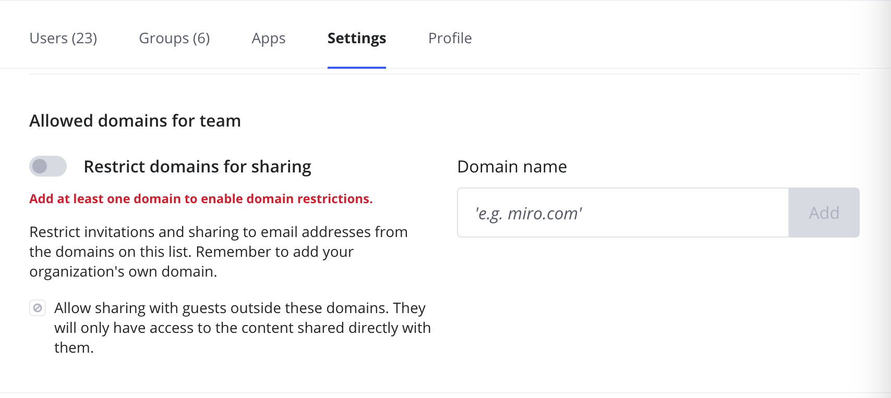
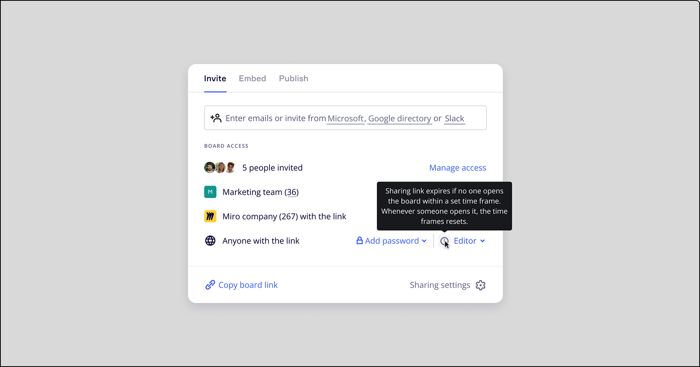
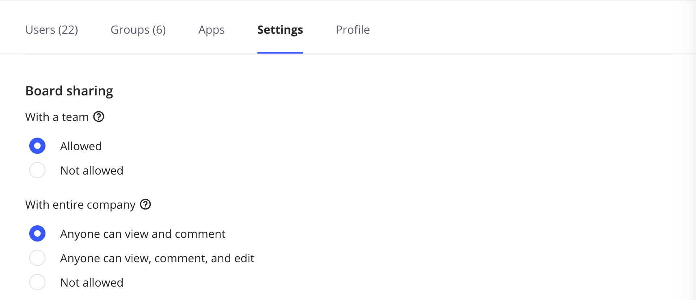
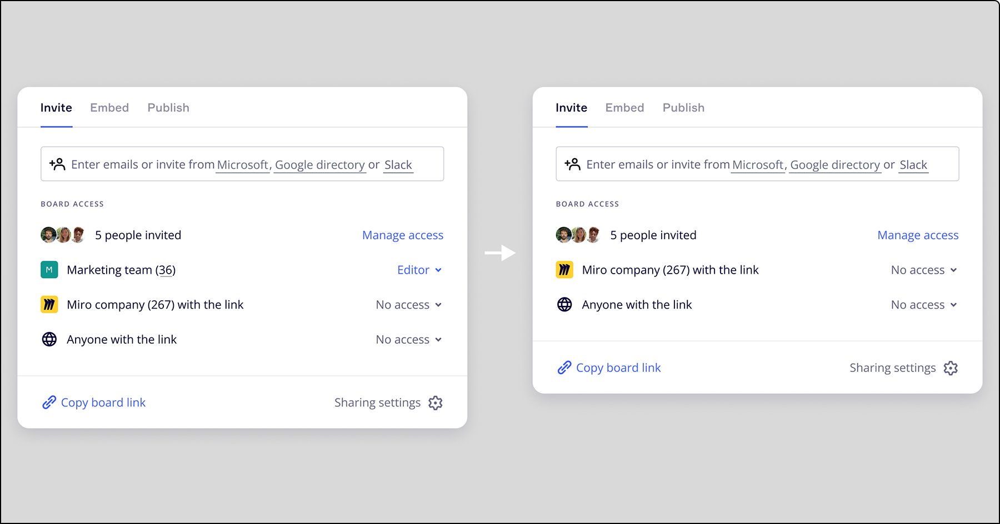
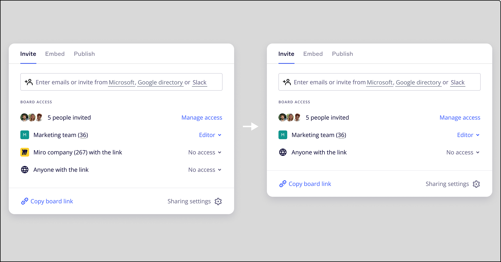

Data security and confidentiality are significant concerns for most enterprises. That's why our Enterprise Plan provides enforced tools to control information security risks. These include safer access management with SAML-based SSO option and better user rights and permissions control with enhanced admin capabilities. Additionally, we introduce optional restrictions: sharing outside of allowed domains and sharing via public link.

:::note
Sharing policy settings also influence available access settings when embedding boards within a specific app. Learn more: [Managing Enterprise sharing policy for embed integrations](../../managing-apps-on-enterprise-plan/05-how-to-allow-or-restrict-embedding-miro-boards-in-supported-apps.md).
:::

## Restrict sharing outside the allowed domains

On Company level On Team level

Once you set allowed domains on Company level, the option to share boards outside the domains will be restricted for all company members and teams.

1. Go to **Company** settings > **Security** > **Sharing**.
2. Toggle on **Restrict allowed domains**.
3. Add the list of trusted domains used within your Enterprise Plan.

To enable sharing with [guest collaborators](../../../using-miro/sharing-boards/07-collaboration-with-guests.md) and bypass the allowlist, check the **Allow sharing with guests outside these domains** box.

When **Allow sharing with guests outside these domains** is turned on, users with domains outside of the allowlist can have boards shared with them, but they still would not be able to find teams under [team discoverability.](../../managing-enterprise-teams-and-content/11-manage-team-privacy-and-discovery-on-enterprise-plan.md)

*The list of trusted domains and option for sharing with guests outside of those domains*

Any users that had been invited to the subscription before the setting was enabled stay in your plan and retain access to the shared content. However, it will not be possible to share any other content with them.

Additionally, you can **Verify all users against the allowlist** in case there are users whose domain is not allowed. You can remove them in the following pop-up:

*Users whose email addresses do not match the allowlist*

By restricting access at the Team level, users outside the allowed domains will not be able to access or be invited to the team or boards in it. The option allows you to enable the settings for a particular team without restricting sharing rules for all Enterprise users. It also provides you with the option to allow a particular domain for a team without the need to allow it for the whole Company.

:::note
If allowlisted domains are not configured on Team level, Company settings are effective. If Team-level allowlist is configured, this overrides Company-level restrictions. For example, if **Domain 1** is allowlisted on Company level and **Domain 2** is allowlisted on Team level, **Domain 1** will not be allowed on Team level unless it is added on Team-level allowlist.
:::

To configure allowed domains for a particular team:

1. Go to **Teams** and select the team you wish to configure.
2. Go to **Settings** and scroll down to **Allowed domains for team**.
3. Enable the **Restrict allowed domains** toggle.
4. Enter your allowed domains and click **Add**.
   To allow sharing with guests outside the domains, check the **Enable sharing with guests outside of allowed domains** box.

*The option to restrict allowed domains for a particular team within an Enterprise subscription*

Once you restrict sharing outside the allowed domains, Company users will be able to share their boards with users from the specified domains only. With the setting enabled, if a Company user tries to share their board with a domain that is not allowed, they get the following message:

*The board cannot be shared with a user whose domain is not in the allowlist*

:::note
If sharing via public link is allowed in your Company, [public boards](../../../using-miro/sharing-boards/03-sharing-boards-and-inviting-collaborators.md#sharing-boards-via-a-public-link) can still be accessed by *anyone with the board link* (and password if it is set up).
:::

## Restrict sharing via public link

Company admins can restrict all Company users or members of a particular team from [sharing company boards publicly](../../../using-miro/sharing-boards/03-sharing-boards-and-inviting-collaborators.md#sharing-boards-via-a-public-link). Once the setting is turned off, **Anyone with the link** option disappears from the Share menu of boards in company or team.

On Company level On Team level

To restrict public sharing for all Company users:

1. Go to **Company** **Settings >** **Security > Sharing**.
2. Toggle off **Boards can be shared publicly**.

Doing this will remove the "Anyone with the link" option from the board Share menu. This also means that all boards that have been previously shared with a public link or embedded to sites will become unavailable for public users, and their active sessions on the boards will be closed.

If Admins enable the ability to share boards publicly again, users will need to reactivate public sharing manually for each board.

If you want to allow editing on publicly shared boards, check the option to **Allow editing on publicly shared boards***.* If you *unselect the checkbox,* public access to all of the boards previously shared for public editing will be restricted.

:::note
Sharing via a public link is turned on by default on Team level and set to “Anyone can view and comment” for newly created teams. However, if this is **off** on Company level, teams can’t share boards publicly even if it is allowed on Team level.
:::

To restrict sharing boards publicly for a certain team:

1. Go to **Teams** and select the team you wish to configure.
2. Go to **Settings** and scroll down to **Sharing settings**.
3. Under **Board sharing** > **By public link**, you will see three options: you can choose whether to allow sharing publicly for viewing and commenting only, for viewing, commenting, and editing, or to restrict public sharing for the team.

*The option to configure sharing via public link for a team within an Enterprise subscription*

**Public link expiration (Company level)**

To make publicly shared boards more secure, enable public link expiration. This means that any links to the board shared with visitors will stop working after a certain amount of time if the board hasn't been opened. This applies to all boards once public link expiration is turned on in the company settings.

To enable public link expiration:

1. Go to **Company Settings > Security > Sharing**.
2. Scroll down to the **Content** section.
3. Select the checkbox for **Expire public sharing link**.
4. Set the number of days before inactive links expire. You can choose between 30 and 999 days.

:::warning
If the password on a board is reset, the board expiration date will also be reset for that board.
:::

## Require passwords for public boards (Company level)

You can also enforce mandatory passwords for all boards publicly shared by link.

1. Go to **Company Settings > Security > Sharing**.
2. Scroll down to **Content** section.
3. Check the box **Require passwords for publicly shared boards**.

Once this feature is checked, this will apply immediately to boards previously accessible with a public link and all boards going forward will not be able to be accessed publicly without a password.

- *For boards previously accessible by* [*public link*](../../../using-miro/sharing-boards/03-sharing-boards-and-inviting-collaborators.md#sharing-boards-via-a-public-link) *with no passwords:*
  If boards were previously accessible by a public link with no passwords, open sessions will be revoked and visitors will be prompted to enter a password if they try to access a previously accessible link.
- *For all boards:*
  To make a board publicly accessible by link, a password must be set by the board owner or [Content Admin](../../managing-enterprise-teams-and-content/12-content-admin-permissions.md). If a password is removed, the **Anyone with the link** option on the board Share menu will be converted to **No Access**. Team members with edit rights can share a board via a public link if the password has already been set, otherwise, they need to contact the board owner to set a password.
- When the "*Expire link when board has been inactive for 'x' days*" option is set, a clock icon will appear in the Share dialog box, with a message that public access will disappear after the specified number of days.
  
*Public sharing option on Enterprise plan with mandatory passwords*

You can also require that passwords be complex and specify which requirements passwords must meet. These can include:

- Minimum password length (from 6-14 characters; default is 8).
- Uppercase and lowercase letters.
- Numbers.
- Special characters.

*Settings for complex board passwords*

## Restrict team-wide and company-wide sharing (Team level)

:::note
Team and Company-wide sharing is turned on by default if the settings haven't been customized by Company admin.
:::

Enterprise Company admins can also enable/disable company-wide or team-wide sharing.

1. Go to **Teams** and select the team you wish to configure.
2. Go to **Settings** and scroll down to **Sharing settings**.
3. In **Board sharing,** choose whether sharing with a team is allowed or not allowed. For company-wide settings, choose whether the company can view and comment on shared boards, view/comment/edit, or whether sharing is not allowed.*Board sharing settings on Enterprise plan*

Enabling board sharing with a team allows team members to easily share their boards and projects with the entire team.

Disabling this option will remove it from the Share menu of team boards and projects. Previously shared boards and projects will no longer be available to team users unless shared by other means.

If the Admin re-enables the ability to share with the team, previously shared boards and projects will not be automatically shared with the team and users will need to manually share them again.

*The option to share a board with the team can be hidden on the Share menu*

Users on Enterprise plans with disabled [Team privacy](../../managing-enterprise-teams-and-content/11-manage-team-privacy-and-discovery-on-enterprise-plan.md) can also [share their boards with the whole Company for viewing, commenting, or editing in one click](../../../using-miro/sharing-boards/03-sharing-boards-and-inviting-collaborators.md#sharing-a-board-with-the-entire-company). You can lock this option for a particular team by selecting **Not allowed** under the setting **With entire company**. Or you can allow sharing for viewing and commenting only, or for editing as well.

Please note, if [Team privacy](../../managing-enterprise-teams-and-content/11-manage-team-privacy-and-discovery-on-enterprise-plan.md) is enabled in your Company, the option to share boards with the entire Company won’t be available even if this is allowed on Team level.

*The option to share board with entire company can be hidden on the Share menu*

## Restrict ability to move boards to other teams (Team level)

:::note
The ability to move boards to other teams is turned on by default if the setting hasn't been customized by Company admin.
:::

When a Company admin disallows moving boards for a team, members of that team won’t be able to move boards into other teams or out of that team. The setting is configured for each team in **Team settings > Permissions**.

:::note
Non-admin users cannot move boards to a team if the [option to create boards is restricted](../../managing-enterprise-teams-and-content/10-team-permissions-on-enterprise-plan.md) for them in the target team.
:::

*The option to restrict moving boards in and out of the team*

## Restrict company-wide custom template sharing

> **Available for:** Enterprise Plan
> **Who can do it:** Company Admins

Company admins can allow or restrict custom template sharing at the company level. When sharing is restricted, Team Members will not be able to share a custom template with the company without Admin approval.

1. Go to **Company settings** > **Security** > **Settings**.
2. Scroll down to **Roles and permissions**.
3. Toggle on **Restrict sharing of company templates**.

*The option to restrict company template sharing*

## Frequently asked questions

Do members receive notifications when Company Admins change the above-mentioned sharing settings on Team or Company level?

No, there is no notification in such cases. The rules get applied immediately.

Do we have a dashboard where we can track all the boards being shared with a public link?

Currently, there is no such dashboard.

I disabled the option to restrict allowed domains but we still cannot share boards with users outside of allowed domains. How can I fix that?

It is possible that the setting is still activated at Company / Team level. Please check if the restriction is turned off in Company or Team settings.
