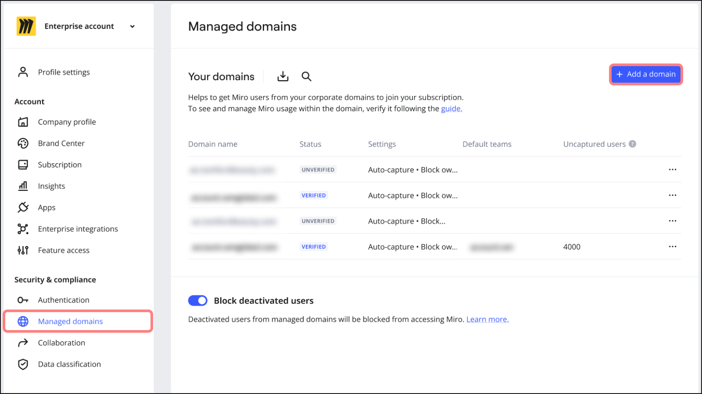
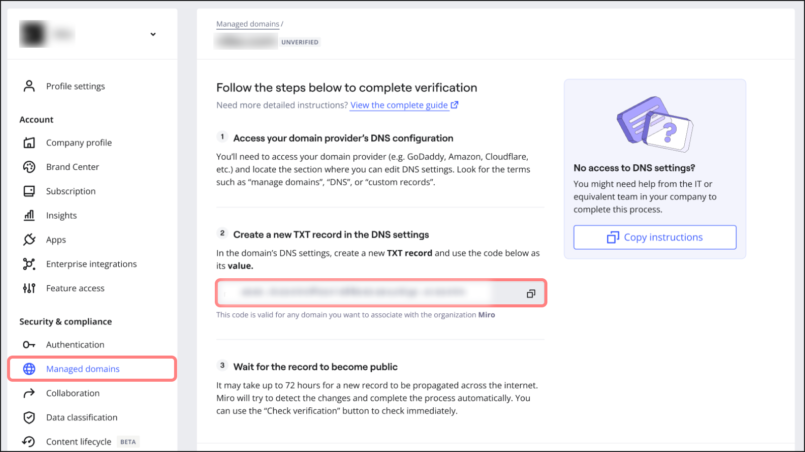
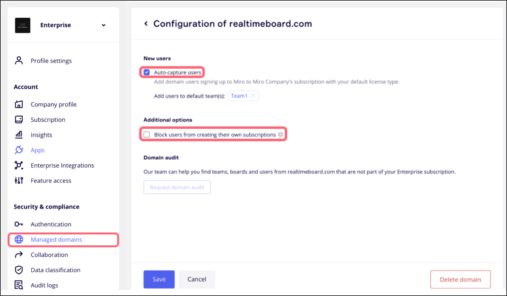

Domain control empowers Company Admins to manage user access within their subscription. By utilizing Domain control, admins can enforce corporate security compliance and maintain oversight over managed user activities within their domains. Learn how to set up and manage Domain control within your organization.

**With Domain control, Enterprise plan admins can:**

- Conduct audits to identify users who are associated with a managed domain that is not included in your subscription, and invite them to join.
- Prevent users within a domain from creating unauthorized subscriptions.
- Automatically add newly registered users to designated teams.
- [Block deactivated users](../../user-management/02-block-deactivated-users.md) to prevent their access to Miro using their corporate email address.

**Business plan admins:**

- Can use automated domain verification to manage domains. Only newly added domains will be automatically verified.
- Cannot change Domain control policies.
- Cannot request a domain audit.

*Domain policies can be viewed under Managed domains for Business plan users*

Business plan users will need to upgrade for other advanced features.

:::note
Bulk domain management is not currently supported.
:::

## Set up Domain control

### Step 1: Add domains

1. Open your Miro dashboard.
2. Click on your profile picture in the top-right corner.
3. Select **Settings** from the dropdown menu.
4. On the left pane, navigate to **Security & compliance**, and click **Managed domains**
   > ✏️ On Business plans, **Managed domains** is found under **Account**.
5. Click **+ Add a domain** and enter the full domain name (e.g., yourcompany.com).
   
*Managed domain settings*

### Step 2: Verify domains

1. After adding a domain, you will receive a verification code within your **Managed domain** settings. Copy this code.

   
*Copying the verification code*
2. If you manage your DNS records, update your DNS settings by adding a TXT record with the verification code as its **Value**. (If someone else manages your DNS records, forward them the verification code with instructions to update the DNS records.)
3. Log into your domain provider’s website (GoDaddy, Amazon, Cloudflare, etc), and navigate to the **DNS** **records** section.
4. Create a new **TXT-record** with the following specifications:
   **Value/Answer/Description:** *“miro-verification=[INSERT VERIFICATION CODE]”*
   **Name/Host/Alias:** Leave this blank or type @ to include a subdomain.
   **Time to live (TTL):** “86400” (this can also be inherited from the default configuration).

   
   *Creating a new TXT-record*

:::note
Updating the TXT record can be done either through the administration console or dashboard of the domain's hosting DNS provider. View the [list of DNS providers](https://support.google.com/a/topic/1409901).
:::

:::note
If you have enabled [Block deactivated users](../../user-management/02-block-deactivated-users.md), all deactivated users associated with a newly verified domain will also be blocked automatically.
:::

### Step 3: Check domain verification

1. After updating the DNS record, check the status of your domain verification immediately in your **Managed domain** settings by clicking **Check verification**.
2. If the domain is not verified immediately, Miro will automatically check for the verification code every 2 hours for the next 30 days.

### Step 4: Notification of verification status

1. Once your domain is successfully verified, you will receive an email notification confirming the verification status.
2. Please do not remove the DNS-record after verification, as it may be needed for future verifications.
   
*Checking domain verification*

## Rules when verifying domains

- You will need to create a separate TXT record for each top-level domain and each subdomain you use. Follow steps 1-4 above for each domain or subdomain you wish to verify.
- Your domain must be an exact match.
  > ✏️ Subdomains are not allowed.
- Ensure that all zones used in the verified domain configuration are included.
- The Fully Qualified Domain Name (FQDN) should match your domain address. For example, [www.mycompanydomain.com](http://www.mycompanydomain.com).
- If you use both internal and external DNS, we recommend verifying both to ensure comprehensive domain control.

## Managing users and access

### Edit domain settings

Domain settings determine how existing and newly registered users within your domain(s) are managed.

1. Once a domain is verified, click the three dots (**...**), and select **Edit domain settings**.
   
*Editing domain setting*
2. You will see options for handling new users to your domain:

- **Auto-capture new users**: Automatically add users who sign up to Miro with a managed domain email to this domain’s subscription with its default license type. You can also define which teams the users will be added to (required).
- **Block users from creating their own subscriptions**: Prohibit managed users within your domain(s) from creating any new teams outside of your subscription. However, these users can still be invited to teams in your domain(s) and collaborate externally.
  
*Options for handling new users to your domain*

## Captured and Uncaptured Users

### Captured users

A user is considered **Captured** when they are:

- In your Enterprise subscription.
- Using your corporate email domain.

This includes [invited](../../user-management/05-manage-user-invitations-on-enterprise-plan.md), [deactivated](../../user-management/01-deactivated-users.md) users, and [Guests](../../../using-miro/sharing-boards/07-collaboration-with-guests.md).

### Uncaptured users

An **Uncaptured user** is a user is someone who uses your corporate email domain but is not included in your Miro Enterprise subscription.

Domain control is the only way to get visibility into the count of uncaptured users other than requesting a **Domain audit** (you can request a domain audit from your Domain control settings).

### Scenarios impacting Uncaptured user counts

**Increase in Uncaptured users:**

- A new user registers with your domain(s) but does not join your Enterprise subscription, likely due to **Auto-capture** or **JIT**(Just-In-Time provisioning) being turned off.
- You [remove a user from the Enterprise subscription](../../user-management/10-remove-users-on-enterprise-plan.md), but their profile still exists.

**Decrease in Uncaptured users:**

- An Uncaptured user is added to your Enterprise subscription
- An invitation to an unregistered user expires 30 days from the invitation date.

## Email change requests

If your enterprise has claimed a domain, any user associated with this domain will be unable to change their email address in Miro without the approval of the Company Admin. When attempting to change their email, users will receive the following error message: **You cannot change your email to or from a domain belonging to an organization**. It is recommended that users contact their Company Admin, who will then reach out to Miro support for assistance.

## Frequently asked questions

Can I use Domain control with a subdomain?

Yes, subdomains are treated as separate entities from primary domains. Follow the setup process for each subdomain you want to verify.

How do I use SSO with domain control?

You will need to set up Domain control before enabling [SSO](../../security-integrations/single-sign-on-sso/09-single-sign-on-sso.md) authentication.

What if my domain name changes or I want to add a subdomain?

If your domain name changes, remove the domain and restart the verification process with the new domain or any subdomains you add.

Where do I find the DNS records for my domain?

To locate the DNS records for your domain, you'll need to access your domain registrar's platform where you registered your domain. If you're unsure who your domain registrar is, you can find this information by using **who.is** to search for the domain. Once you have identified your registrar, log into their website and navigate to the section usually labeled **Domains** or **DNS Management**. Here, you will find the DNS settings or records for your domain.

Why can’t I see **Managed domains** within my **Security & compliance** settings?

If you are unable to see the **Managed Domains** option, it could be due to two reasons:

- You are not subscribed to an Enterprise Plan which includes this feature.
- You do not have the Company Admin role required to access this setting.

Please verify your plan details and role with a Company Admin for further assistance.

Can I delete the TXT record for my domain once it’s been verified?

While deleting the TXT record after verification will not immediately affect the operation of your domain control, it is strongly advised to retain this record. Keeping the TXT record in place is crucial for potential re-verification processes in the future. Removing the TXT record could complicate these processes and require you to undergo the verification steps again.
