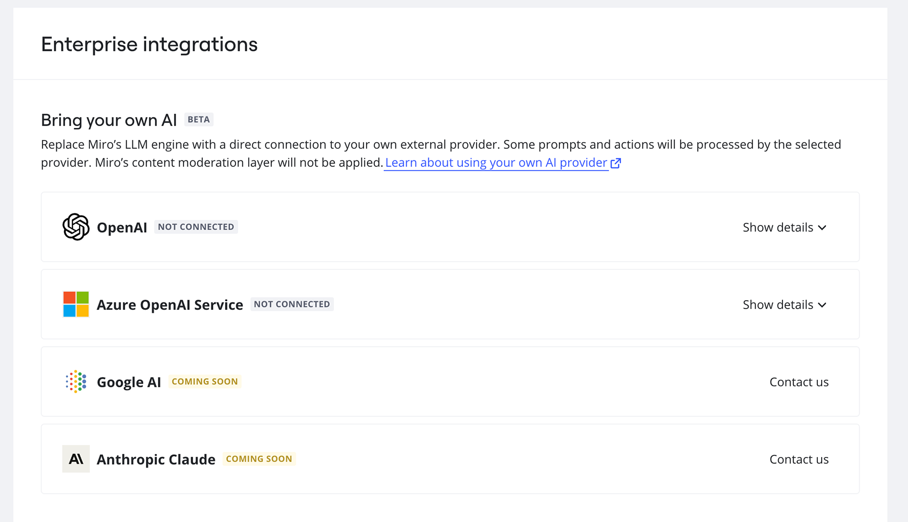
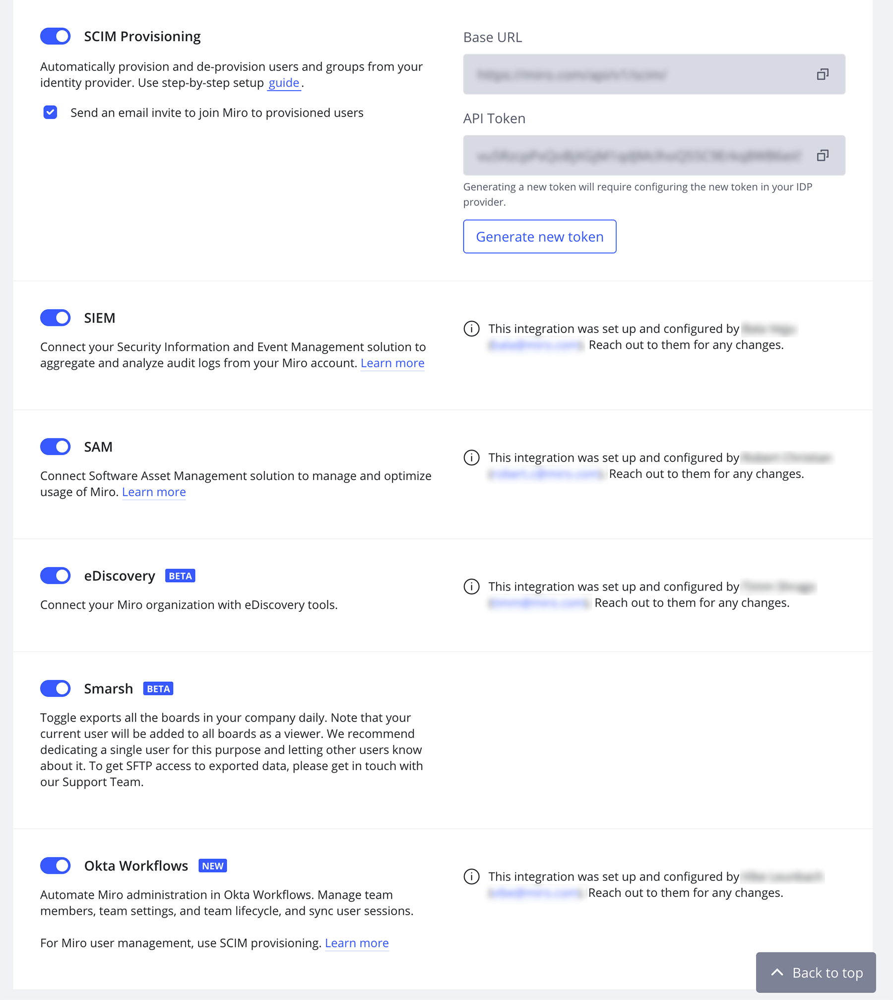

**Enterprise Integrations** page is a single place where you can configure all Enterprise Admin features such as SSO, SCIM, SIEM, and SAM to ensure additional security and efficient user and subscription management. It guarantees an easy way to set up integrations with a single click and does not require the creation of Developer Teams or private apps.

Access **Enterprise Integrations** from the Company settings of your Enterprise plan, under **Apps and integrations**.

At the top, you'll see options for Bring your own AI.

*Bring your own AI integrations*

Below that, you'll find additional integrations.

*Enterprise integrations*

On this page, you can configure a number of Enterprise integration settings.

- **System for cross-domain identity management**. Set up automated user provisioning and user management through your Identity provider. [Learn more about SCIM in Miro](../../security-integrations/system-for-cross-domain-identity-management-scim/02-scim.md).
- **Security information and event management.** Collect and analyze audit logs from your Miro  Enterprise organization. [Learn how to set it up](../../security-integrations/security-information-and-event-management-siem/01-miro-app-for-splunk.md).
- **Software asset management.** Analyze your subscription usage and manage licenses efficiently by settings up the integration with ServiceNow, Productiv, or Zylo. [Learn more about SAM in Miro](../../security-integrations/software-asset-management/01-software-asset-management-miro-enterprise.md).
