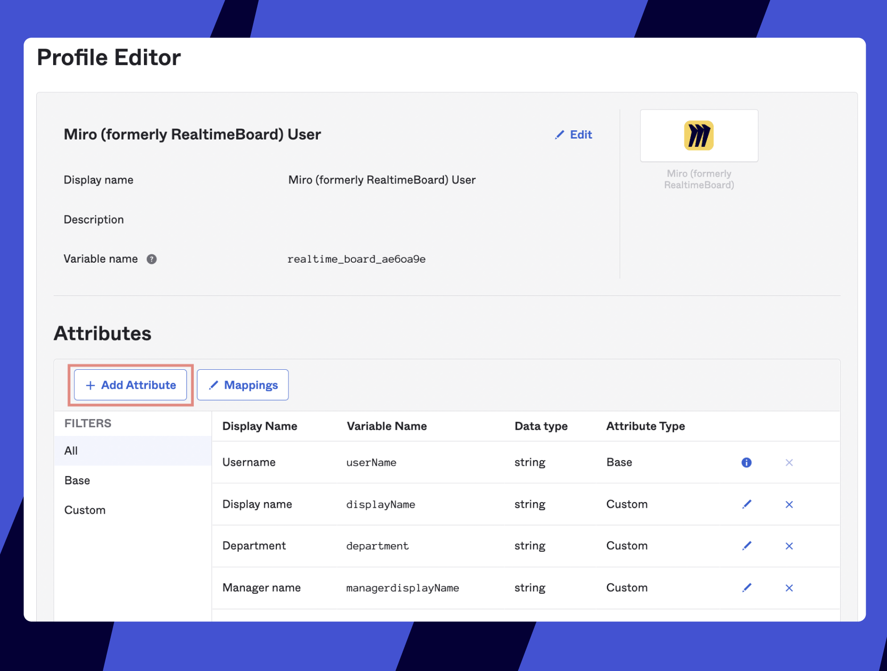
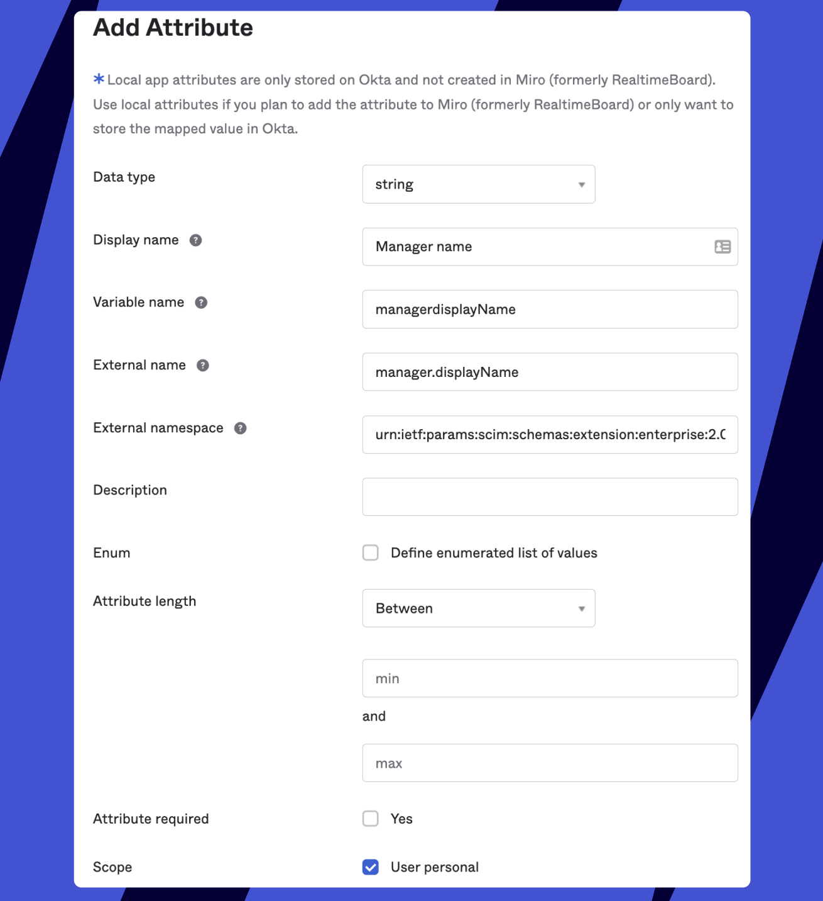
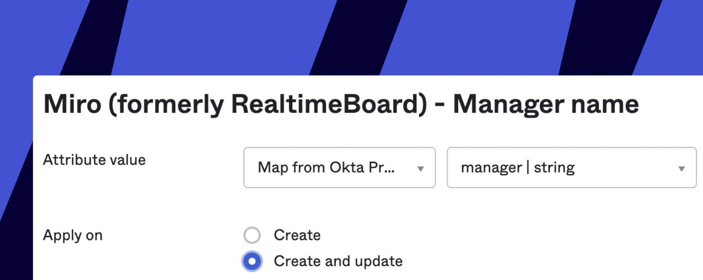
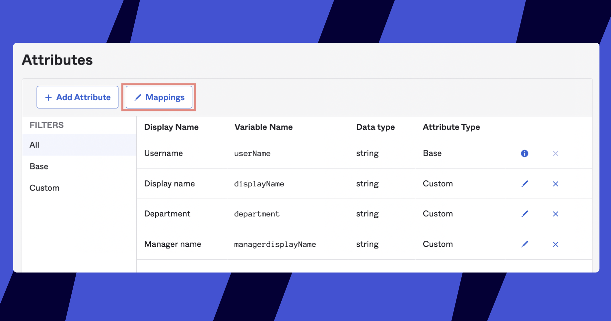
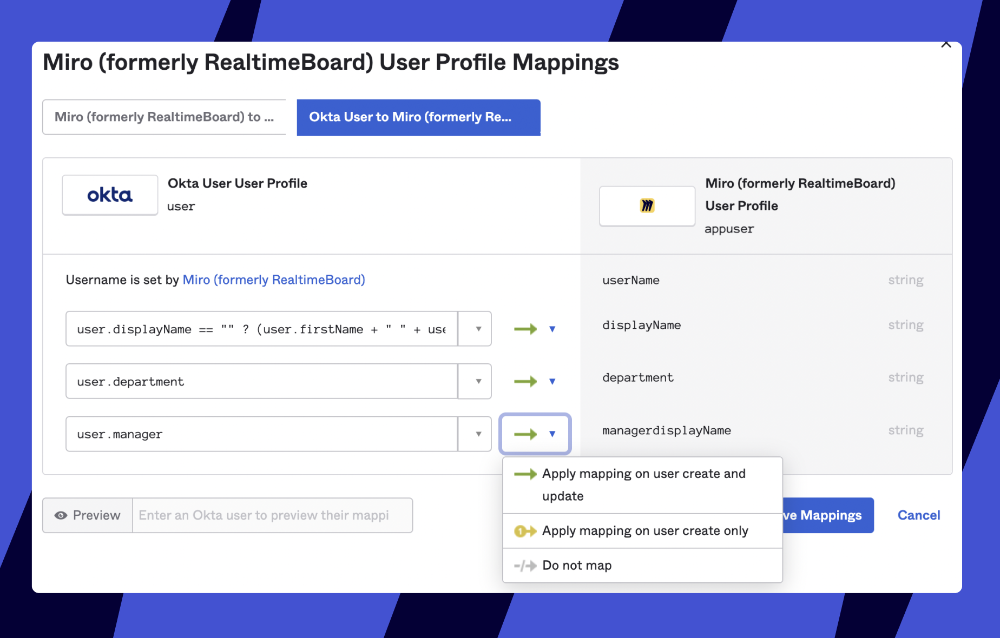
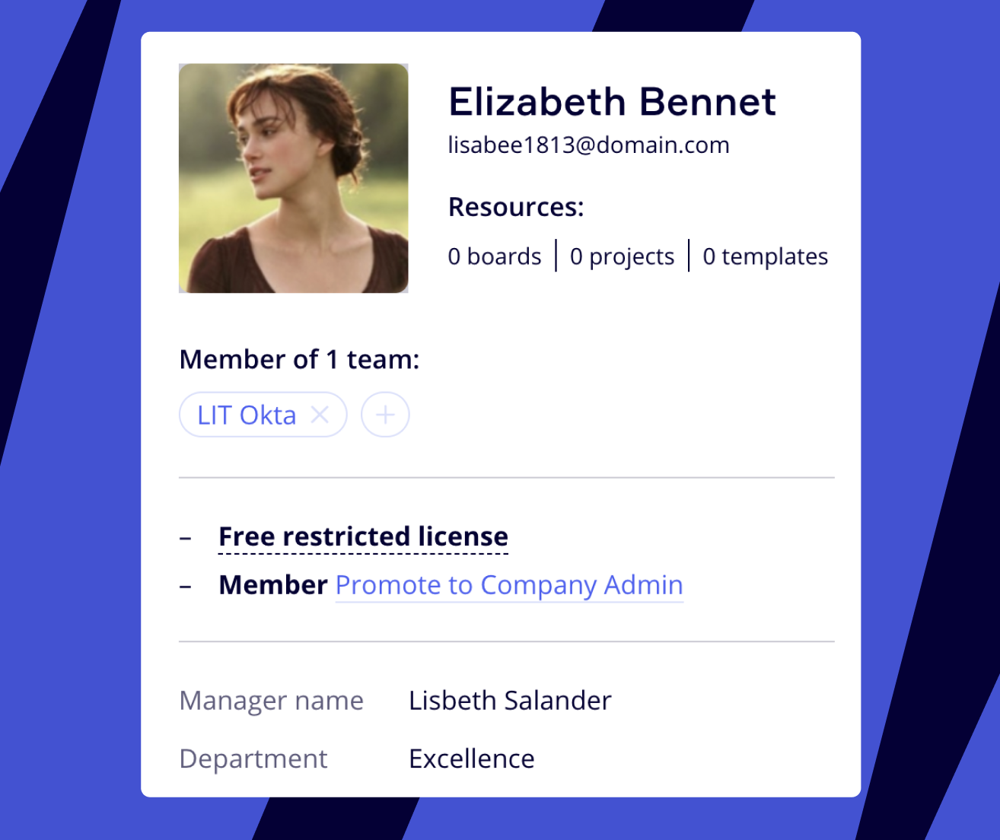
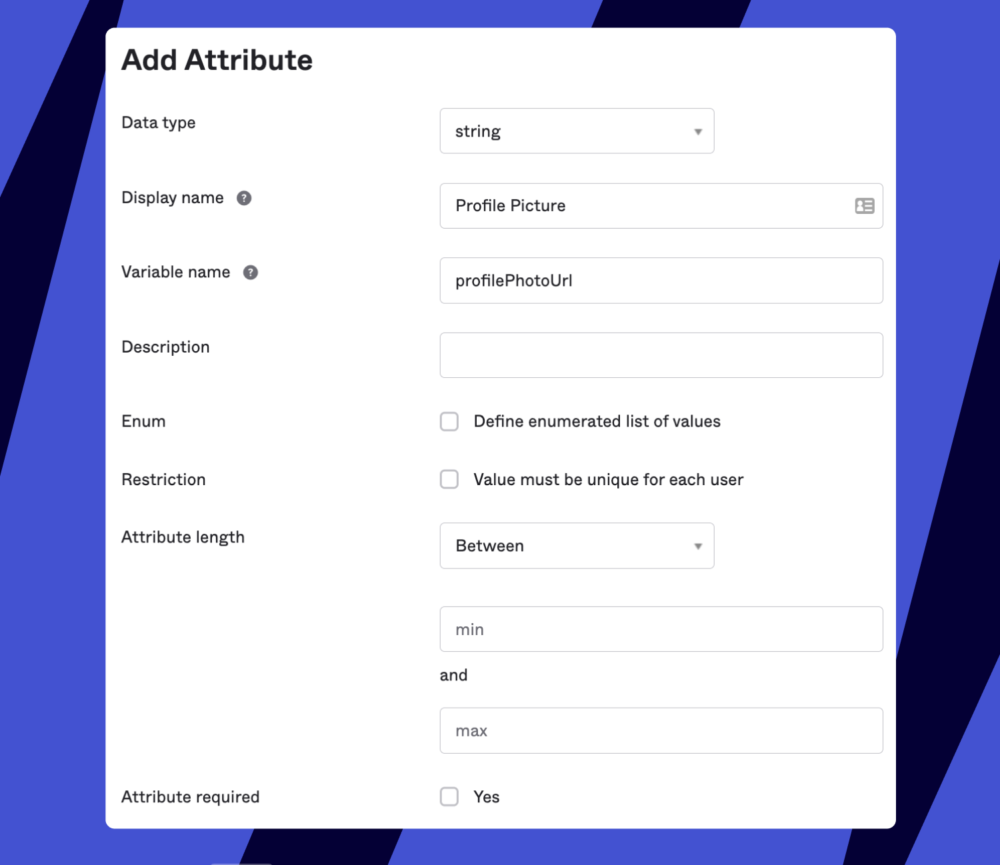
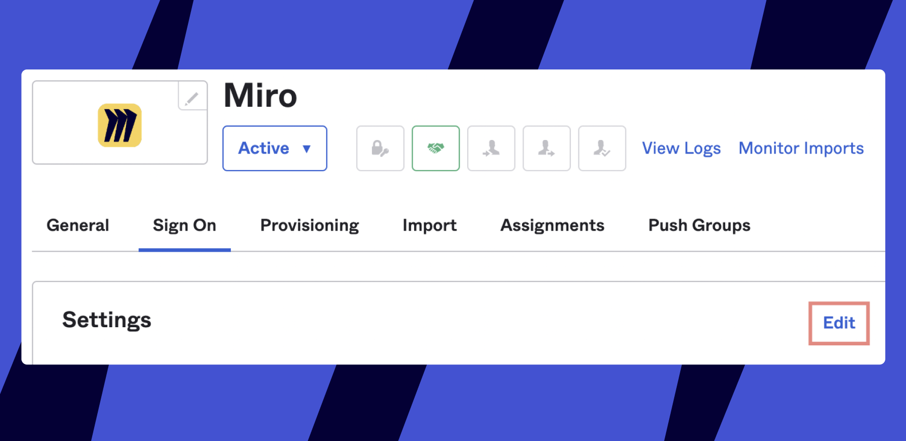
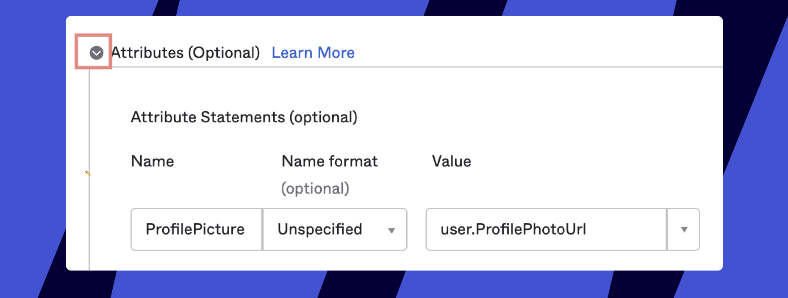

This article explains how to add new attributes when your Miro-Okta communication for SCIM and or SSO is already successfully configured.

> How to set up [Okta SSO](../../../security-integrations/single-sign-on-sso/07-how-to-configure-okta-sso.md)
> How to set up [Okta SCIM](../../../security-integrations/system-for-cross-domain-identity-management-scim/05-setting-up-automated-provisioning-with-okta.md)
> Okta license [provisioning Guide for FLP](https://drive.google.com/file/d/191s--JT-3vzU0g24xevhji5ObZO4zkCW/view?usp=sharing) (how to create and assign licensing attribute)
> How to set up [ProfilePicture for the SSO flow guide](https://drive.google.com/file/d/1go4BJWzFpQS5R04WdN1Q4O5Dy93k4wGp/view?usp=sharing) (when SCIM is disabled)

The only value required by Miro is **userName,** and the attribute must be in the form of an email. Other attributes are not required, but some of them will be accepted by Miro if present. To map the additional attributes to the Miro schema, you can use the details from [this document](https://developers.miro.com/docs/users#user-attributes) and follow the steps below.

:::warning
Since the Miro app-level attributes are synced value-wise to the general attributes you have in Okta, some attributes that may be unique to Miro (or at least not previously used in your instance) first need to be created in **Directory** > **Profile Editor** > **User (default)** before you proceed to the instructions below.
:::

## Creating attributes for SCIM

:::warning
Note that the attributes must be created on the Miro app level, ***not*** in the main Profile Editor in the Directory.
:::

1. Go to **Applications** > Open the Miro > **Provisioning.**
2. In OKTA, go to **Directory** > **Profile editor** > scroll down and click **Go to Profile Editor** > click **Add Attribute.
   ***The Profile Editor section of the Miro app*
3. See [the list of the supported attributes](https://developers.miro.com/docs/users#user-attributes) and copy **Miro attribute namespace** (the second column) of the attribute you would like to add. Paste the copied value into the field **External namespace**.
4. Copy the respective **Miro attribute** and paste it into the **Variable name** field. Okta will automatically add it to **External name** as well. Then remove the period sign from the **Variable name** field if it's present.
5. Enter the attribute name of your choice in the **Display name** field (we advise using the suggested values from the **IDP attribute name** column in our documentation).
6. Mark the **User personal** checkbox at the bottom of the modal.

As a result, the filled-out form should look something like this:
**
*Adding the Manager name attribute in OKTA*

Click **Save**. See that the new attribute appears on the list on the same page. Now your attribute is created but is not synced to anything and is empty.

### Setting up mappings

Your new attribute is unmapped and by default hidden under the cut on the list of attributes on the **Provisioning** tab of the Miro app. Click to **Show Unmapped attributes** > **Edit** your attribute:

- Attribute value: Select a type = **Map from Okta Profile, ATTRIBUTE_NAME | string**
- select **Create and Update**:

Click to **Save**. Now your attribute is shown as Mapped on the list, but this mapping is the one syncing data on the Okta side (now Okta knows where to take the value for the attribute). Now you need to sync the data between Miro and Okta.

Click the **Mappings** button on the same page:

*The Profile Editor section of the Miro app*

Click the section **Okta User to Miro**. On the right, you will see the attribute. On the left, choose the Okta attribute that you wish to sync, and then set the connection to **Apply mapping on user create and update.**

*Mapping the Manager name attribute to Miro*

After that, the attribute will start being sent to Miro for all new and existing users.

Click **Save mappings** and then **Apply updates now**.

And you're done!

:::warning
Note that the attribute data will be displayed only for those users that have any attribute value added to their profiles.
To assign the attribute on the group level follow the instructions [here](https://drive.google.com/file/d/191s--JT-3vzU0g24xevhji5ObZO4zkCW/view) from p.2.3 (the guide is created for License assignment but can be used for any attribute).
:::

The new attributes start displaying in Miro immediately (as soon as sent out by Okta). The attributes are displayed in the Miro settings for admins at the bottom of the [user's information card](../../../user-management/12-user-management-overview-on-enterprise-plan.md#user-info).

*User info card*

## Creating Profile Picture attribute for SSO

> How to set up [ProfilePicture for the SSO flow guide](https://drive.google.com/file/d/1go4BJWzFpQS5R04WdN1Q4O5Dy93k4wGp/view?usp=sharing) (when SCIM is disabled)

If you enable [SCIM](../../../security-integrations/system-for-cross-domain-identity-management-scim/02-scim.md) it is recommended to skip this part and configure the **Profile Picture** attribute the standard way. This part can be used as a workaround if you only use [SSO](../../../security-integrations/single-sign-on-sso/09-single-sign-on-sso.md).

The **Profile Picture** attribute, unlike others, can also transferred during *SSO authentication* - if you [enable it in your Miro SSO settings -](../../../security-integrations/single-sign-on-sso/09-single-sign-on-sso.md) not during SCIM pushes. This is why its creation flow can differ, and despite the notice at the beginning of this article, in this case it should be created in the *main* **Profile Editor**.

1. Go to **Directory** > **Profile Editor** > **Add Attribute**
2. Set the **Display Name** as "Profile Picture"
3. Set the **Variable Name** as "profilePhotoUrl"

   The result should be this:*Adding the **Profile Picture** attribute in the main Okta Profile Editor*
4. Click **Save** and proceed to populate the user custom attribute **Profile Picture** for each user in Okta (in the user Profile) using the image URL as the value.

:::warning
As of now Okta does not support storing images natively within their platform. The images must be hosted on a third-party server, publicly accessible via URL.
There is no size limit for images, however, ones larger than 400x400px may take additional time to load after the user re-authenticates.
:::

:::note
Alternatively, you can populate/update the attribute [via Okta API](https://developer.okta.com/docs/reference/api/users/#update-user).
:::

### Enabling Profile Picture attribute

Finally, enable the attribute in the **Sign On** section of the Miro app.

1. Go to **Applications** > chose your Miro app > **Sign On** tab > click to **Edit
   ***Sign on section of the Miro app*
2. Click the arrow beside **Attributes (Optional)** and add the following values:
   - **Name**: "ProfilePicture"
   - **Value**: "user.ProfilePhotoUrl"
   Your result should look like this:
   
   *Enabling the Profile Picture attribute in the Sign On section of the Miro app*
3. Double-check that the attribute naming is the same everywhere (we advise copying all the values from our instructions) otherwise, Okta may not be able to sync.
4. Scroll down and click **Save**.

**Profile Picture** is displayed *after a new successful user's authentication with SSO* on the Miro end.
