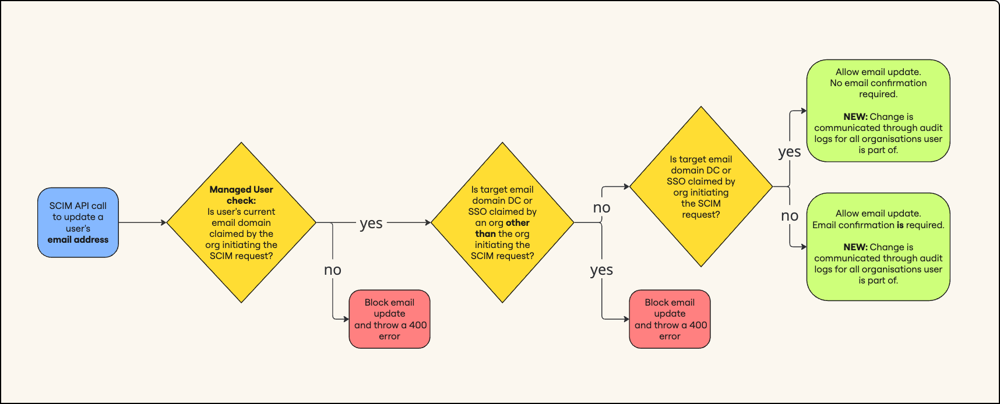
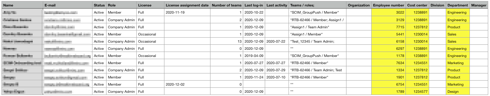

System for cross-domain identity management (SCIM) enables you to automate user management and provisioning and management between Miro and your identity provider (IdP).

## Important to know

- **SAML based SSO must be properly set up and be functional in your Enterprise plan before you start configuring automated provisioning.**
  See [the guide](../../../security-integrations/single-sign-on-sso/09-single-sign-on-sso.md) to configuring SAML SSO.
- **Syncing IdP groups with Miro teams is optional.**
  You can optionally link and sync your IdP groups with teams in Miro. You cannot create or delete teams using IdP. You can create and manage teams using the [Teams API](https://developers.miro.com/reference/enterprise-create-team). For more information about how the SCIM API enables you to manage IdP groups, see the [Miro Developer documentation](https://developers.miro.com/docs/groups).
- **Email address changes in SCIM include the following validation rules:**
  - **Managed User Check:** If the user’s current domain is not claimed by the organization initiating the SCIM request, the email update is blocked and throws a 400 error.
  - **Target Email Domain Verification:** If the target email domain is claimed by an organization other than the one initiating the SCIM request, the email update is blocked and throws a 400 error. If the target email domain is claimed by the organization initiating the SCIM request, the email update is allowed without requiring email confirmation. Audit logs record the update in each organization where the user is a member.
  - **Domain Control and SSO:** Email updates are allowed based on domain verification through Domain Control (IDC) or Single Sign-On (SSO). If the target email domain is verified through CD or SSO by the initiating organization, the update can proceed.
    
    *A diagram of the SCIM email change validation workflow*

### Rules under which Miro SCIM operates

- The SCIM-synced changes are primarily applied to newly assigned users. The status of those who are already under your subscription will be supplemented but might not be overwritten in that the changes are applied on the team level. For instance:
  a) if a user is a member of Team1 on the Miro side and your IdP sends an update to add them to Team2, their status in Team1 remains unaffected.
  b) if your IdP sends an update containing changes to User1, other team members are unaffected. As mentioned in **Supported Features** > **Sync and push groups** to overwrite the team status and re-sync all users at once try and initiate a new push.
- All users provisioned under SCIM are assigned the *default license* of your subscription:
  a) For Enterprise subscriptions without Flexible Licensing Program: a Full license. If your subscription runs out of licenses the users start getting provisioned under [Free Restricted](../../../enterprise-subscription-management/enterprise-licensing/04-free-restricted-license.md) license.
  b) For Enterprise subscriptions with [Flexible Licensing Program](../../../enterprise-subscription-management/enterprise-licensing/03-flexible-licensing-program-flp.md) activated: Free or Free Restricted license depending on the [default subscription license](../../../enterprise-subscription-management/enterprise-licensing/05-license-management-on-the-flexible-licensing-program-flp.md).
  *- If you need some of the users to be provisioned under a license different to the default one:*
  *as stated above, all users are provisioned with the default license. However, you can immediately update all or some of them using the **UserType** attribute with a Full value. Users updated with the attribute will be upgraded to the Full license with no downtime on the user-end.*
- All users provisioned under SCIM are also affected by the [Domain control](../../../canvas-25-admin-features/domain-control/01-domain-control.md) feature. This means that if a user is a member of only one security group in your Identity provider but your Domain control settings define 3 teams as the designated ones the user will also be added to those 3 teams.
- To protect the service Miro limits the number of API calls available every 30 seconds:

  | Request type | Limit level |
  | --- | --- |
  | GET scim/users    GET scim/users/\{userId\} | First Rate Limit Level 1 |
  | POST scim/users/\{userId\}    PUT scim/users/\{userId\}    PATCH scim/users/\{userId\}    DELETE scim/users/\{userId\} | Third Rate Limit Level 3 |
  | GET scim/Groups    PATCH scim/Groups/\{groupId\} | Fourth Rate Limit Level 4 |
  | GET scim/Groups/\{groupId\} | Third Rate Limit Level 4 |

  For details on limit levels please see [**here.**](https://developers.miro.com/reference#ratelimiting)If the number of requests exceeds the limit, Miro will return the standard **429 Too many requests**.

## Supported features

Detailed Miro SCIM schema can be found [**here**](https://developers.miro.com/docs/scim).

Miro supports the following provisioning features:

- **Create new users**
  New users assigned to Miro application in IdP will be created in your Miro Enterprise subscription as Enterprise Members. Users that are added to a IdP group that is synced to a Miro team with the same name will be added to the team as Team members.
- **Push user profile updates**
  For the supported attributes and changes see below.
- **Sync and push** **IdP** **groups**
  Sync your IdP groups and their members to the teams within your Miro Enterprise subscription to automatically manage user membership. Ongoing sync will send specific updates regarding your IdP group's users to the synced Miro team, while a push will overwrite the team's state treating the IdP group as the source of truth (if there were any manual changes by your Company Admins on the Miro end).
- **Decouple the IdP Group/Miro Team names**
  Miro syncs IdPGroups and Miro Teams by name thus they must have the same exact name. However, after the initial sync is created you will be able to give either one or both of them the names that are convenient for you. You can see the example of the decoupling [here](../../../security-integrations/system-for-cross-domain-identity-management-scim/03-setting-up-automated-provisioning-with-entra-id.md#decoupling-groups-and-teams)
- **Remove users from IdP group/Miro team (not the Enterprise subscription, see below)**
  Removing a user from an IdP group will remove them from the synced Miro team (during the next Group Push)
- **Deactivate users**
  Deactivating/deleting a user or disabling a user's access to the application in the IdP will *deactivate* the user in your Miro Enterprise plan. Depending on the circumstances, deactivating a user may reassign their content to the oldest team admins:
  - if you deactivate the user on the IdP end but keep them assigned to the Miro app, their team membership on the Miro end is not changed, and their content is not reassigned - they are simply moved from an **Active** to a **Deactivated** state (and users section, respectively) and stop consuming a license.
  - if you trigger the deactivation by deleting the user in the IdP or deassigning them from the Miro app, while the user is a member of some *synced* teams then the user will additionally be removed from *those* Miro teams and their content in the said teams will be reassigned to the oldest team admins.
  - if you trigger the deactivation by *deleting* the user in the IdP or *deassigning* them from the Miro app, when the user is not a member of any *synced* teams the user's team membership will not be changed and their content will not be reassigned.
  **Removing a user** from the Enterprise subscription is not supported *by default.* Still, you can [manually add the functionality using API](https://developers.miro.com/docs/scim#section-delete-user-by-id) to have the user completely removed from the subscription instead of setting them to the **Deactivated** status. In this scenario, the content is reassigned to respective Team members. It's impossible to set which Admins will get the ownership over automatically reassigned content. But this can be set when you manually [deactivate a user in Miro settings.](../../../user-management/01-deactivated-users.md)
- **Reactivate users**
  Assigning a user back to the application or reactivating the user profile in the IdP will reactivate them in your Miro Enterprise subscription if they were previously provisioned and deactivated.
- **Automating billing group allocation**
  Auto-assign new users to [billing groups](../../../enterprise-subscription-management/enterprise-billing/01-billing-groups.md) using SCIM. Once your Identity Provider (IdP) is set up, link your cost centers to your billing groups. This ensures every current and future user from these cost centers gets automatically sorted into the right billing category.

You can also remove users from your Enterprise plan by sending a direct **Delete** API call - please see the documentation [here](https://developers.miro.com/docs/scim#section-delete-user-by-id). Note that only *direct* calls will remove the users. **Delete** events initiated *by your identity solution* will be treated as a request to **Deactivate**.

### Supported attributes

:::warning
Note that:
- **Email** / The Primary Parameter / Unique Identifier / **Username**) is the only value required by Miro and must be in the form of an email.
- the email update is only possible for already synced users. In other words, the first sync must happen when their email in the IdP and Miro is the same, otherwise Miro won't recognise the user and a duplicate Miro profile under the new email will be created.
- the email update must happen in the user’s IdP profile, not in the assignments list.
- Unlike with other attributes, updating the user's **Email** will send them a notification: both the old and the new email address will receive a letter letting the user know that they are now to use their new email address to log into Miro.
:::

| Attribute name | SCIM Attribute (Claim) |
| --- | --- |
| Email | Username.  **Must be present and in the email format** |
| *The attributes listed below are not required and will be accepted by Miro if present (other attributes sent to Miro will be ignored).* | |
| Full name | displayName;      formated;      givenName + " " + familyName;      userName |
| User type | userType       supported value: "Full" |
| Active | active       supported value: "true" or "false" |
| Profile Picture | **photos.^[type=='photo'].value** or     **photos.^[type==photo].value** (Okta)     **photos[type eq "photo"].value** (Entra)        Must be a text URL to the image.        Supported file types: jpg, jpeg, bmp, png, gif        To define file type, you should have defined file extension in url        (e.g. `https://host.com/avatar_user1.jpg`) or request to url              should return together with a file content a header Content-            Type (e.g. Content-Type = 'image/jpeg')        Max file size to download is: 31457280 bytes |
| User Role | roles.^[primary==true].value (Okta)      roles[primary eq "True"].value (Entra)        supported values:  **ORGANIZATION_INTERNAL_ADMIN** **ORGANIZATION_INTERNAL_USER** |
| Employee number | employeeNumber |
| Cost center | costCenter |
| Organization | organization |
| Division | division |
| Department | department |
| Manager name | manager.displayName |
| Manager id | manager.value  "value" field has String type in SCIM standard but managerId       internal miro field has type Long. If "value" attribute is not       number value we ignore this value |

:::warning
Password changes are not supported and there are no immediate plans to start supporting this change.
⚠️ **Username**, **UserType** and **roles.value** cannot be updated for [Deactivated users](../../../user-management/01-deactivated-users.md).
:::

All attributes will be displayed in the exported CSV user list that can be downloaded from the [Active Users](../../../user-management/12-user-management-overview-on-enterprise-plan.md) section.

*The option to download a list of users*

## Configuring SCIM

### Step 1: Enable SCIM option in Miro

To enable SCIM for your Miro Enterprise plan, go to the **Company** settings > **Enterprise integrations,** enable the SCIM Provisioning feature**.** There you can get the Base URL and the API Token for configuring your IdP.

### Step 2: Configure your Identity Provider

The setup will depend on the Identity Provider you use. Miro supports preconfigured Okta and Entra ID however you can use any Identity Provider of your choice for as long as it allows setting up SCIM.

OKTA - see the setup instruction [here](../../../security-integrations/system-for-cross-domain-identity-management-scim/05-setting-up-automated-provisioning-with-okta.md).

Entra ID - see the setup instruction [here](../../../security-integrations/system-for-cross-domain-identity-management-scim/03-setting-up-automated-provisioning-with-entra-id.md).

## Generate new token

1. Go to the **Company** settings > **Enterprise integrations.**

2. In the **SCIM Provisioning** section, click **Generate new token**.

2. In the **Generate new SCIM token** window, click **Generate**.

3. After generating a new token, you must configure the new token in your IdP provider.

## Possible issues and how to resolve them

*1. Users do not get provisioned due to an allowlist error.*

Please make sure that the user's domain address is added to your allowlist [in the **Security** settings](../../../canvas-25-admin-features/data-security/07-sharing-policy-on-enterprise-plan.md).

*2. If you authenticate your end-users with one identity solution (IDP1) but would like to enable SCIM via a different one (IDP2), this is possible on two conditions:*

1. the IDP2 can do API calls with the bearer token.
2. both identity providers are in sync (so SCIM-provisioned users exist in the IDP1 as well and therefore are able to authenticate with Miro).

For more information on SCIM errors, see our [documentation here](https://developers.miro.com/docs/errors). If the issue persists, you can [reach out to the Miro Support Team](https://help.miro.com/hc/requests/new?referer=help-center-article).
