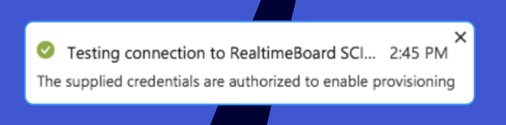
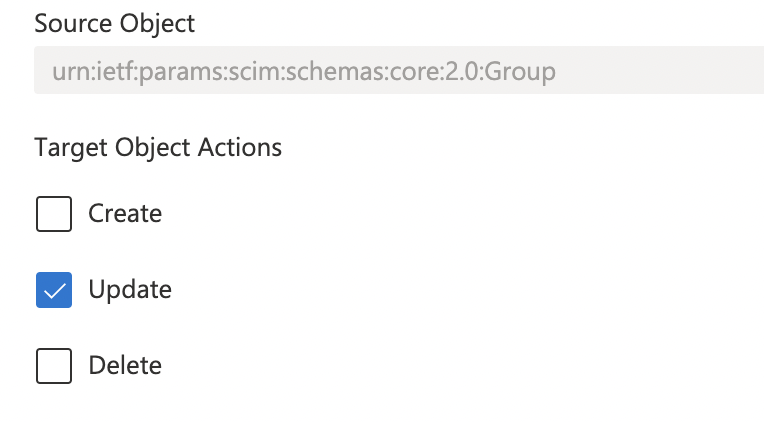
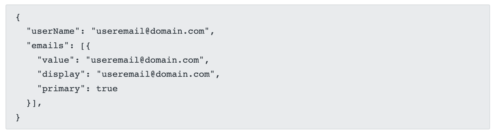
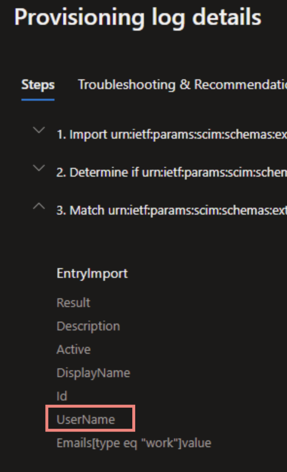

:::warning
The guide provides steps to configure the feature. For available functionality, rules that Miro SCIM follows and possible issues and how to resolve them please first see [**here**](../../../security-integrations/system-for-cross-domain-identity-management-scim/02-scim.md).
Miro's Developer documentation for SCIM can be found [**here**](https://developers.miro.com/docs/scim).
:::

A detailed provisioning guide for customers who utilize the [Flexible Licensing Program](../../../enterprise-subscription-management/enterprise-licensing/03-flexible-licensing-program-flp.md) can be found [**here**](https://drive.google.com/file/d/1TV1je5_4a6shNIZDqYHAobHaJSnmobix/view).

## Prerequisites

The Miro SCIM API is used by SSO partners to help provision, manage users and teams (groups). SAML based SSO must be properly set up and be functional in your Miro Enterprise plan before you start configuring automated provisioning. The instructions on how to set up SSO can be found [here](../../../security-integrations/single-sign-on-sso/09-single-sign-on-sso.md).

Your security groups and Miro teams must already be created and named the same way.

## Setting up Provisioning

Once the application is created during SSO configuration, you will see its settings:

*Miro application settings*

1. Choose the **Provisioning** item on the left panel and then change **Provisioning Mode** from **Manual** to **Automatic**:
2. Provide Admin Credentials:
   a) Use `https://miro.com/api/v1/scim/` as **Tenant URL**
   b) Provide the **Secret Token.** You can obtain it from the SSO section of your Miro settings like so:
   c) Click **Test Connection** button right below the **Secret Key** edit box.
   If the connection passes the test, you will get the following notification:
   
   *Successful connection test notification*
   If there is no confirmation, double-check the **Tenant URL** and make sure that it is not blocked by firewalls and any other traffic interceptors inside your network, as well as make sure the **API Token** is correct.
3. Save the configuration:
   
   *Saving the configuration*

## Mappings

Miro SCIM API makes use of a part of metadata Entra ID attaches to users and groups. This section explains the required mappings between Miro SCIM API and Entra ID attributes.

### Users

1. Choose the **Provisioning** tab on the left side, then click **Synchronize Entra Active Directory Users to Miro:**
   **
   *Enabling synchronization*
2. Default mappings are expected to be enough. However, double-check that synchronization is enabled for users and all required methods (Create, Update, Delete) are ON:
   
   *Attribute mapping*

Please note that Miro will recognize Entra users only by their UPNs for the SP-initiated flow.

To add one of the supported attributes click on **Show advanced options** option and select **Edit attribute list for Miro:**


*Advanced options*

Then enter the attribute name you want to map and save it. Please refer to our [SCIM documentation](https://developers.miro.com/docs/scim) to see the full list of supported attributes.


*Miro user attributes*

Now you can choose the option **Add New Mapping** and select the new attribute we just added:


Note that to be able to [map a new attribute](https://docs.microsoft.com/Entra/active-directory/app-provisioning/user-provisioning-sync-attributes-for-mapping#create-an-extension-attribute-on-a-cloud-only-user) you should enable this option by accessing Entra with the following URL:

```
https://portal.azure.com/?Microsoft_AAD_Connect_Provisioning_forceSchemaEditorEnabled=true
```

For further information about adding new attributes please visit Microsoft documentation [here](https://docs.microsoft.com/Entra/active-directory/app-provisioning/customize-application-attributes) and [here](https://docs.microsoft.com/Entra/active-directory/app-provisioning/user-provisioning-sync-attributes-for-mapping#create-an-extension-attribute-on-a-cloud-only-user).

:::warning
ProfilePicture attribute is not supported by Entra. You may request this feature to promote its development on [User Voice](https://feedback.Entra.com/d365community/forum/22920db1-ad25-ec11-b6e6-000d3a4f0789).
:::

### Groups

1. Choose the **Provisioning** tab on the left, then click **Synchronize Entra Active Directory Groups to Miro.**
2. Default mappings are expected to be enough. Check that synchronization is enabled for groups and *un*check **Create** and **Delete** methods - note that Miro SCIM API does not support creating and deleting teams.

   > ⚠️ We strongly recommend unchecking the methods to prevent unplanned changes [when we start supporting the methods.](../../../security-integrations/system-for-cross-domain-identity-management-scim/02-scim.md#important-to-know)

   
3. Click **Save**.

## User and Group Assignments

Miro SCIM Provisioning helps you to provision and de-provision users to your Enterprise subscription, and automatically distribute them across teams.

Users or Groups from Entra Active Directory must be assigned to Miro SCIM Provisioner application to be automatically managed in Miro.

To assign users and groups to the application, follow the steps below.

1. Choose **Provisioning** tab on the left. In the **Settings** section make sure the scope is set to the one you expect to be synced with Miro. Please choose "*Sync only assigned users and groups*".
2. Choose **User and groups** tabs on the left panel, then click **Add user**:
   
   *User and groups tab*
3. On the **Add assignment** screen, choose **Users and groups** tab, then select users and groups from the list. **NOTE**: Miro SCIM API does not create new teams in Miro. Please see the SCIM features list [here](../../../security-integrations/system-for-cross-domain-identity-management-scim/02-scim.md).
4. Click **Select**, then **Assign** buttons.
5. Assigned users and groups will appear in the list.

:::note
Removing the assignment for groups on Entra ID doesn’t remove users from the synced team in Miro and doesn’t deactivate them. To successfully deprovision users, remove them from all Entra ID groups connected to Miro.:
:::

### Downgrading a user

To downgrade a user, follow these steps:

1. In Entra ID, follow these steps:
   1. Remove the user from the group where the **Full** app role is assigned.
   2. Ensure that the user is a member of another group where the **User** role is assigned.
2. In Miro, update their license to **Free Restricted**.

:::warning
If you remove any user from all Entra ID groups assigned to the Miro application, then the user is deactivated in Miro and loses access to the Miro application. If the user you're downgrading must continue to access Miro with a **Free Restricted** license, then ensure that the user is a member of an Entra ID group where the **User** role is assigned.
:::

:::note
Downgrading a user from a **Full** to **Free Restricted** license via SCIM provisioning is not yet supported.
:::

## Enabling and disabling provisioning

When the initial set up is complete, switch Provisioning Status toggle to enable the provisioning.

1. Choose **Provisioning** tab on the left.
2. Click **On** option on the Provisioning Status toggle.
   
   *Provisioning status*
3. Hit **Save**. This will start the initial provisioning that might take some time. Go back in about 20 minutes and check the bottom of the page for the status.

Whenever needed, choose the **Off** option to disable the provisioning. Note that Entra updates the data intermittently so if you need an urgent update, Stop the provisioning and then Start again. Resync will be immediate and will also carry with it the updates.

## Decoupling Groups and Teams

To enable SCIM and sync your groups to your Miro teams they must be named the same way because Miro performs the sync based off the name value. However, if you need to have them named differently you can change the names of either of them after the sync is performed. Please see the example below.

The planned result: in Entra there is a Group named **sfo_hq_eng_support** while in Miro there is a Team named **Engineering Support** and the sync is performed between the two.

Run the curl command to list all Security Groups (don't forget to replace the placeholders with your unique values):

```
curl \
-H "Accept: application/json" \
-H "Content-Type: application/json" \
-H "Authorization: Bearer SCIM_API_TOKEN" \
-X GET https://miro.com/api/v1/scim/Groups
```

Sample response:

```
{
  "schemas": [
    "urn:ietf:params:scim:api:messages:2.0:ListResponse"
  ],
  "totalResults": 1,
  "Resources": [
    {
      "schemas": [
        "urn:ietf:params:scim:schemas:core:2.0:Group"
      ],
      "id": "3074457345618261605",
      "displayName": "YourMiroTeamName",
      "members": [],
      "meta": {
        "resourceType": "Group",
        "location": "https://miro.com/api/v1/scim/Groups/3074457345618261605"
      }
    }
  ]
}
```

At this moment in Miro there exist the Miro team called **Engineering Support** and the Miro Security group **Engineering Support** (with id **3074457345618261605**). They are mapped 1:1.

The goal now is to modify the name of the Security Group **Engineering Support** to **sfo_hq_eng_support** while keeping the Team name unchanged. To achieve that run the curl command:

```
curl \
-H "Accept: application/json" \
-H "Content-Type: application/json" \
-H "Authorization: Bearer SCIM_API_TOKEN" \
-X PATCH https://miro.com/api/v1/scim/Groups/3074457000018261605 \
-d '{
  "schemas": [
    "urn:ietf:params:scim:api:messages:2.0:PatchOp"
  ],
  "Operations": [
    {
      "op": "Replace",
      "path": "displayName",
      "value": "YourSecurityGroupName"
    }
  ]
}'
```

This change will be immediately displayed on the Miro **Company teams** page.


Entra performs the background scheduled synchronization every 40 minutes. With the next sync Entra will see the **sfo_hq_eng_support** Security Group in Miro and will automatically link it with the respective Group in Entra.

At this point you have connected your Security Group to one of your Miro teams and have them named differently.

## Possible issues and how to resolve them

### Issues with changing user emails

If you updated some of users' emails but do not see the change on the Miro end, see that the expected attribute is updated. This issue may usually arise if you use **emails[type eq "work"].**

**emails[type eq "work"]** attribute is a default in Entra, so Miro does support it - but only in that it's read-only and is dynamically generated from **userName**.
When reading users, we return:

Since **emails[type eq "work"]** is read-only on our end, Miro will ignore any attempts to modify it. This is because in Miro a user email is the primary ID of the user; this is what we recognize users by, so we do not support *extra* emails. But the SCIM structure does require an email array, so we support its existence.

To *modify* user emails, the update must be sent for **userName**, not **emails[type eq "work"]**.



### Failed to update user error

Entra logs show **Failed** status with:

**Status Reason -** "Failed to update user: Attribute emails does not have a multi-valued or complex value"
**ErrorCode** - SystemForCrossDomainIdentityManagementServiceIncompatible
