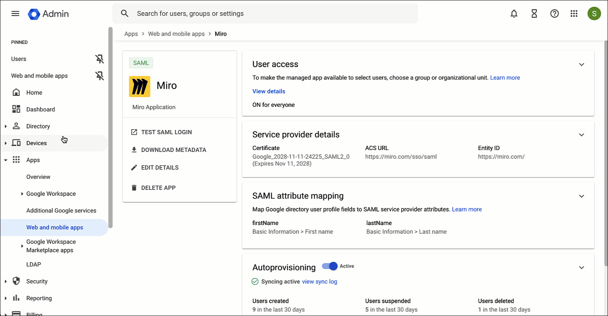

:::warning
This guide provides steps to configure SCIM using Google. For available functionality, rules that Miro SCIM follows, and possible issues and how to resolve them, please see the [Miro SCIM article](../../../security-integrations/system-for-cross-domain-identity-management-scim/02-scim.md).
For developers, please see the [Miro SCIM API introduction](https://developers.miro.com/docs/scim).
:::

Google also has steps on [how to configure Miro user provisioning](https://support.google.com/a/answer/14207443).

## Prerequisites

Before you can begin configuring automated provisioning with SCIM, Google SSO must first be set up in Miro. Please refer to these instructions on [how to set up Google SSO](../../../security-integrations/single-sign-on-sso/06-how-to-configure-google-sso.md).

Your security groups and Miro teams must also have already been created.

## Setting up user provisioning

1. In your Google Workspace Admin Console, go to your Miro app (**Apps > Web and mobile apps > Miro**)
2. Under “Autoprovisioning”, click **Configure autoprovisioning**
3. To provide your Miro access token, log in to your Miro organization (`https://miro.com/app/dashboard/`) then click your avatar in the top-right corner and click **Settings**
4. In Company settings, click **Enterprise integrations** and toggle on **SCIM Provisioning** if needed
5. Use the **Copy** button to copy the API Token
6. Return to your Google Admin Console and paste the token, then click **Continue**
7. Verify that all required values for Attribute mapping are mapped to Google attributes. If not, click the down arrow next to the attribute and choose the correct value. Click **Continue**
8. If you want to limit provisioning scope to specific groups, type the group name or names to add them. Otherwise, to add provisioning for all users, click **Continue**
9. Next, configure any deprovisioning settings you wish, then click **Finish**
10. You will now see autoprovisioning settings in the “Autoprovisioning” area. Click the toggle to make autoprovisioning **Active**.

## Testing provisioning in Google and Miro

1. First, add a user in the Google Admin Console. Click **Directory > Users**
2. Click **Add new user**
3. Enter the **First name** and **Last name** for the user, then click **ADD NEW USER**
4. Click **DONE** to confirm and add the new user
5. Refresh your browser and the new user should appear
6. Next, on the Miro side, go to your Company settings (`https://miro.com/app/dashboard/` then click your avatar in the top-right corner and click **Settings**), then click **Active users**
7. You should now see your newly-provisioned users*Adding provisioned users to Google (and Miro)*

## Troubleshooting if autoprovisioning stops working

If the admin password for Miro changes or if there is account inactivity, autoprovisioning can stop working. To continue syncing user accounts in Google Workspace to the app, you need to reauthorize autoprovisioning.

1. In your Google Workspace Admin Console, go to your Miro app (**Apps > Web and mobile apps > Miro**)
2. Click the **Autoprovisioning** section, then under “App authorization”, click **REAUTHORIZE**
3. When prompted for Access token, enter the **API token** from Miro (see steps 3-5 in “Setting up user provisioning” above)
4. Click **Re-authorize**

If you need additional support, please see the [Miro SCIM article](../../../security-integrations/system-for-cross-domain-identity-management-scim/02-scim.md).

For more information on editing provisioning settings, turning off autoprovisioning and deleting configuration information, see [Configure Miro user provisioning](https://support.google.com/a/answer/14207443#zippy=) in the Google Help Center.
