:::warning
The guide provides steps to configure the feature. For available functionality, rules that Miro SCIM follows and possible issues and how to resolve them please first see [**here**](../../../security-integrations/system-for-cross-domain-identity-management-scim/02-scim.md).
Miro's Developer documentation for SCIM can be found [**here**](https://developers.miro.com/docs/scim).
:::

Read our detailed provisioning guide for customers who utilize the [Flexible Licensing Program](../../../enterprise-subscription-management/enterprise-licensing/03-flexible-licensing-program-flp.md).

## Prerequisites

SAML based SSO must be properly set up and be functional in your Miro Enterprise plan before you start configuring automated provisioning. The instructions on how to set up SSO can be found [here](../../../security-integrations/single-sign-on-sso/07-how-to-configure-okta-sso.md).

When calling the SCIM API, you will need to provide an API Token. Enable the SCIM option in your **Enterprise Integrations** > **SSO** > **SCIM** settings to see the token.

Before syncing see [**Important to know** and **Rules under which Miro operates**](../../../security-integrations/system-for-cross-domain-identity-management-scim/02-scim.md) to avoid errors during connection.

## Configuration

1. On the application settings page, switch to the **Provisioning** tab. Then click **Configure API Integration:
   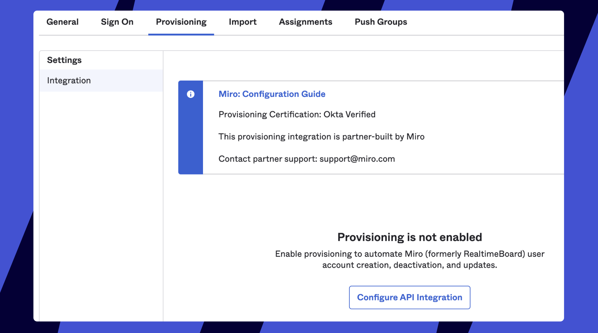***Provisioning tab in the preconfigured Miro app*
2. Set **Enable API Integration** checkbox and provide **Base URL** (`https://miro.com/api/v1/scim/`) and your unique **API Token** (available in the **Security** section of Miro settings) in the respective fields. After that click to **Test API Credentials**.
   If the connection passes the test, you will get the notification saying "Miro was verified successfully":
   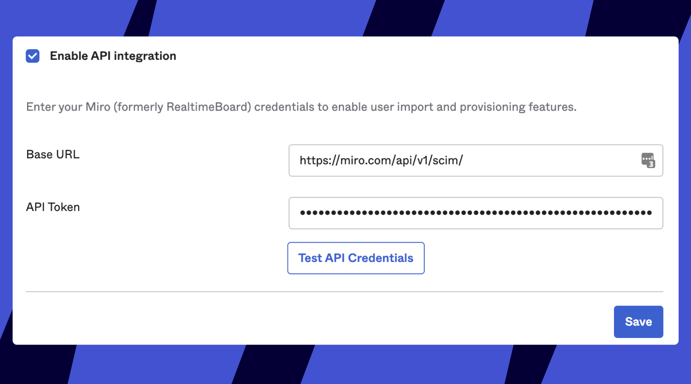
   *Provisioning tab, Integration section*
   If there is no confirmation, double-check the **Base URL** `https://miro.com/api/v1/scim/` and make sure that it is not blocked by firewalls and any other traffic interceptors inside your network, as well as make sure the **API Token** is correct.
3. **Save** the configuration.

## To app mappings

Miro SCIM API makes use of a part of metadata OKTA attaches to users and groups. This section explains the required mappings between Miro SCIM API and OKTA attributes.

1. On the application settings page switch to **Provisioning > To App** tab. Click **Edit** and enable checkboxes next to **Create Users, Update User Attributes** and **Deactivate Users** sections.
   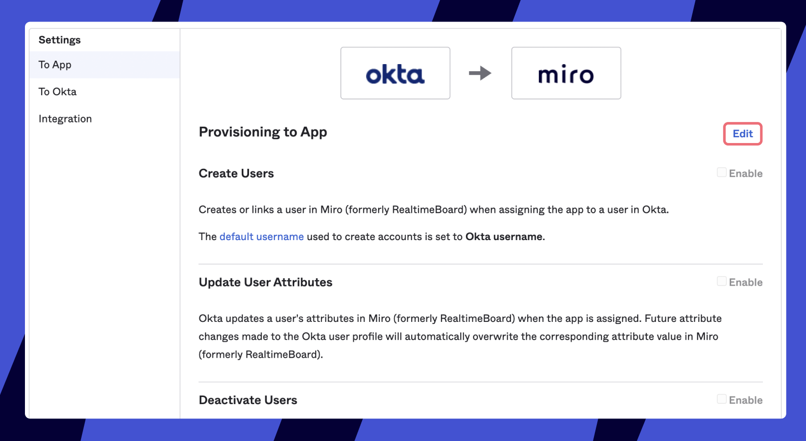
   *To App tab in the preconfigured Miro app*

Scroll down and check that the Username is set to **Configured in Sign On Settings**:
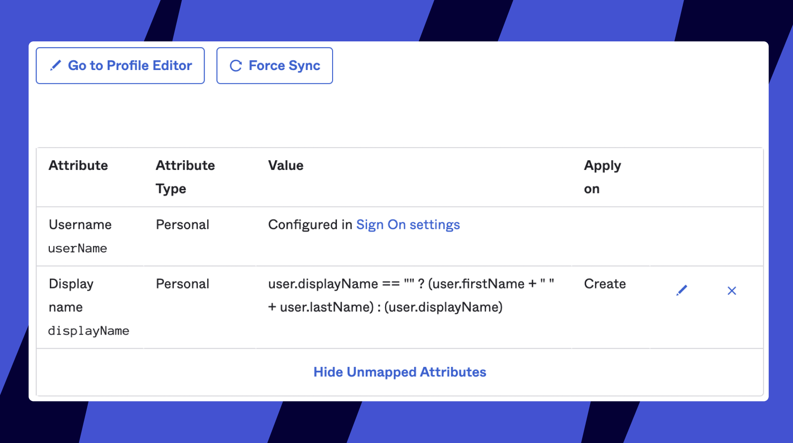
*Attribute mappings tab in the preconfigured Miro app*

To add one of the supported attributes click on **Go to Profile Editor**option and select **Add Attribute:**

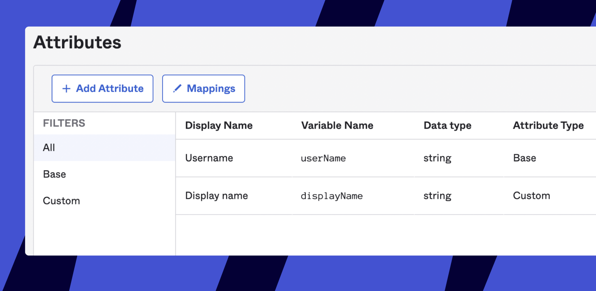
*The list of active attributes in the Profile editor*

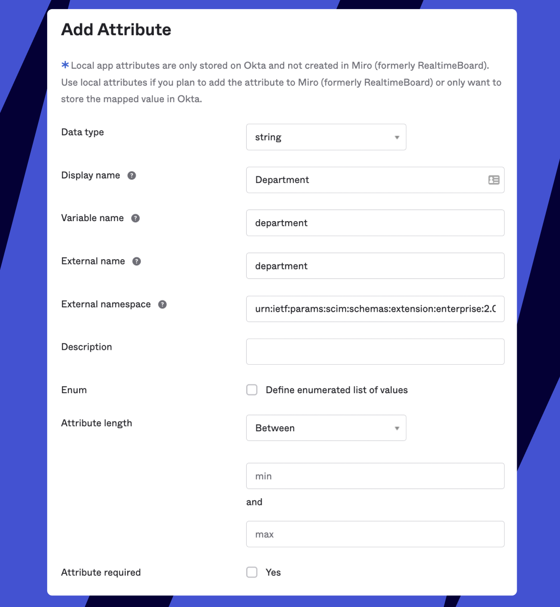

Please visit our [SCIM documentation](https://developers.miro.com/docs/users#user-attributes) to see the full list of supported attributes.

## Assignments and push groups

Miro SCIM provisioning can help you provision users to your Miro Enterprise plan, as well as automatically distribute them across teams, and deactivate them if need be.

:::warning
Groups from OKTA must be *assigned* to the Miro application (even if the group contains the users that were already assigned as Users directly) *and* then also to be added to *Push Groups* of the app.
:::

1) Use **Assignments** tab to assign groups to the Miro application. All assigned users will be able to authenticate via Miro SSO at this point but will not be placed into any Miro teams.

2) After that, configure **Push Groups** to sync your Okta groups to your Miro teams.

- Choose **Push Groups** tab on the application settings page, then click **Refresh App Groups:
  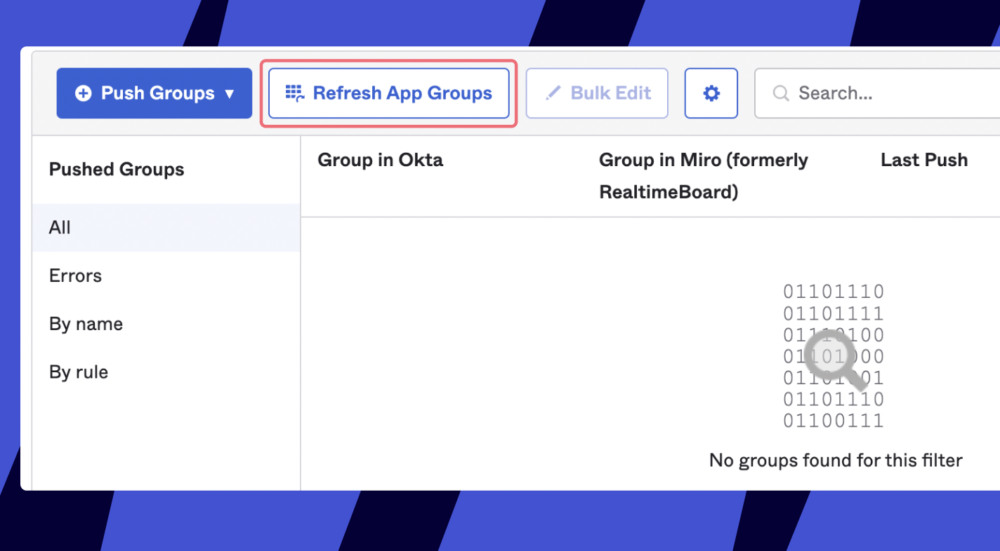***Push groups in the preconfigured Miro app*

  This will allow Okta to learn which teams exist in your Miro subscription to be able to sync to them afterward. It may take a few minutes to download the list of teams depending on their number.
- Click **Push Groups > Find groups by name: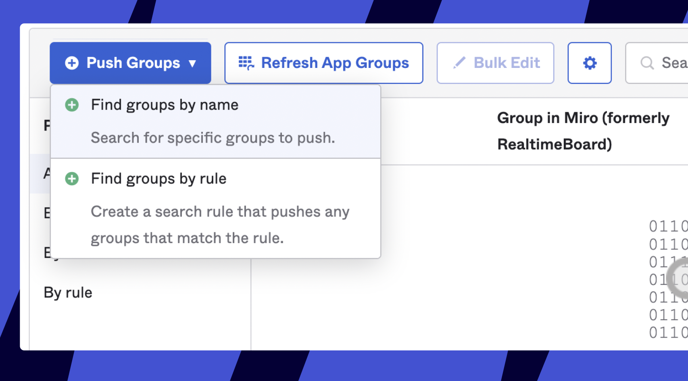***Setting up pushed groups*Type-in an OKTA group name in a quick search box and choose it from the auto-suggest list. OKTA will show you the group that has a match to the respective Miro team (according to the previously downloaded list).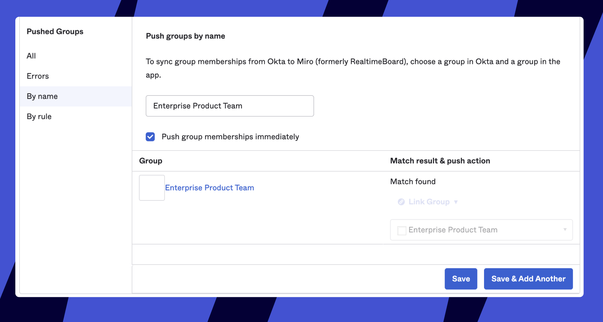*Linking OKTA groups and Miro teams*If OKTA shows you the option to *manually* link the group, make sure the Miro team *with the name of the group exists* on the Miro side. It's best to click **Refresh Apps groups** again so the system syncs the entities and then retry searching by the group's name.
- If you have some users already added to your Miro Enterprise plan *directly* instead of being provisioned from Okta, go to the **Import** tab and click to **Import now.** This will import the information about your existing Miro users to Okta. From there you can choose how to process the imported users:
  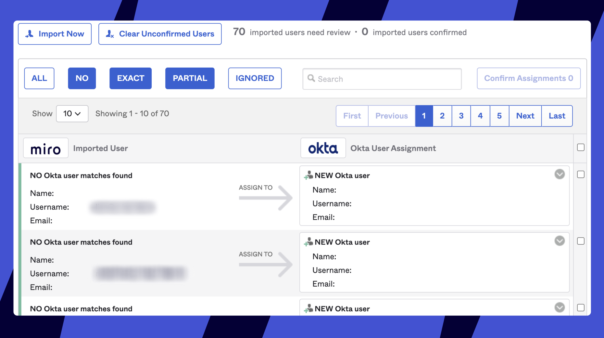
  As a result you will ensure that there are no users mismatched between the systems and thus unable to log in after you enable SSO.
- **Save**changes and that will be all! You will be shown the list of the groups that are now Pushed to Miro and the status of the synchronization which should be Active (in green). At this point, all the users of the chosen groups will be placed in the respective Miro team and will get access to the boards shared with the team. They will then be continuously updated.

## Possible issues and how to resolve them

1. *Users are not pushed to Miro.*
   Please check that the pushed group in Okta is properly *assigned* to the app. Note that Okta's **Active** status of the Push Group sync may sometimes be *faulty*. To solve sync errors try to de-assign the group, remove it from Push Groups, and then recreate the sync connection by assigning the group anew and then adding it to Push Groups again. Even if the setup you have did not change, the process of re-creating the synchronization connection may be required to solve the issues.
2. *Users are not being deleted.*
   Note that the [SCIM processes](../../../security-integrations/system-for-cross-domain-identity-management-scim/02-scim.md) do not include user *deletion*. To take away a user's access, deactivate them in OKTA, or de-assign a user from the application on Okta side, which will send a corresponding request to Miro and will set the user to the [Deactivated status](../../../user-management/01-deactivated-users.md), refer to our guide how to [*delete* a user](../../../user-management/10-remove-users-on-enterprise-plan.md).
3. *User data are not being updated.*
   Please note that the **Username** attribute should NOT be updated from **Application** > **Assignments**:
   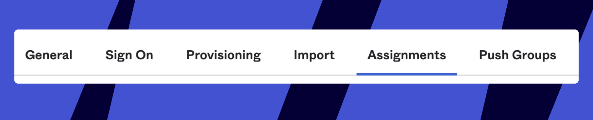
   Username attribute (as well as other attributes) should be updated from **Edit** option in the user profile:
   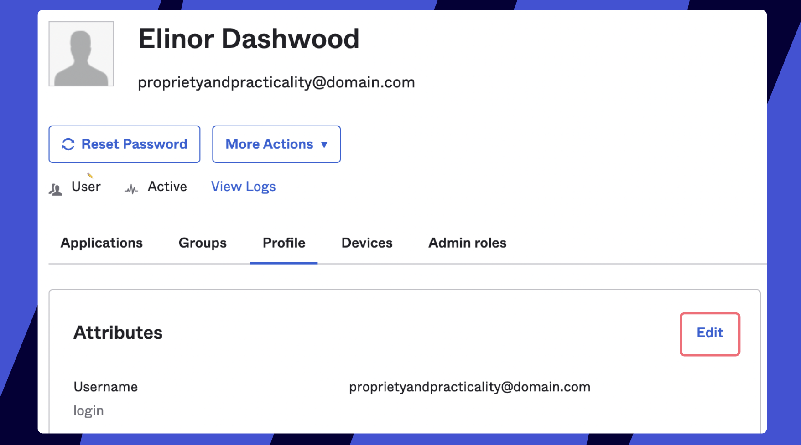
4. *Users do not get provisioned due to "Conflict. Errors reported by remote server: DomainAddress is not whitelisted".*
   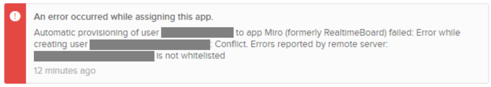
   Please make sure that the user's domain address is allowed according to your [Sharing policy.](../../../canvas-25-admin-features/data-security/07-sharing-policy-on-enterprise-plan.md)
5. *After using the **Push Now** option some of our boards and projects got reassigned to the Team admins.*
   With this option, Okta initiates a PATCH request to replace all members of your subscription (meaning syncing the list of users in Miro to the user list in Okta). If a timeout occurs until the process is completed Miro is left only with the users available until the timeout happened. Since on Miro end that results in removing the users from your teams, the boards and projects they previously owned are reassigned to respective Team admins.
6. *The number of **Scanned** users provided by the **Import Now** option does not match the number of users I have in my Miro subscription.*
   Please note that this number does not include [Deactivated users](../../../user-management/01-deactivated-users.md) and [Non-Team users](../../../user-management/11-user-access-levels-on-enterprise-plan.md). We also noticed that the results may differ if Okta included some fresh changes that occurred since the last Import (for example, like "1 user removed" change shown on the screenshot below). To get the actual number try running the **Import** command at least 2 times.
   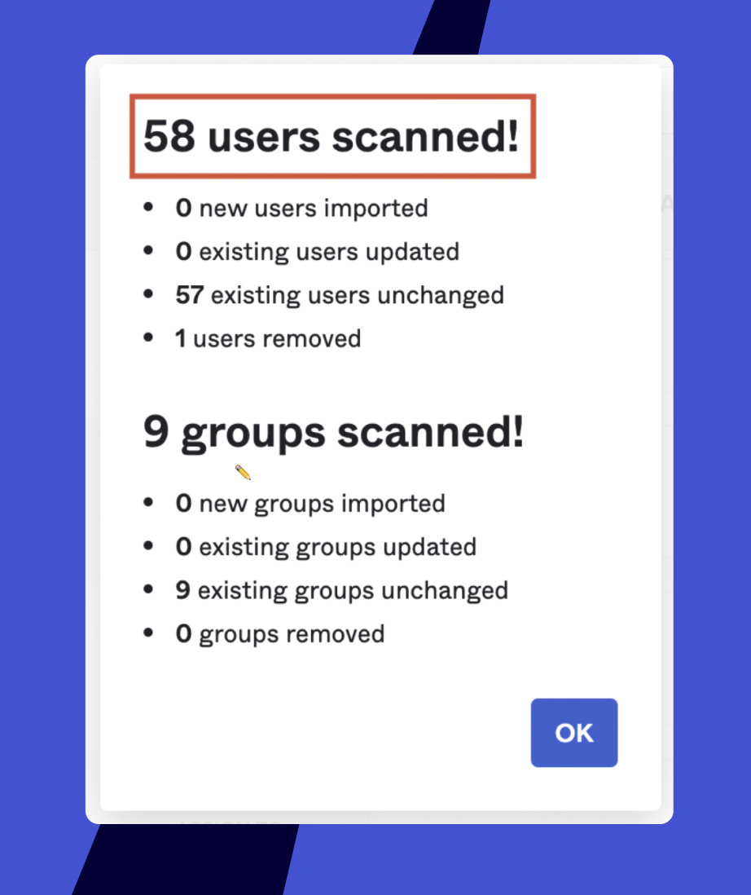
7. *My users are not updated with some data.*
   Please check that all the attributes that you configured, especially if they are custom, like ProfilePicture or UserType are present and filled in on the **User profile page**:

   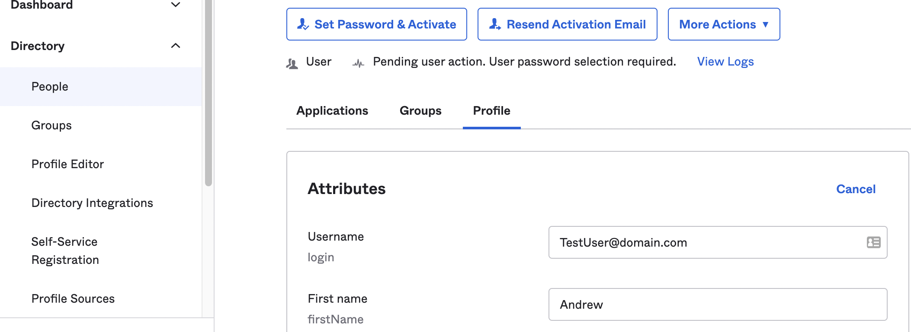
8. *The changes are not sent to Miro due to Link / Push Group timeout:**"Failed on 06-14-2021 12:16:29PM UTC: Unable to update Group Push mapping target App group &lt;Group Name&gt;: Error while creating user group &lt;Group Name&gt;: Read timed out".*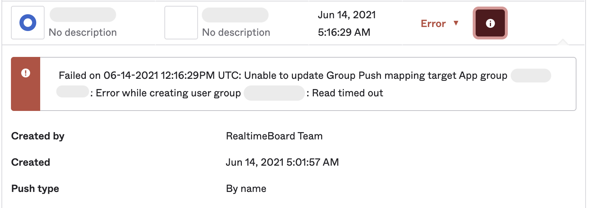

   This timeout error may appear when attempting to link existing groups or to push a new group with a large number of members.

   If you were pushing a new group, check whether Okta's SCIM request timed out before or after the target group was created in Miro.

   If the target group was not created in Miro, then you can retry the "Push Group" operation:
   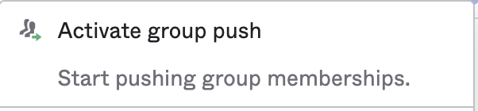

   If you were linking existing groups or the target group was created in Miro after the initial push operation, then you need to restore the link between the groups in Okta and Miro. To do this you can try the following steps:

   - Unlink pushed group (check **Leave the group in target app** in modal window):

   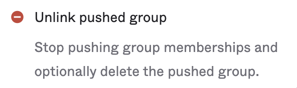
   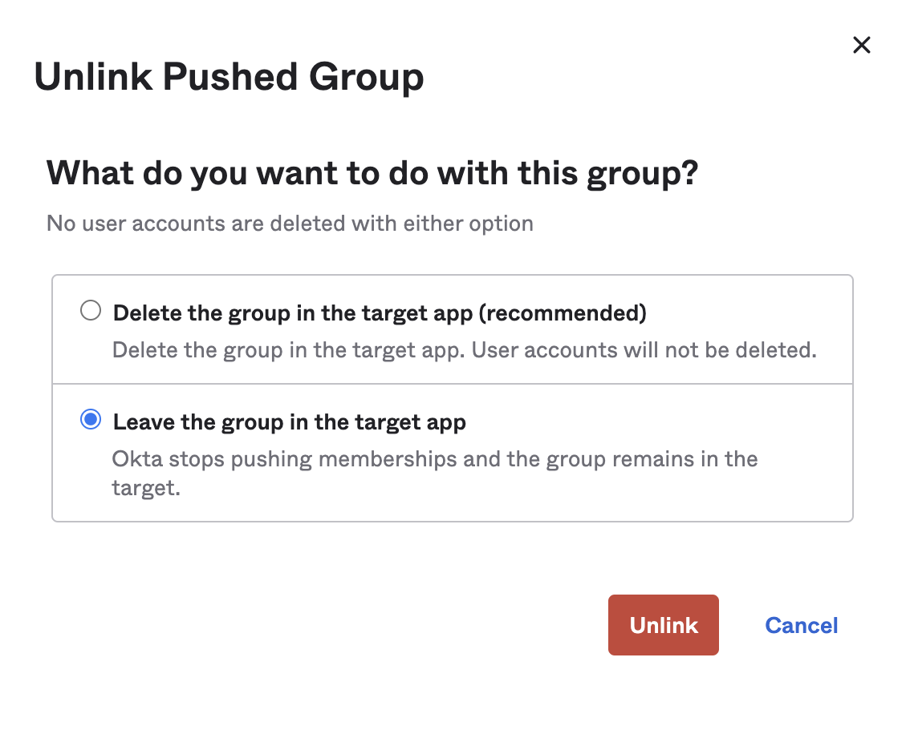

   - Click **Refresh App Groups** button to let Okta pull the list of groups in Miro:

   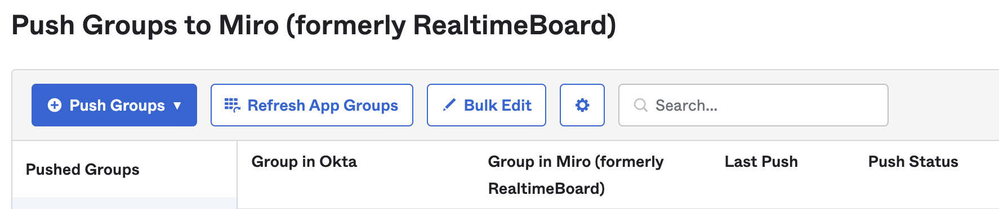

   - Click **Push Groups** button and select **Find Groups by name** option.
   - Find the group you are trying to push by typing its name in the search box and select it from the dropdown. Okta should display it with the **Link Group** disabled option like so:

   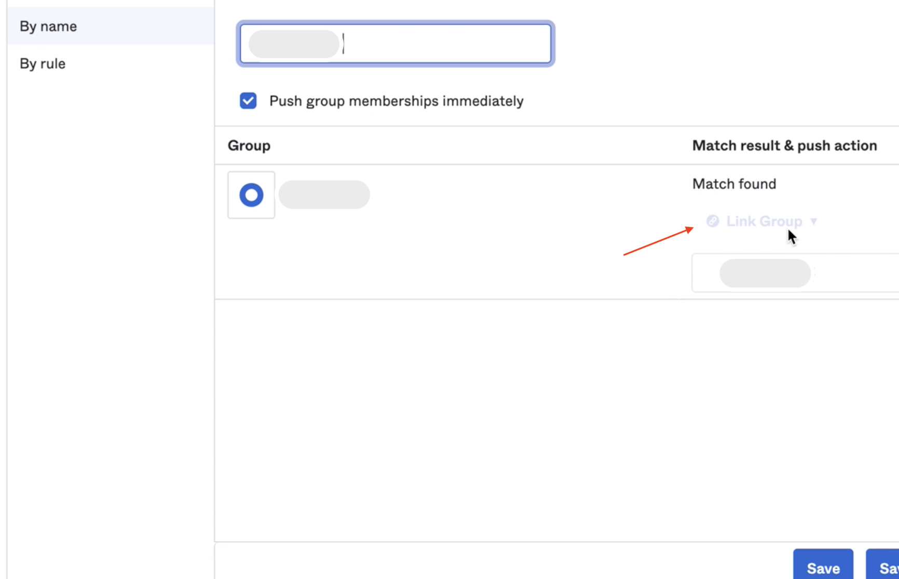

   - Click **Save**. Okta will try to sync target group using PATCH /Groups SCIM requests.
   - If not all the members from the Okta group were assigned to the respective team in Miro, you can check "Directory → Tasks" tab in Okta and retry failed operations:

   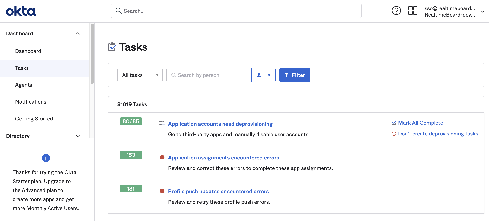
