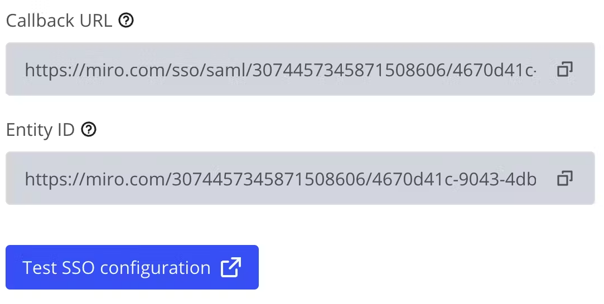
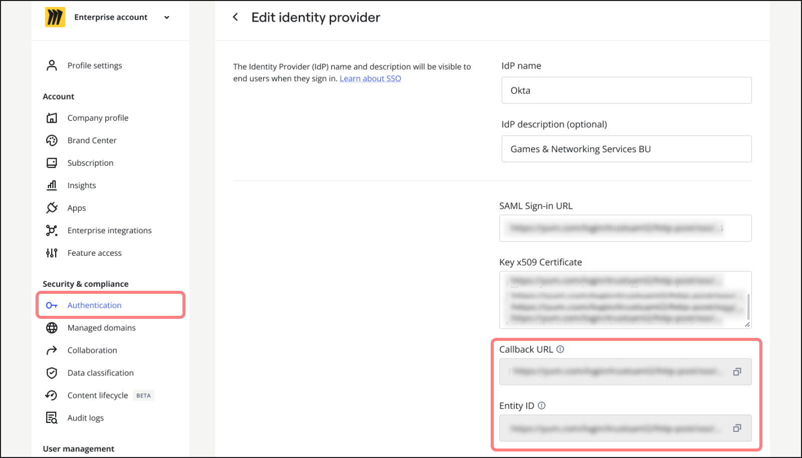
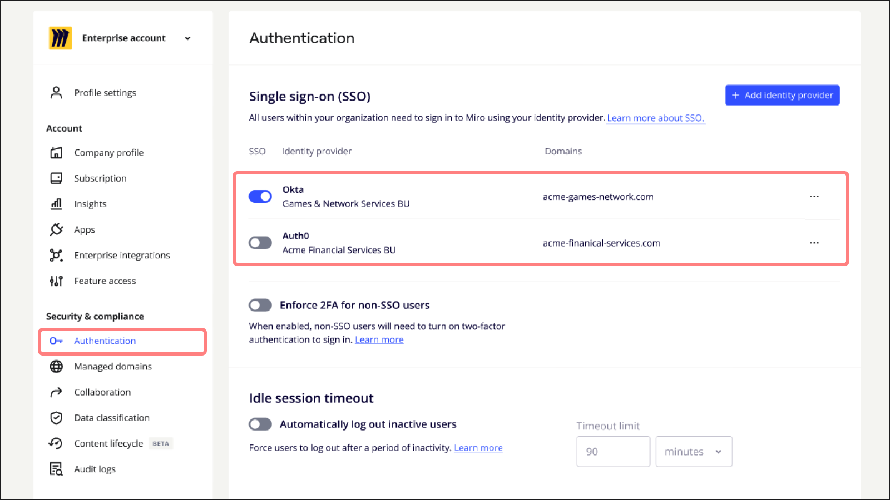
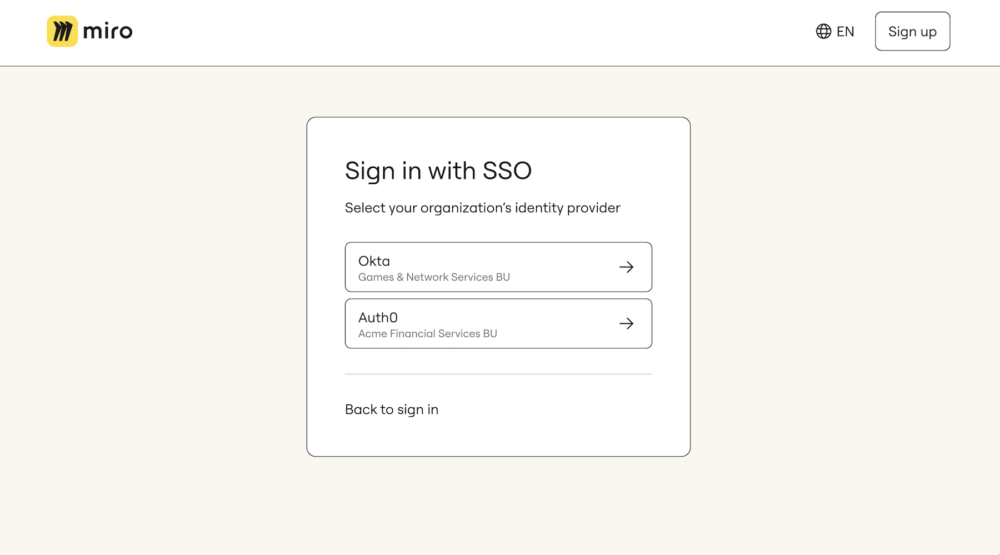

:::note
Adding multiple identity providers is a private feature available exclusively to Enterprise customers. To access and enable this feature, contact your Miro Account Team Manager or Customer Success Manager. Miro Support cannot enable this feature.
:::

Use several identity providers (IdPs) for single sign-on (SSO). This is especially useful for big organizations with different branches or subsidiaries, each having their own IdP but needing access to the same Miro subscription.

## Preparing to add multiple identity providers

To ensure [single sign-on (SSO)](../../security-integrations/single-sign-on-sso/09-single-sign-on-sso.md) continues to work after adding multiple identity provider applications, you need to update the configuration of the existing IdP application.

Entra ID and some other IdPs won't support the new configuration format until your organization joins enables the multiple identity provider (multi-IdP) private feature. To avoid login disruptions, we suggest arranging a call with your Customer Success Manager, who can guide you step-by-step to enable the multi-IdP private  feature at the same time the configuration is updated.

### How to configure your Enterprise settings

1. [Turn off SCIM](#turn-off-scim).
2. [Update the SSO configuration](#update-the-sso-configuration).
3. [Verify your SSO functionality](#verify-your-sso-functionality).

#### Turn off SCIM

We do not currently support [SCIM](../../security-integrations/system-for-cross-domain-identity-management-scim/02-scim.md) with multiple IdPs. To turn off SCIM for your Enterprise Plan, go to **Company** settings > **Account** > **Enterprise integrations**, and toggle off **SCIM Provisioning**.

#### Update the SSO configuration

**Old configuration**

When Miro SSO was originally configured in your IdP, it is likely that the following configuration values were used:

- **Callback URL/ACS:** https://miro.com/sso/saml
- **Entity ID:** https://miro.com

**New configuration**

To ensure the IdP knows which configuration within Miro it relates to, the below values need to be updated. Go to **Settings** > **Security** > **Authentication**.

These values are available in the SSO settings once your organization has enabled the multi-IdP private feature and will have the following format:

- **Callback URL/ACS:** https://miro.com/sso/saml/&lt;org_id&gt;/&lt;saml_settings_id&gt;
- **Entity ID:** /"https://miro.com/&lt;org_id&gt;/&lt;saml_settings_id&gt;

*Callback URL and Entity ID in the Enterprise admin console*

#### Verify your SSO functionality

Once you’ve finished updating your IdP configuration, test that SSO is working properly by logging out and in again.

## Adding a new identity provider (IdP)

The process to add new IdPs is similar to the existing [SSO configuration](../../security-integrations/single-sign-on-sso/09-single-sign-on-sso.md), but includes a couple of key changes:

- **New fields:** 'IdP name' and 'IdP description' (optional). These fields help users and admins identify the correct IdP during login, especially if multiple IdPs are used.

  Because these fields are displayed in the admin settings and can be shown to users when they sign in via SSO, we strongly recommend setting these names intentionally (for example, Business Unit, or IdP name).

  
*The option to add an IdP name and IdP description*
- **Read-only fields:** 'Callback URL' (Allowed Callback URL, Custom Assertion Consumer Service URL, Reply URL) and 'Entity ID' (Identifier, Relying Party Trust Identifier) are now automatically generated in your Miro IdP settings once your organization has enabled the multi-IdP private feature.

  Previously these values were static as they were the same for all IdP configurations. Once generated, you will also need to copy and paste these values into the corresponding fields in your IdP provider’s settings.

  
*Callback URL and Entity ID fields*

## Managing multiple identity providers (IdPs)

> **💡** You can add and enable up to 20 identity providers at a time.

After adding the IdPs, each configuration can be turned on or off as needed. To turn off an IdP, go to **Company** settings > **Account** > **Authentication**, and toggle off the IdP.

*The option to turn an IdP on or off*

## Sign in view for email domains with multiple IdPs

If a user's email domain is linked to several IdP configurations, they can select one during sign in. If these configurations have distinct domains, the user is auto-routed to the relevant IdP.

*View of multiple IdPs when signing in*
