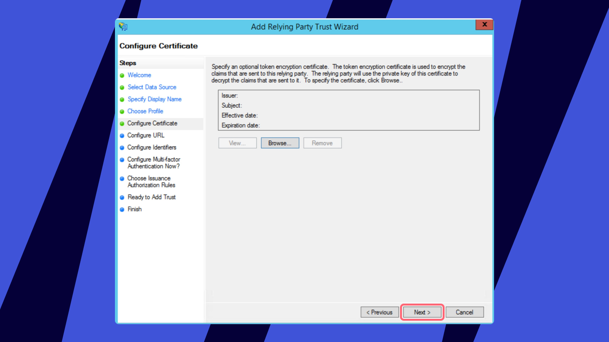

Miro supports single sign-on (SSO) logins through SAML 2.0.

A SAML 2.0 identity provider (IDP) can take many forms, including a self-hosted Active Directory Federation Services (ADFS) server. ADFS is a service provided by Microsoft as a standard role for Windows Server that provides a web login using existing Active Directory credentials.

This guide uses screenshots from **Server 2012R2**, but similar steps should be possible on other versions.

First, you need to install ADFS on your server. Configuring and installing ADFS is beyond the scope of this guide but is detailed in this [Microsoft article](http://msdn.microsoft.com/library/gg188612.aspx).

During testing, ensure that your working station authentication is set to the same test email that you are using for the test otherwise, ADFS will not allow you to log in even under correct configuration and profile.

> *💡 It is strongly recommended to configure SSO in a separate incognito mode window of your browser.* This way, you keep the session in the standard window, allowing you to switch off the SSO authorization in case something is misconfigured.

If you wish to set up a test instance before enabling SSO on production, please request it with your Account Executive or Sales representative. Only those who configure SSO will be added to this test instance.

> **⚠️ See our main SSO article** [**here**](../../security-integrations/single-sign-on-sso/09-single-sign-on-sso.md) **for rules, supported features and optional configuration on the Miro end.**

## Step 1 - Adding a Relying Party Trust

1) Login to the ADFS Server and launch the **ADFS Management Console**.

2) Select the **Relying Party Trusts**folder from **AD FS Management**, and add a new **Standard Relying Party Trust** from the **Actions**sidebar. This starts the configuration wizard for a new trust.

*Adding Party Trust*

3) In the **Select Data Source** screen, select the last option, **Enter Data About the Party Manually.**

*Choose **Enter Data About the Party Manually***

4) Enter a **Display name** that you'll recognize in the future, and any notes you want to make.

*Adding a display name*

5) Select the **ADFS FS (ADFS 2.0) profile** button.

*You will be prompted to browse for a Certificate to encrypt and decrypt the claims. This is optional and can be skipped by pressing **Next**.*

6) Check the box labeled **Enable Support for the SAML 2.0 WebSSO protocol**.
The service URL will be https://miro.com/sso/saml.

:::note
that there's no trailing slash at the end of the URL.
:::

*Enable Support for the SAML 2.0 WebSSO protocol*

7) Add a **Relying party trust identifier** as `https://miro.com/`

*Adding a **Relying party trust identifier***

*On the next screen, you may configure multi-factor authentication but this is beyond the scope of this guide.*

*Rejecting configuring* *multi-factor authentication*

8) Select the **Permit all users to access this relying party** button.

*Permitting all users to access the relying party*

On the next two screens, the wizard will display an overview of your settings.

On the final screen use the **Close**button to exit and open the **Claim Rules** editor.

*Finishing adding a Relying Party Trust*

Please also make sure that your configuration includes **Signed Assertion**.

## Step 2 - Creating claim rules

Once the relying party trust has been created, you can create the claim rules.
By default the claim rule editor opens once you created the trust.

1) To create a new rule, click on **Add Rule**.

*Adding a new rule*

2) Create a **Send LDAP Attributes as Claims**rule.

*Creating a rule*

3) On the next screen, name your rule, and using **Active Directory** as your attribute store, map as follows:

| LDAP Attribute | Outgoing Claim Type |
| --- | --- |
| E-Mail-Addresses | E-Mail Address |
| Given-Name | FirstName |
| Surname | LastName |

*Mapping of LDAP attributes*

Click on **OK**to save the new rule.

4) Create another new rule by clicking**Add Rule**, this time selecting **Transform an Incoming Claim** as the template.

*Selecting **Transform an Incoming Claim** as the template*

5) Then name the rule and set the following parameters:

|  |  |
| --- | --- |
| **Incoming Claim Type** | E-mail Address |
| **Outgoing Claim Type** | Name ID |
| **Outgoing Name ID Format** | Email |

*Setting the rule parameters*

Finally, click **OK**to create the claim rule, and then **OK**again to finish creating rules.

With this the configuration of ADFS has been completed! After this simply [enable the SSO feature for your Miro plan](../../security-integrations/single-sign-on-sso/09-single-sign-on-sso.md) and your end-users will be able to start using SAML to authenticate in Miro.

## Testing SSO configuration in Miro

1. Complete the steps above to configure your SSO settings.
2. Click the **Test SSO configuration** button.
3. Review the results:

1. If no issues are found, a confirmation message **SSO configuration test was successful** will be displayed.
2. If issues are found, a confirmation message **SSO configuration test failed** will be displayed, followed by detailed error messages to guide you on what needs to be fixed.

*Testing SSO configuration in Miro*
