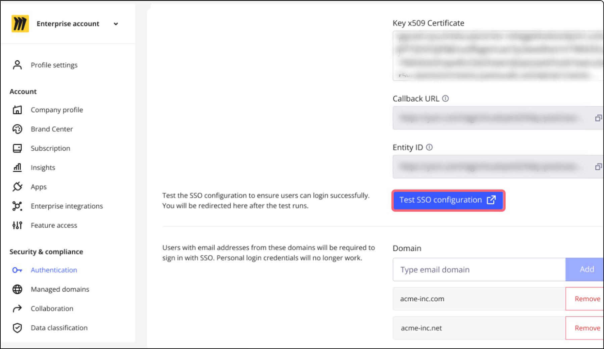

> *💡 It is strongly recommended to configure SSO in a separate incognito mode window of your browser.* This way, you keep the session in the standard window, allowing you to switch off the SSO authorization in case something is misconfigured.

If you wish to set up a test instance before enabling SSO on production, please request it with your Account Executive or Sales representative. Only those who configure SSO will be added to this test instance.

> **⚠️ See our main SSO article** [**here**](../../security-integrations/single-sign-on-sso/09-single-sign-on-sso.md) **for rules, supported features and optional configuration on the Miro end.**

## Prerequisites

You’ll need the following to set up AWS SSO access to with Miro:

1. Access to the AWS SSO console with IAM permissions to manage applications
2. Company-level admin permissions on Miro's Enterprise or Business plan

## Setup Instructions

1. On the AWS SSO Configure page, add a new application and search for **Miro**.  When adding the Miro application the display name and description can be updated.
   *
   AWS SSO Application Catalog*
2. Log into the Miro dashboard in a different browser window. We recommend a separate incognito browser window.
3. On the top right, click your profile icon, then go to **Settings**. On the left panel ensure that the correct team is selected from the drop-down menu in the top left.
4. On the left panel, go to **Enterprise integrations** (Business plan users need to go to **Security**) and toggle the **Enable SSO/SAML** option. Enter the following value for **SAML Sign-in URL** from AWS SSO.

*AWS SSO Application Configuration Page*

5. Download the AWS SSO SAML metadata file and copy and paste the X509 Certificate to **Key x509 Certificate**. Your configuration in Miro should now look similar to the configuration below.

*Miro SSO Configuration Settings*

6. In Miro SSO configuration, enter your company email domain name into the value for **Domains**. Make sure that you have added at least one Company Domain.
7. Click **Save** to save changes.
8. Return to your application for Miro in the AWS SSO web console. Under Application metadata, check to make sure the following values are entered. These should automatically pull in if you searched for and added the Miro application instead of creating a custom application.
9. |  |  |
   | --- | --- |
   | **Field** | **Value** |
   | Application ACS URL | [https://miro.com/sso/saml](https://Miro.com/sso/saml) |
   | Application SAML audience | [https://miro.com/](https://Miro.com/) |
10. Choose **Save Changes**.
11. [Assign a user](https://docs.aws.amazon.com/singlesignon/latest/userguide/assignuserstoapp.html) to the application in the Application's Assigned users of the AWS SSO console.

And that's all! Your SSO configuration is now complete.

If you'd like to also enable auto-provisioning for Miro, check out [this article](../../security-integrations/system-for-cross-domain-identity-management-scim/03-setting-up-automated-provisioning-with-entra-id.md).

## Testing

Use the following section to verify the SSO integration. Before verification, ensure that the user performing the verification is logged out of both AWS SSO and Miro before performing the steps below. Users will not be able to login using SSO unless the user exists in your directory, is a member of your Enterprise or Business plan in Miro, and the user is assigned to the application.

### Verifying IdP Initiated SSO from AWS SSO

1. Access the AWS SSO end-user portal using the credentials of a user assigned to the Miro application.
2. In the list of applications, choose Miro application to initiate a login to Miro.
3. If login was successful you will be signed-in to the Miro dashboard.

### Verifying Service Provider Initiated SSO from Miro

1. Access [https://miro.com/login/](https://Miro.com/login/) and choose **Sign in with SSO**. Then enter your work email.
2. You will be redirected to the AWS SSO portal where you will type in the credentials of a user assigned to the application in the AWS SSO console.
3. You will be signed-in to the Miro dashboard if login was successful.

### Alternatively, you can test in Miro

1. Complete the steps above to configure your SSO settings.
2. Click the **Test SSO configuration** button.
3. Review the results:
   1. If no issues are found, a confirmation message **SSO configuration test was successful** will be displayed.
   2. If issues are found, a confirmation message **SSO configuration test failed** will be displayed, followed by detailed error messages to guide you on what needs to be fixed.*Test SSO configuration from Miro*

## Troubleshooting

For general troubleshooting problems, please refer to the [AWS SSO Troubleshooting Guide](http://docs.aws.amazon.com/singlesignon/latest/userguide/troubleshooting.html).
