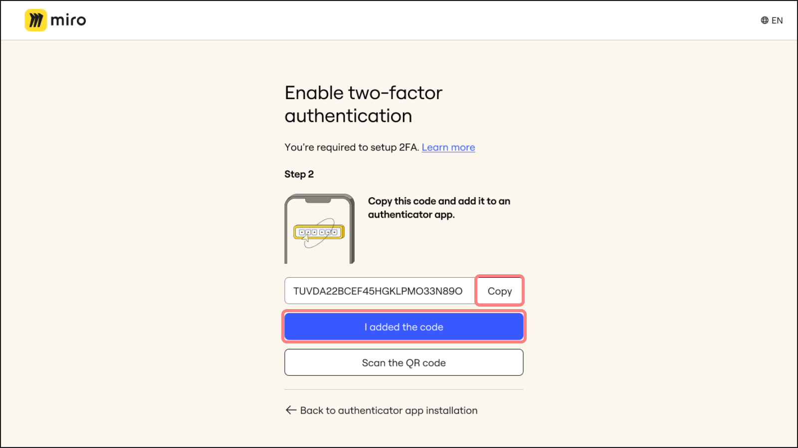
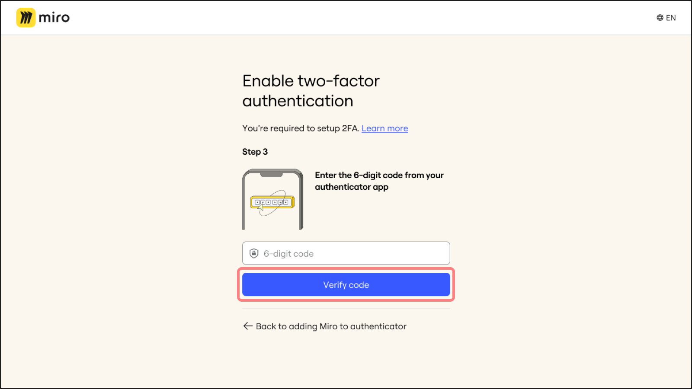
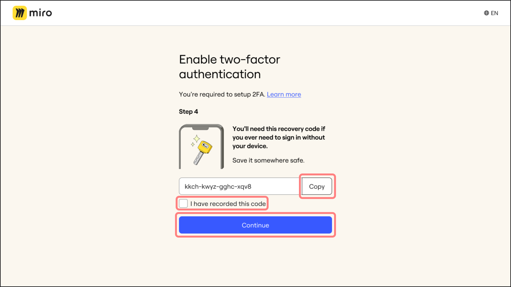
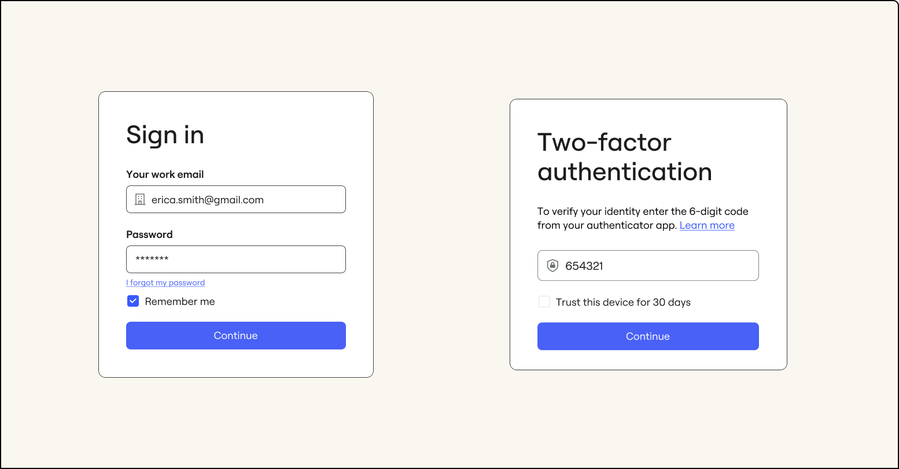
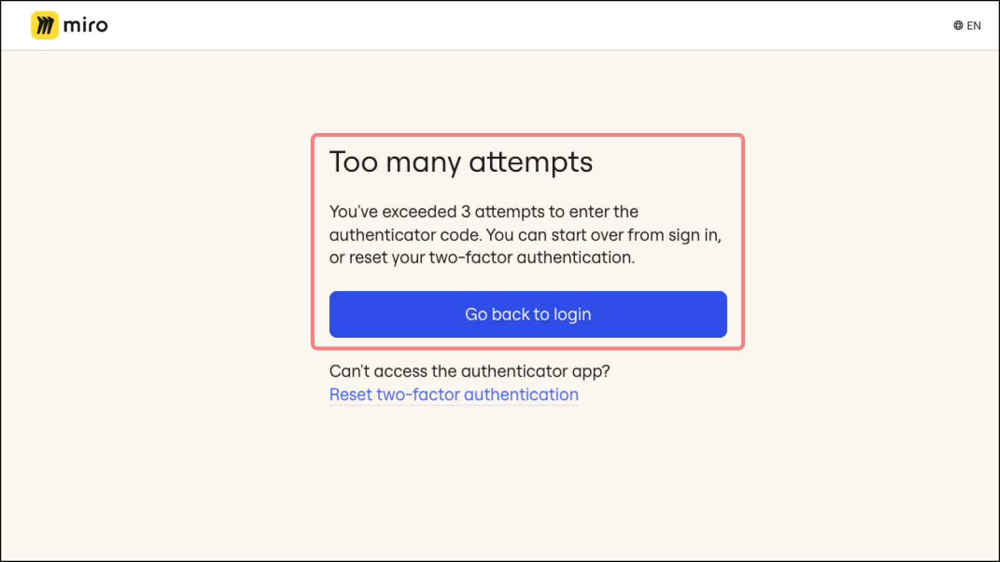
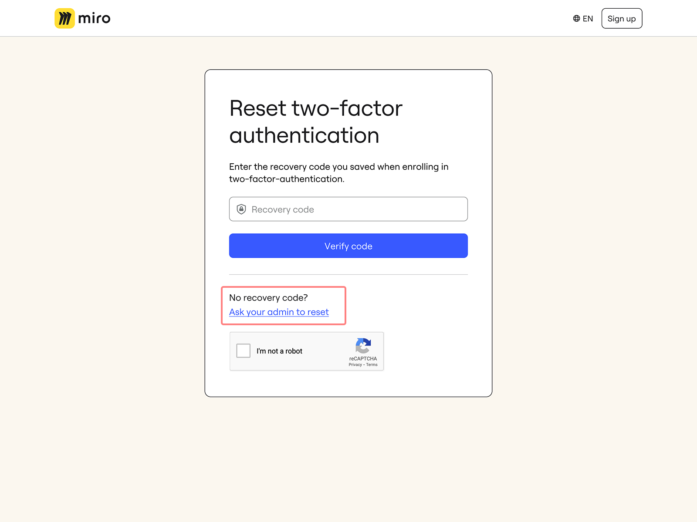

## What is two-factor authentication (2FA)

Two-factor authentication (2FA) adds more security to your online accounts. When your Company Admin activates two-factor authentication (2FA), each sign-in to Miro using your email and password will be followed by an extra layer of security. This additional step ensures enhanced protection for your account, requiring verification beyond your regular login credentials.

:::tip
Learn how to enable two-factor authentication (2FA) for your organization for [Enterprise plans](../../security-integrations/two-factor-authentication-2fa/01-enterprise-two-factor-authentication-2fa-–-admin-guide.md), and [all other plans](../../../administration/security-compliance/01-two-factor-authentication-2fa.md).
:::

## How to set up two-factor authentication (2FA)

**New users:** During your initial [sign-up](https://miro.com/signup/) process with your company email address, you will be prompted to enable 2FA.
**Existing users:** Upon your next [sign-in](https://miro.com/login/), if your organization requires 2FA and you are not using single sign-on (SSO), you will be prompted to set up 2FA.

1. Download an authenticator app on your mobile device. Authenticator apps, like Google Authenticator, Microsoft Authenticator, and Authy, generate a time-based one-time (TOTP) code for secure sign-ins to Miro. For guidance on which authenticator app to choose, ask your Company Admin or IT administrator.

2. Click **I have an authenticator app** in the Miro 2FA setup screen.

   
   *Confirmation of authenticator app*
3. Using the authenticator app, you now have two options:

   Scan the QR code

   1. Open your authenticator app.
   2. Use the app to scan the QR code.
   3. After scanning, click on **I scanned the code**
      in Miro.

      *Scanning the QR code*

   Manually enter the Miro code

   1. If you are unable to scan the QR code, click
      on **Can’t scan QR code?** in
      Miro.
   2. Miro will then provide an authentication
      code. **Copy** this code.
   3. Open your authenticator app and paste the copied code.
   4. After adding the code to the app, click on
      **I added the code** in Miro.

      *Copying the Miro code to paste in the authenticator app*
4. The authenticator app will generate a 6-digit verification code. Enter this code in Miro and click **Verify code**.

   
   *Verifying the 6-digit code*
5. After successfully verifying your account with the 6-digit code, Miro will provide a recovery code. Click **Copy** to save this code securely. It's crucial to have this code as it allows you to reset your 2FA in case you lose access to your authenticator app.

   To confirm you've recorded the code, select **I have recorded this code**, then click **Continue** to complete the process.

   *Saving the recovery code*

## Signing in with two-factor authentication (2FA)

Once you have successfully set up two-factor authentication (2FA) for your account, each time you attempt to log in, Miro will prompt you to enter a 6-digit time-based one-time (TOTP) code.

This code is generated by your authenticator app and provides an extra layer of security for your account. Simply open your authenticator app, retrieve the current code, and enter it on the sign-in page to gain access to your account.

*Signing into Miro with 2FA*

You have 3 attempts before you will be prompted to restart the sign-in process.

*Too many sign-in attempts with 2FA*

### Trusting two-factor authenticated (2FA) devices

If your administrator has set it up, you can choose the checkbox to **Trust this device** when signing into your account with 2FA when using a secure device (do not use **Trust this device** if signing in from a shared or publicly accessible computer). When you do this, you'll be able to sign in without entering your second factor, until a specified time period has passed. This time period is set by your administrator for between 7 and 90 days.

*The duration of trusting a device is displayed next to the checkbox when signing in with two-factor authentication*

If you do not see the option to "Trust this device," then your administrator hasn't enabled it for your organization.

If you sign in with a new device—or after you've cleared the cookies on your trusted device—2FA will be required again.

## How to reset two-factor authentication (2FA)

If you encounter issues with your authenticator app, lose your device, or need to reset your 2FA for any other reason, follow these steps:

### I have a recovery code

1. Click on **Reset two-factor authentication**.
2. Use the recovery code saved during your initial 2FA setup. You will be guided through the setup process again to reconfigure your authenticator app.

*The option to reset two-factor authentication*

### I do not have a recovery code

If you've lost your recovery code or are unable to use the self-recovery flow, you'll need to request that your admin reset your 2FA.

If your email domain isn’t part of your organization’s verified domains, your admin can’t initiate a reset for you. You’ll need to request a 2FA reset yourself — your admin will then be able to approve it.

Admins can reset two-factor authentication only for users whose email domains are verified in their organization, if the admin initiates the reset. If the user requests a reset, then any admin in the organization can approve it.

Follow these steps:

1. Click on **Ask your admin to reset**.
   
   *Ask your admin to reset your 2FA if you don't have a recovery code*
2. If you belong to more than one organization using 2FA, you'll need to select which organization's admin you want to make the request to.
3. You will receive an email with a verification code.
4. Enter the verification code.
5. A confirmation that the request was sent to your chosen admin will be shown.
6. When the admin resets your 2FA, you'll need to go through the 2FA setup process the next time you log in.

## Frequently asked questions

Why do I need to set up 2FA?

Two-factor authentication enhances security for your organization.
All non-SSO users must use two-factor
authentication to sign in if this requirement is enforced by
your Company Admin.

Do I have to use 2FA every time I sign in?

Yes. After completing the initial setup, you must use your authenticator
app for every sign-in to ensure your account remains secure.

I tried to set up 2FA but received an "Invalid code" error, even
though my code is correct. What should I do?

Ensure that your device's timezone, date, and time are correctly
set. If the issue persists, try setting up 2FA on a different
device.

What if I accidentally trust a shared device?

If you accidentally trust a shared device, you'll need to clear
the cookies for Miro on that device. Doing this is simple:

1. Click on the slider icon on the left side of the address
   bar in your browser.
2. Click on "Cookies and site data" in the menu.
3. Then click on "Manage on-device site data."
4. Click the trash can icon next to each URL listed there to
   clear the cookies and site data.

Note that once you've cleared site data from the device, you'll
have to sign in again using two-factor authentication.

What if I lose access to a trusted device?

If you lose access to a trusted device before the trusted period
has expired, you can use the **Sign out everywhere**
option to remove access from all signed in devices (except for
the device you are currently using). This will sign you out of
all other devices and revoke 2FA from any trusted devices. You
can find the **Sign out everywhere** link in your
user profile settings. You'll then need to go through the 2FA
sign in process again on devices you have access to.
