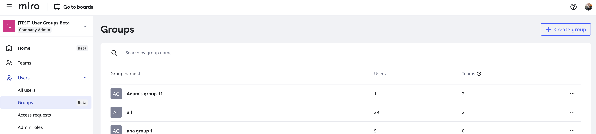

User Groups simplifies user management for Company admins, enabling them to share content to all members of a group instead of each user individually.

For example, you want to share a project board with all designers in your organization. You can create and add all designers to a User Group, and share with the group. All members of the group have the same access that you specify, Edit, Comment, or View.

To learn how to create User Groups, see [User Groups](08-user-groups.md).

*Company admins can create User Groups in Admin Console.*

User Groups ensures that all users in a group have access to the same content, without the need to share boards with each user individually. You can also add a User Group to a team.

:::note
To learn about managing User Groups via SCIM, contact your Miro CSM or Support.
:::

## Key Features

- **Create and manage User Groups**
  In Admin Console, Company admins can create, review, edit, add members, and delete User Groups. For more information, see [User Groups](08-user-groups.md).
- **Share boards and Spaces with User Groups**
  Team members can [share any board or Space with a User Group](08-user-groups.md), and set permissions.
- **Manage User Groups by API**
  User Groups APIs enable admins to programmatically create, edit, and remove User Groups.
- **Mention User Groups in comments**
  Mention a User Group on any board. All users in the group receive a notification.
- **See User Group members on boards**
  See and review all members of a User Group when you mention a group on a board.
